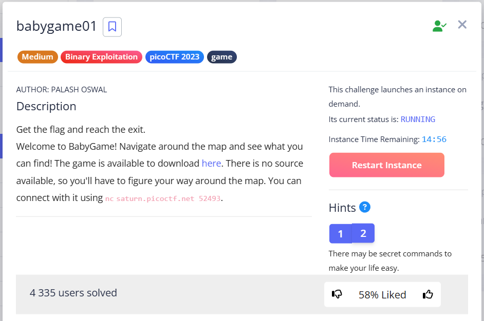
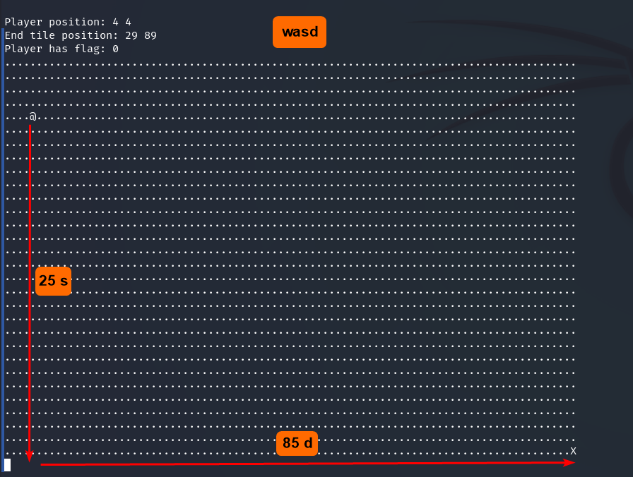
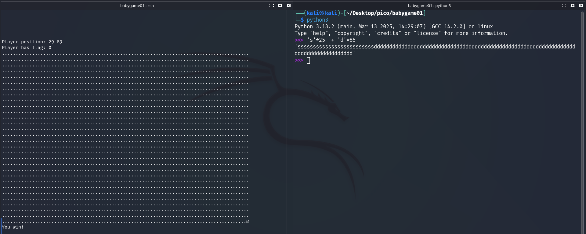
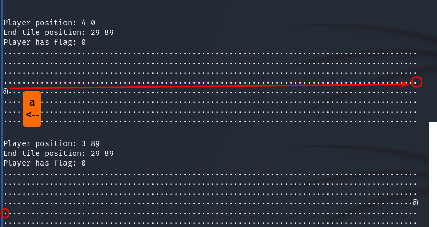
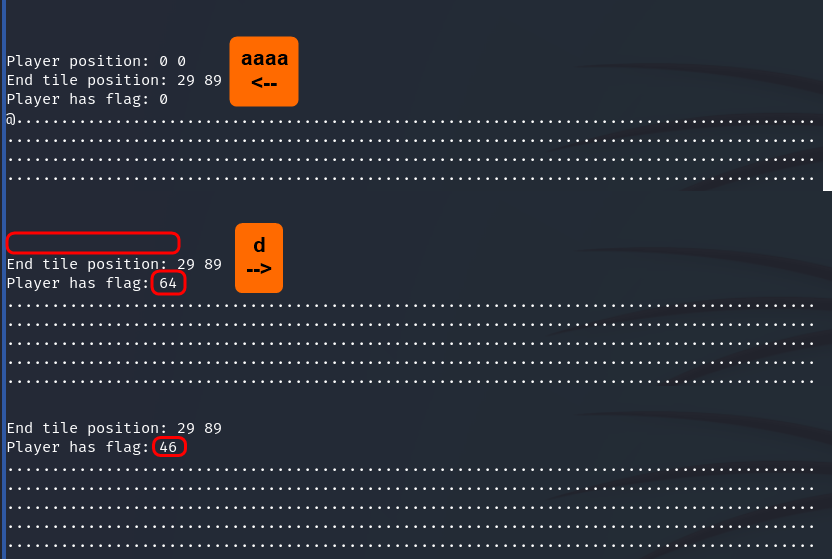
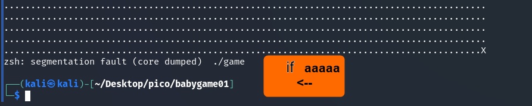
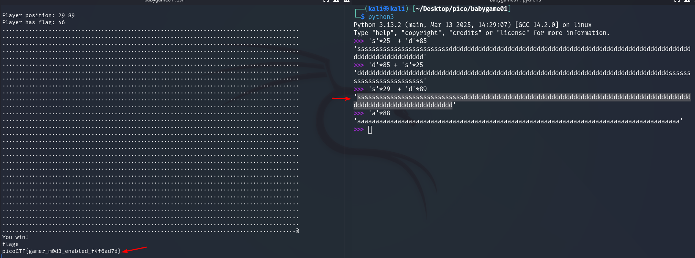

It's a pretty weird task that involves moving the "`@`" symbol to "`X`" symbol around the "map" from the dots, but you need to change the `Player has flag` parameter from 0 to something else. 
To do this, we need to trigger a **segmentation fault**.

---

First, let's try to just get to the end. Let's create a payload so we don't have to type characters manually:

We get "You win!" and that's all we got (parameter `Player has flag: 0`)

I was poking aroung and found, that if you move to the **far left**, you will be **moved up one line near the far right**.  
So you can **move to the right as if reading a book** and you will arrive at "`X`" !   

> [!IMPORTANT]
> Let's move to the upper left corner and **go beyond the map:**    

What we have done:

* reached the upper left corner
* moved 4 to the left (**if 5, the program crashes**)

  

* turned 1 step back to the right

Now, with this value `Player has flag: 46`, we need to get to the end:

`picoCTF{gamer_m0d3_enabled_f4f6ad7d}`
 
