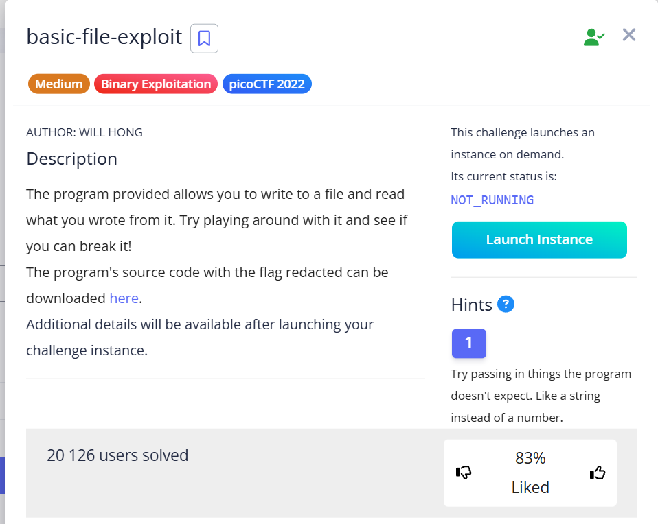
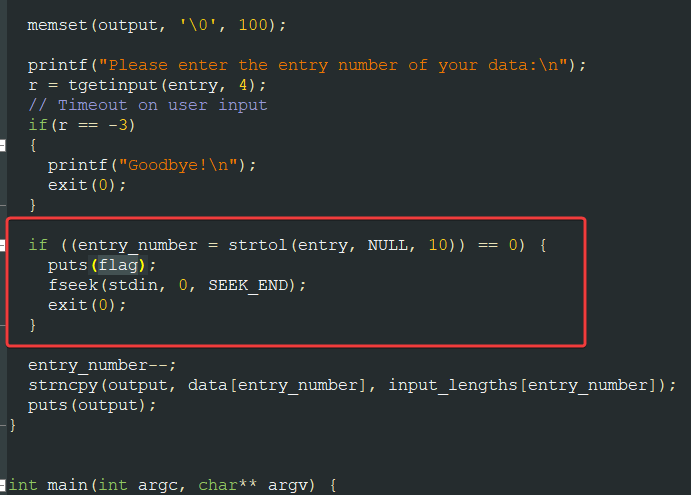
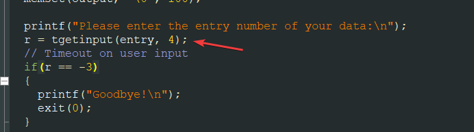
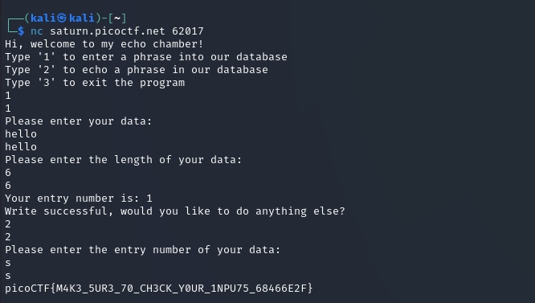

The program we interact with via `nc saturn.picoctf.net &lt;port>` has the following functionality:


* entering any text
* specifying its length
* saving this text in the internal database
* outputting this text

The code for this program is attached to the task `program-redacted.c`

Find the part where there is some mention of flag.





```c
  if ((entry_number = strtol(entry, NULL, 10)) == 0) {
    puts(flag);
    fseek(stdin, 0, SEEK_END);
    exit(0);
  }
```


This part:


```c
entry_number = strtol(entry, NULL, 10)
```


* `strtol - ` Standard function in the C language library `stdlib.h` ,which is designed to convert a string (`string` type) into a long integer (`long int` type) and works as follows:
    * If the string passed as the first argument to `strtol` begins with a number or the `+` or `-` sign, the function reads the string from left to right, reading it until it encounters a character (letter, space) that is not part of the number.
*  in this code, it accepts 3 parameters:
    * `entry` — a string (array of char characters) that needs to be converted to a number. It can be seen in this part, where the `tgetinput()` method reads 4 values from the keyboard into the array:

    

    * NULL - specifies the function to ignore everything that comes after the found string
    * 10 – the base of the number system in which the number to be read is expected	
* !! If `strtol(entry, NULL, 10)` does not find any numbers, or if it is passed an empty string, it will return 0. And in this code, we have a check condition, whether the VALUE RETURNED by `strtol == 0`.

This means that the vulnerability lies in the fact that when the program asks us for `printf("Please enter the entry number of your data:\n");`, we can enter 0 or any character, and the program will display the flag `puts(flag);`.





`picoCTF{M4K3_5UR3_70_CH3CK_Y0UR_1NPU75_68466E2F}`

<h3>How this vulnerability could have been detected: </h3>


* **Analyze the code, looking for type conversions:** In code written in C/C++ or other low-level languages, it is always worth paying attention to places where data received from the user (strings) is converted to other types (numbers, pointers, etc.).
* **Study the behavior of convert functions:** Knowing how functions such as `strtol`, `atoi`, and `sscanf` behave when given incorrect or non-numeric input is critically important. The documentation for `strtol` clearly states that it returns 0 if conversion is impossible from the beginning of the string.
* **Search for conversion result verification:** It is worth seeing how the program checks the values obtained after conversion. If the result is compared to a specific value (especially 0), and this comparison leads to an "interesting" (e.g., flag printing, access to hidden logic) branch of code, this may be a vulnerability.
