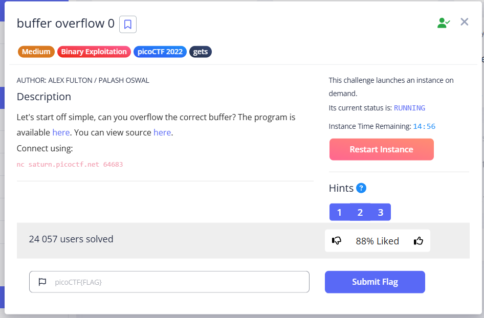

In this task, we need to overflow the buffer. 
The program at `nc saturn.picoctf.net <port>` displays "Input: " and will display a flag when the buffer overflows. 

---

Let's take a closer look at the `vuln.c` source code:

```c
#include <stdio.h>
#include <stdlib.h>
#include <string.h>
#include <signal.h>

#define FLAGSIZE_MAX 64

char flag[FLAGSIZE_MAX];

void sigsegv_handler(int sig) {
  printf("%s\n", flag);
  fflush(stdout);
  exit(1);
}

void vuln(char *input){
  char buf2[16];
  strcpy(buf2, input); //функція копіює дані з input (виклик vuln(buf1)) в buf2 
}

int main(int argc, char **argv){
  
  FILE *f = fopen("flag.txt","r");
  if (f == NULL) {
    printf("%s %s", "Please create 'flag.txt' in this directory with your",
                    "own debugging flag.\n");
    exit(0);
  }
  
  fgets(flag,FLAGSIZE_MAX,f);
  signal(SIGSEGV, sigsegv_handler); // Set up signal handler
  
  gid_t gid = getegid();
  setresgid(gid, gid, gid);


  printf("Input: ");
  fflush(stdout);
  char buf1[100];
  gets(buf1); 
  vuln(buf1);
  printf("The program will exit now\n");
  return 0;
}
```


* `FILE *f = fopen("flag.txt","r");`– the program opens the file with flag to read 
* `fgets(flag,FLAGSIZE_MAX,f); `– In this line, `f` is a **pointer to a structure of type `FILE`**.
  In our code:
  
  ```c
  #define FLAGSIZE_MAX 64
  char flag[FLAGSIZE_MAX];
  ``` 

From pointer `f`, `FLAGSIZE_MAX - 1` characters are read into the buffer of variable `flag` (or until the end of the string or file). 

> [!NOTE]
> `FLAGSIZE_MAX - 1`, because in C, strings ALWAYS end with `\0` (null terminator)


* `signal(SIGSEGV, sigsegv_handler); `– an important part of the program, which is somewhat similar in logic to the `try...except` block in Python

> [!NOTE]
> **Signals:** In Unix-like operating systems (such as Linux), signals are a way of notifying a process about certain events that may occur. These events may be related to errors, requests from other processes, or the system kernel. Signals can arrive at any point during program execution (asynchronously). There are many types of signals, each with its own name (for example, `SIGINT` for interrupts, `SIGTERM` for termination requests).
>
> **SIGSEGV:** This is one of the types of signals that means **Segmentation Violation**. This signal is generated by the operating system when a program attempts to access memory in a way that it is not allowed to (for example, attempting to write data to a memory area that is read-only, or attempting to access an address that does not belong to the program at all).
> Buffer overflow often leads to `SIGSEGV`.
>
>
> `signal(signum, handler)`: This is a standard C function (from `signal.h`) that allows a program to specify how it should respond (handle) to a specific signal (`signum`).

In our case `signal(SIGSEGV, sigsegv_handler);`:

* First arg (`SIGSEGV`): Indicates the type of signal we want to intercept.
* Secind arg (`sigsegv_handler`): This is a **pointer to a function** (called a **signal handler**), which will be called by the operating system when the process receives a `SIGSEGV` signal.

> [!NOTE]
> By default, when a program receives a `SIGSEGV` signal, the operating system usually terminates the program (the program "crashes" or "freezes") and can create a core dump file for debugging.


In our task `signal(SIGSEGV, sigsegv_handler);` changes this standard behavior. 
It tells the operating system: "If my process receives a `SIGSEGV` signal, **do not terminate it immediately**, but instead, please execute the `sigsegv_handler` function", which **will actually raise a flag**.


> [!NOTE]
> Comparison with `try...except` in Python:
>
> In **Python**: `try...except SpecificError:` <br/>
> In **C**: `signal(SpecificSignal, handler_function);` 
 


That is, we need to cause a `SIGSEGV` segmentation fault to get the flag.


```c
printf("Input: ");
  fflush(stdout);
  char buf1[100];
  gets(buf1); 
  vuln(buf1);
```


Here, the program waits for user input. Using the `fflush(stdout)` method, we clear the output buffer so that nothing unnecessary is output, except for the next printf or flag (when the buffer is full and the signal handler is thrown).

**Key momet** – `gets(buf1);` This method does not check how many chars buffer can contain, so we can overflow it. There is a hint:  


Next, the contents of `buf1` will be passed to `vuln(buf1)`, where we observe another vulnerability:


```c
void vuln(char *input){
  char buf2[16];
  strcpy(buf2, input); 
} 
```


`strcpy` **does not check** whether the entire `input` string fits into the `buf2[16]`. 
`buf2[16]` can contain 15 characters + \0 (C-style string), while `char buf1[100];` 99 + \0. Therefore, we need to enter EXACTLY MORE THAN 16 characters for overflow.

I tried to determine more precisely how many characters are needed for the `SIGSEGV` trigger, and got this:  


To reach the return address (which is the typical target of a stack buffer overflow exploit), you need to enter a number of characters greater than 16 + the size of the padding + the size of the saved EBP/RBP.

<br/>

In this task, 4 bytes were probably allocated to the Base Pointer (EBP (32-bit) / RBP (64-bit)), which occupies 4 bytes in a 32-bit architecture. And the result was 15+4 (if we disregard `\0`, **this is just my guess**).

`picoCTF{ov3rfl0ws_ar3nt_that_bad_c5ca6248}`
