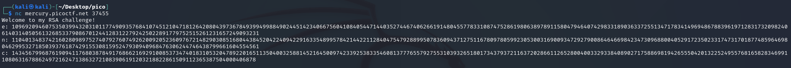
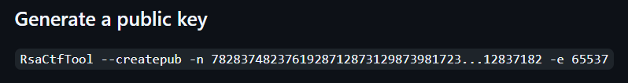

In this task, we connect to `nc mercury.picoctf.net 37455` and obtain module `n`, public key `e`, and ciphertext `c` of the rsa algorithm:  

  

The task itself gives us a rough hint that the private key `d` is very small.  

---

## Method I

If it is known that the key d is small, there is Wiener's method to attack such RSA ciphertext:
- Wikipedia: [source](https://en.wikipedia.org/wiki/Wiener%27s_attack)
- CryptoBook: [source](https://cryptohack.gitbook.io/cryptobook/untitled/low-private-component-attacks/wieners-attack)  

We won't go into the details of the algorithm, but there is an `owiener` module in Python. [Source](https://pypi.org/project/owiener/)  

This module contains the method `attack(e, n)`.
Let's write a Python program for this:

> [!TIP]
> A script as well as other scripts I left there: [*click*](../content/scripts/cryptography/Dachshund%20Attacks/wiener%20attack.py)

 

`picoCTF{proving_wiener_3878674}`
