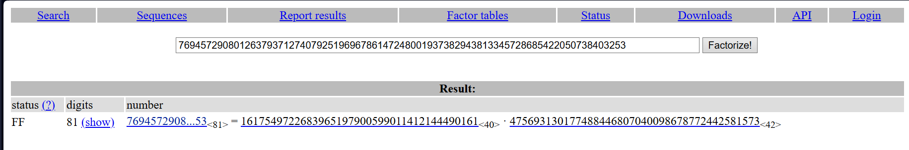
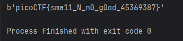

  

In this task, `n` and `e` are small. I search for "`rsa small n and e attack`" and find `iroot` method from `gmpy2` module

<details>
  <summary><em>RSA theory</em></summary>

RSA encryption uses the following parameters:

- `n` - module (product of two large prime numbers p and q)
- `e` - public exponent (usually 65537)
- `d` - private exponent (secret, required for decryption)
- `m` - message (plaintext)
- `c` - ciphertext

Encryption: `c = m^e mod n`  
Decryption: `m = c^d mod n`

</details>

## iroot

### What does iroot do:  

`iroot(c, e)` calculates the integer root of the e-th degree from the number `c`. Returns a tuple `(result, is_accurate)`.

### When working for RSA (Small e Attack):  

This method works only when the message m is so small that:  
`m^e < n`  

In this case, during encryption, **the module does not affect the result**, i.e.:

`c = m^e mod n = m^e`  (the modulus is not applied!)  

Therefore, you can simply take the root of the e-th degree without knowing `d`:  

```python
m = iroot(c, e)[0] # we get the original message
```

Example when it works:
```bash
# If m = 100, e = 3, n = 100,000
c = 100^3 = 1000000
# But 1,000,000 mod 100,000 = 0 (the modulus is applied here)

# If m = 100, e = 3, n = 10000000 (large n)
c = 100^3 = 1000000
# 1000000 < 10000000, therefore c = 1000000 (no change)
# m = iroot(1000000, 3) = 100 ✓
```

So, I tried:
```python
from gmpy2 import iroot

c = 8533139361076999596208540806559574687666062896040360148742851107661304651861689
n = 769457290801263793712740792519696786147248001937382943813345728685422050738403253
e = 65537

m = iroot(c, e)
print(m)
```

And got `(mpz(1), False)`, which means that `m^e >= N`. So this method does not work.  

## factordb + python

Let's try to factor `n` into prime factors `p` and `q`. `n` is small enough that this won't take long.  
`n` is small enough that it doesn't take much time.

I used [https://factordb.com](https://factordb.com):  

    

and write a Python program to find `d`, calculate `c^d mod n` (decrypt), and convert the key and bytes:

> [!TIP]
> This script as well as for other tasks I left here: [*click*](../content/scripts/cryptography/Mind%20your%20Ps%20and%20Qs/small%20e%20and%20n.py)

```python
from Crypto.Util.number import inverse, long_to_bytes

c = 8533139361076999596208540806559574687666062896040360148742851107661304651861689
n = 769457290801263793712740792519696786147248001937382943813345728685422050738403253
e = 65537
p = 1617549722683965197900599011412144490161
q = 475693130177488446807040098678772442581573

phi = (p - 1)*(q - 1)

# d = e^(-1) mod phi  | d is within the range from 1 to phi-1
# i.e., the inverse(e, phi) method finds the modular inverse of (e mod phi)
# that is, a number such that (e*d) mod phi == 1
# implements the "Extended Euclidean Algorithm"
d = inverse(e, phi)

m = pow(c,d,n) #c**d mod n

print(long_to_bytes(m))
```

As indicated in the code above, the inverse method from the Pycryptodome library implements the "Extended Euclidean Algorithm." That is, it searches for the value `d` that:
- modular multiplicative inverse of the number `e mod phi`
- such a number exists ONLY if `GCD(e, phi) == 1`
- such a number `d == e^(-1) mod phi(n)`
- if you multiply `d*e` and then apply `mod phi (d*e mod phi)`, the remainder MUST be `1`



`picoCTF{sma11_N_n0_g0od_45369387}`

