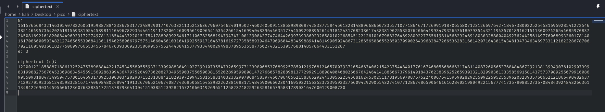
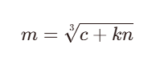
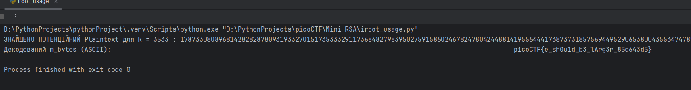

The task is to break an RSA ciphertext with a very small public exponent `e`.  

> [!TIP]
> A good [article](https://amsghimire.medium.com/low-exponent-attack-511bf5d227fc) to remind you how RSA encryption works.  


ciphertext:  
  

If my [write-up](../content/Cryptography/Mind%20your%20Ps%20and%20Qs.md) to Mind your Ps and Qs i tried `iroot` method and explained when it works. 
This [write-up](https://ir0nstone.gitbook.io/notes/writeups/picogym/cryptography/mini-rsa) also can be useful.  

iroot does the following:
- calculates the root of the e-th degree for the ciphertext number
- adds a Boolean value indicating whether the ciphertext number is a perfect root of the e-th degree
- returns a tuple containing the root of the ciphertext and a Boolean value indicating whether it is an EXACT integer (i.e., without remainder).

> [!NOTE]
> **Perfect e-th root**: This means that the e-th root of a given number is an integer. For example, 3 is the perfect square root of 9. 2 is the perfect cube root of 8.

If `m**e < N`, then it is sufficient to simply take the root of the e-th degree. If `m**e >= N`, then n multiplied by 1 or 2 or 3 must be added to the ciphertext, and so on until the root of the e-th degree is True:

<div align="center">



</div>

Let's write a Python program to solve this problem:

> [!TIP]
> This script as well as other I left here: [*click*](https://github.com/Sarmatae685/PicoCTF-write-ups/blob/main/content/scripts/cryptography/Mini%20RSA/iroot_usage.py)

```python
from gmpy2 import iroot

ct = 1220012318588871886132524757898884422174534558055593713309088304910273991073554732659977133980685370899257850121970812405700793710546674062154237544840177616746805668666317481140872605653768484867292138139949076102907399831998827567645230986345455915692863094364797526497302082734955903755050638155202890599808147276605782889813772992918898400408026067642464141885067379614918437023839625205930332182990301333585691581437573708925507991608699550931884734959475780164693178925308303420298715231388421829397209435815583140323329070684583974607064056215836529244330562254568162453025117819569708767522400676415959028292550922595255396203239357606521218664984826377129270592358124859832816717406984802489441913267065210674087743685058164539822623810831754845900660230416950321563523723959232766094292905543274107712867486590646161628402198049221567774173578088527367084843924843266361134842269034459560612360763383547251378793641304151038512392821572406034926965112582374825926358165795831789031647600129008730
e = 3
n = 1615765684321463054078226051959887884233678317734892901740763321135213636796075462401950274602405095138589898087428337758445013281488966866073355710771864671726991918706558071231266976427184673800225254531695928541272546385146495736420261815693810544589811104967829354461491178200126099661909654163542661541699404839644035177445092988952614918424317082380174383819025585076206641993479326576180793544321194357018916215113009742654408597083724508169216182008449693917227497813165444372201517541788989925461711067825681947947471001390843774746442699739386923285801022685451221261010798837646928092277556198145662924691803032880040492762442561497760689933601781401617086600593482127465655390841361154025890679757514060456103104199255917164678161972735858939464790960448345988941481499050248673128656508055285037090026439683847266536283160142071643015434813473463469733112182328678706702116054036618277506997666534567846763938692335069955755244438415377933440029498378955355877502743215305768814857864433151287
max_k_to_check = 2000000

for k in range(max_k_to_check):
    value_to_root = ct + k * n

    if value_to_root < 0:
        print(f"value_to_root became less than 0 for k = {k}.\nExit the loop" )
        break

    m_tuple = iroot(value_to_root, e)

    if m_tuple[1] == True:
        potential_m_int = int(m_tuple[0]) # convert to int() so that the bit_length() method can be called
        if potential_m_int < n:
            print(f"POTENTIAL Plaintext FOUND for k = {k} : {potential_m_int}")
            if potential_m_int == 0:
                m_bytes = b'\x00'
                byte_length = 1
            else:
                byte_length = (potential_m_int.bit_length() + 7) // 8 # division without remainder, leaving only the whole part
                m_bytes = potential_m_int.to_bytes(byte_length, byteorder='big') # RSA uses big-endian

            decoded_m_ascii = m_bytes.decode('ascii', errors='replace')
            print(f"Decoded m_bytes (ASCII): {decoded_m_ascii}")
        else: # if potential_m_int >= n
            print(f"\nFound perfect root for k = {k}, but m ({potential_m_int}) >= n. Invalid candidate.")
```

First, a simple script was written that simply calculates `iroot(ct, e)`, but the method returned false, so it is necessary to find `k` for which the cube root is an integer.

- `for k in range(max_k_to_check)` -  move to `k` 2000000 to get to an integer
- `m_tuple = iroot(value_to_root, e)` – calculate the root of the e-th degree for `ct + k * n`
- `if m_tuple[1] == True`: – remember that the method returns a tuple, and if the first element is True, it means that it has found the value `k` for which `m` can be an integer
- `potential_m_int = int(m_tuple[0])` – convert to `int()` so that the `bit_length()` method can be called
- `byte_length = (potential_m_int.bit_length() + 7) // 8` – the `bit_length()` method returns the minimum number of bits required to represent this number in binary form, excluding leading zeros.
- `m_bytes = potential_m_int.to_bytes(byte_length, byteorder='big')` – using the `to_bytes()` method, we convert to bytes, specifying the length calculated in the previous line and the big endian order (straight order)
- `decoded_m_ascii = m_bytes.decode('ascii', errors='replace')` encode as ASCII characters  

<details>
  <summary><em>Why</em> <code>(bit_length() + 7) // 8</code>?</summary>

If we simply divide the number of bits by 8, we get the number of bytes with a fractional part (for example, 9 bits / 8 = 1.125 bytes). 
But bytes cannot be "divided" like that. We need a whole number of bytes. 
Even if we only have 1 bit of data, we still need at least 1 byte to store it. 
If we have 9 bits, we need 2 bytes (one byte is not enough). 
We need to round up to the nearest whole number of bytes.  

- 8 // 8 = 1 (8 bits = 1 byte - correct)
- 9 // 8 = 1 (9 bits = 1 byte - incorrect, 2 is required)
- 7 // 8 = 0 (7 bits = 0 bytes - incorrect, 1 is required)

The trick with adding 7: Adding 7 before dividing by 8 is a standard way to implement integer division with rounding up.  
- The formula for rounding up when dividing `a` by `b` is as follows: 
  ```
  (a + b - 1) // b.
  ```
- In our case, `a` - number of bits (`potential_m_int.bit_length()`), and `b` is 8.
- Therefore, the formula becomes:
  
  `(potential_m_int.bit_length() + 8 - 1) // 8`, which simplifies to `(potential_m_int.bit_length() + 7) // 8`.


Here's how it works for the number of bits:
- 1 bit: (1 + 7) // 8 = 8 // 8 = 1 (1 byte - correct)
- 7 bits: (7 + 7) // 8 = 14 // 8 = 1 (1 byte - correct)
- 8 bits: (8 + 7) // 8 = 15 // 8 = 1 (1 byte - correct)
- 9 bits: (9 + 7) // 8 = 16 // 8 = 2 (2 bytes - correct)
- 15 bits: (15 + 7) // 8 = 22 // 8 = 2 (2 bytes - correct)
- 16 bits: (16 + 7) // 8 = 23 // 8 = 2 (2 bytes - correct)
- 17 bits: (17 + 7) // 8 = 24 // 8 = 3 (3 bytes - correct)

</details>

  

k = 3533

`picoCTF{e_sh0u1d_b3_lArg3r_85d643d5}`

