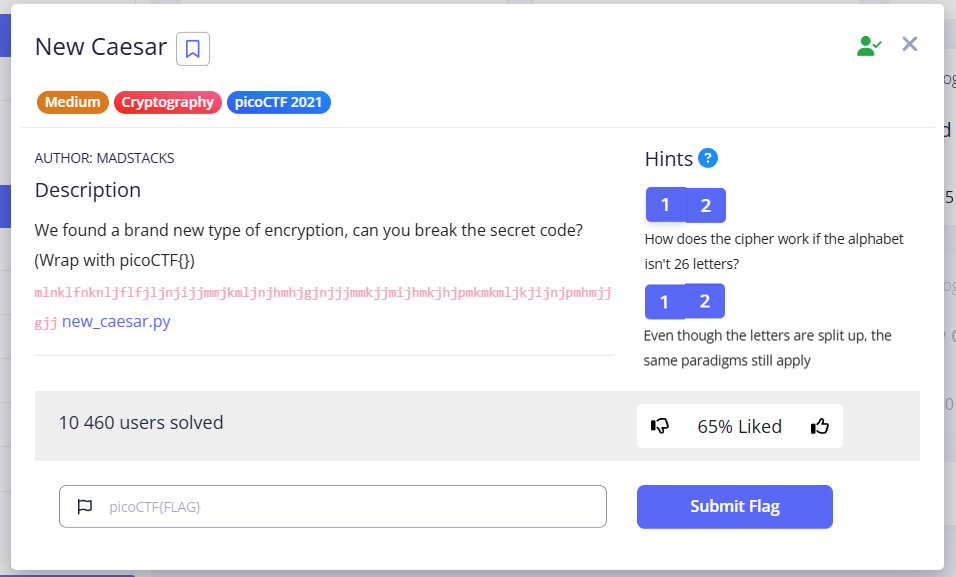
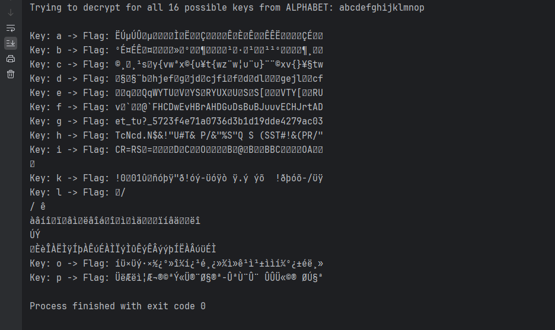

In this task, we have a flag: `mlnklfnknljflfjljnjijjmmjkmljnjhmhjgjnjjjmmkjjmijhmkjhjpmkmkmljkjijnjpmhmjjgjj`

and the program with which it was encrypted. The program is similar to Caesar's cipher, but:  


* **Size and alphabet:** 16 characters ('a'-'p') versus 26 (a-z).
* **Intermediate encoding:** `b16_encode` is used before shifting.
* **Shifted object:** The **result** of `b16_encode` is shifted, not the original text.


Let's look at the encryption program `new_ceasar.py`:


```python
import string

LOWERCASE_OFFSET = ord("a")
ALPHABET = string.ascii_lowercase[:16]

def b16_encode(plain):
	enc = ""
	for c in plain:
		binary = "{0:08b}".format(ord(c))
		enc += ALPHABET[int(binary[:4], 2)]
		enc += ALPHABET[int(binary[4:], 2)]
	return enc

def shift(c, k):
	t1 = ord(c) - LOWERCASE_OFFSET
	t2 = ord(k) - LOWERCASE_OFFSET
	return ALPHABET[(t1 + t2) % len(ALPHABET)]

flag = "picoCTF"
key = 'a'
assert all([k in ALPHABET for k in key])
assert len(key) == 1

b16 = b16_encode(flag)
enc = ""
for i, c in enumerate(b16):
	enc += shift(c, key[i % len(key)])
print(enc)
```

break down the code: 
`ALPHABET = string.ascii_lowercase[:16]`: is a limited alphabet consisting only of the first 16 lowercase letters of the English alphabet.: `'abcdefghijklmnop'`. Length `ALPHABET` = 16.

Method `b16_encode(plain) ` 


* Extracts `decimal ascii` values `c` (`for c in plain`) adds zeros to make it 8 characters long and converts it to binary format. For example: `ord('a')` = 97 --> `01100001`
* divides into 2 parts: `[:4]`  - takes from the binary values digits by indexes from 0 to 3, than takes base 2 number and converts to decimal int num (it will be in range 0-15). Then throws it in search by index in ALPHABET and stores found letter from ALPHABET
* same repeats for other part of binary value [4:] (indexes 4 - 7

Thus, method takes text from input, and outputs **two other letters** from the ALPHABET array **for each letter** taken by `for` loop. 

Method `shift(c, k):`

* takes `с` from string previously processed by `b16_encode`, and key `k`, which **may be 1 CHAR from ALPHABET**. About it hints exception, that all `k` chars must be present in ALPHABET array and key length == `1`


```python
assert all([k in ALPHABET for k in key])
assert len(key) == 1
```


* for `с`, `k` finds decimal ascii value and subtracts global variable `LOWERCASE_OFFSET = ord("a")` to make them all in range 0-15 (ALPHABET indexes): variables `t1` and `t2`
* Performs addition of these indices modulo the length of `ALPHABET` (16).
* The result is a new index, which is used to select a character from `ALPHABET`.

That is, it is a classic affine cipher with addition, but with an alphabet length of 16 instead of 26.

- In the main body of the loop `for i, c in enumerate(b16)`, the method `enumerate(b16)` returns a pair (index, value), and they are written each iteration in `i, c`. Therefore, will move to `len(b16) - 1`. 
- `key[i % len(key)]` - This expression determines which key symbol is used for shifting in a given iteration. `i % len(key)`: Calculates the remainder of dividing the current index `i` by the key length. Since the key length is 1, `i % 1` will always return 0 for any integer `i`. Probably, the author of the code just wanted to confuse people this way, because the key is *always 1 character long* and the modulus will always be 0.

In other words, to decrypt this algorithm, we need to create a program that will perform all actions in reverse order:

Here I described what it should perform:

`unshift`:
1. takes encrypted `c` char and `k` key 
2. Finds their indexes (from their dec ASCII representations subtract LOWERCASE_OFFSET)
3. recreate the original index (ciphertext character index - key index and then mod16 to make it in digits from 0 to 15)
4. `ALPHABET[recreated index]`

`b16_decode`:
1. Takes a string whose characters are all present in ALPHABET
2. Processes characters in pairs, since we converted the characters to binary code and divided them into `[:4]` `[4:]`
3. Finds the index in ALPHABET for each character, since in the original program we converted bits to dec and threw them into `ALPHABET[dec]`. Now vice versa, the index --> converts to a 4-bit representation.
4. Concatenates two numbers by 4 bits each back into an 8-bit string
5. Converts this integer back to an ASCII character with `chr()`
6. Combines all received characters back into a potential flag


All that remains is to write the final double loop, where the outer loop will iterate through the characters of ALPHABET in order to find the correct key, and the inner loop will take the key selected by the outer loop and take each ciphertext character `mlnklfnknljflfjljnjijjmmjkmljnjhmhjgjnjjjmmkjjmijhmkjhjpmkmkmljkjijnjpmhmjjgjj` and throw this pair into the `unshift` method, thereby extracting the `b16 encoded` string. Then the entire string will be passed to the `b16_decode` function, and so on for all possible keys (16 variants from ALPHABET):

> [!NOTE]
> I duplicated code here: [*click*](https://github.com/Sarmatae685/PicoCTF-write-ups/blob/main/content/scripts/cryptography/New%20Caesar/reverse%20new%20caesar.py)

```python
import string

LOWERCASE_OFFSET = ord("a")
ALPHABET = string.ascii_lowercase[:16]

ENCRYPTED_FLAG = "mlnklfnknljflfjljnjijjmmjkmljnjhmhjgjnjjjmmkjjmijhmkjhjpmkmkmljkjijnjpmhmjjgjj"

def unshift(c, k):
    char_index = ord(c) - LOWERCASE_OFFSET # e.g for ord(b) - offset/ord(a) = 98 - 97 = 1
    key_index = ord(k) - LOWERCASE_OFFSET  # in this way we return the index of the character in the alphabet ALPHABET
    return ALPHABET[(char_index - key_index) % len(ALPHABET)] # in the original cipher was ALPHABET[(t1 + t2) % len(ALPHABET)] that is, we added


def b16_decode(encoded_string):
    decoded_chars = []

    for i in range(0, len(encoded_string), 2): # iterate by 2
        char1 = encoded_string[i]
        char2 = encoded_string[i+1] #but for 1 iteration we will extract 2 characters, the i-th and the next one after it

        val1 = ALPHABET.index(char1)
        val2 = ALPHABET.index(char2)

        binary1 = "{0:04b}".format(val1)
        binary2 = "{0:04b}".format(val2)

        eight_bit_binary = binary1 + binary2

        dec_value_in_ascii = int(eight_bit_binary, 2)

        decoded_char = chr(dec_value_in_ascii)

        decoded_chars.append(decoded_char)

    return "".join(decoded_chars)

print(f"Trying to decrypt for all {len(ALPHABET)} possible keys from ALPHABET: {ALPHABET}\n")

for key_char in ALPHABET: # we will search which of the 16 characters of ALPHABET will be VALID key, so this will be an outer loop
    potential_b16_encoded = "" # first unshift to get the b16_encoded string, and then b16_decode it
    for char in ENCRYPTED_FLAG:
        potential_b16_encoded += unshift(char, key_char)

    # for this key (we got string in base16) apply b16_decode
    potential_flag = b16_decode(potential_b16_encoded)

    if potential_flag != None:
        print(f"Key: {key_char} -> Flag: {potential_flag}")
```





`picoCTF{et_tu?_5723f4e71a0736d3b1d19dde4279ac03}`
