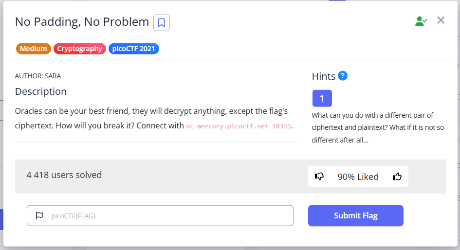
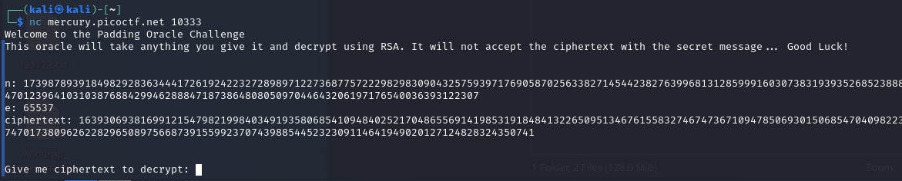
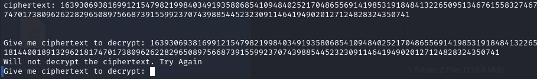
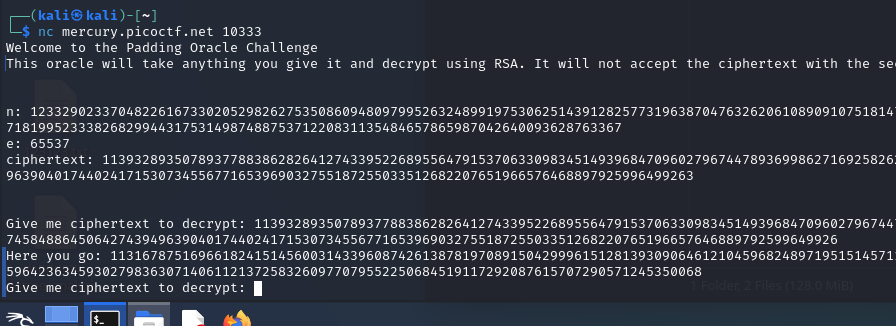
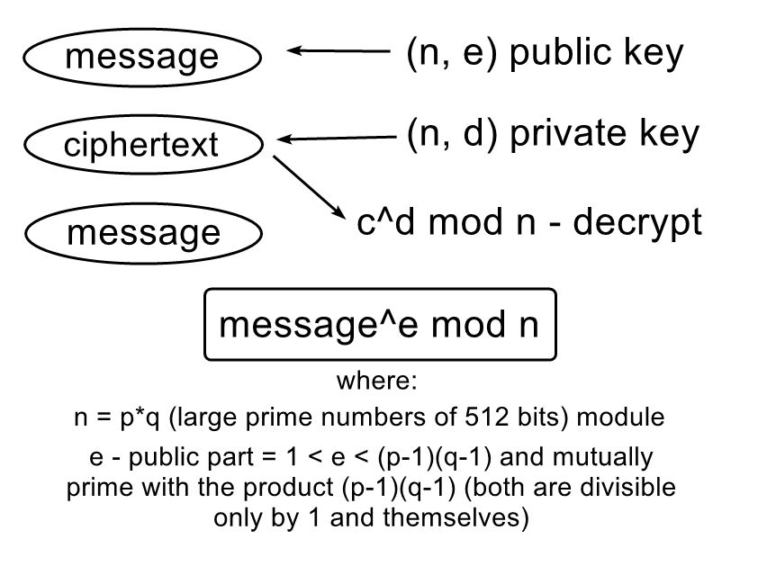
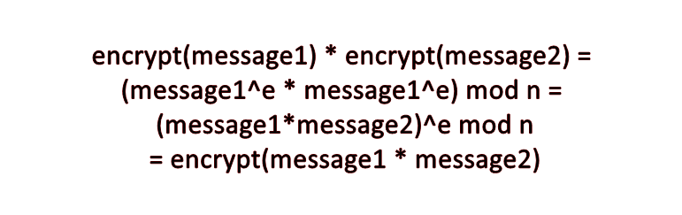
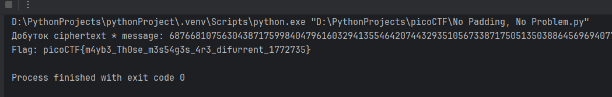

  

First connect to `nc mercury.picoctf.net 10333`.  
When switching to the server, we get:  

  

where:  
- `n` - RSA modulus
- `e` is a public exponent (the opposite, private key will be `d`, which we do not know)
- `ciphertext` - encrypted flag

It is important to note that the values of `n` and `ciphertext` change every time we log into the server, and the server also has an idle timeout.  

First, let's try to give it ciphertext:  
  

does not accept it, I try to give it exactly the same ciphertext, but remove the last digit:  
  

The server also accepts any set of numbers *except* letters. This suggests that the server accepts *everything where padding is absent*.  

<details>
  <summary><em>📖 What is Padding?</em></summary>

**Padding** – adding extra data to a message before it is encrypted. This data usually has no meaning and is needed to:
- Pad the block to the fixed length required by the algorithm (aes or hash)
- Avoid determinism, as the same message always results in the same ciphertext.

A good example is: You want to send a secret word (very short) in a sealed envelope (ciphertext). 
If the envelope is too small, anyone can guess that there is only one word inside. 
Padding is like putting extra blank pieces of paper or pieces of paper with random text in the envelope along with your secret word. 
Now the envelope is bigger, and it is harder to guess what the secret is.
  
</details>

The name of the task suggests that ciphertext padding was probably not applied to our ciphertext.  
There is also a hint:
"What if it is not so different after all...": This is the key part of the hint. It suggests that you can create new ciphertexts that have a certain mathematical relationship to the original ciphertext.  

The following write-up helped me much: [source](https://github.com/Dvd848/CTFs/blob/master/2021_picoCTF/No_Padding_No_Problem.md)    

Since we have been hinted that we can create ciphertext with a specific mathematical relationship, let's create new ciphertext. The standard RSA encryption formula:

<div align="center">

  

</div>

In the abovegiven write-up, the author notes that *unpadded RSA is homomorphic*.  

<details>
  <summary><em>📖 Homomorphic encryption</em></summary>

**Homomorphic encryption** -  is a property of encryption where mathematical operations can be performed *directly on ciphertexts* without decrypting them.
  
</details>

<div align="center">

  

</div>  

The server blocks attempts to decrypt the ciphertext it gave us, but decrypts everything else using the standard formula `decrypted_text = c^d mod n` (where `d` is the private key, which we do not know). 
However, we do know the public key `e` = 65537.  

Let's use the homomorphism of unpadded RSA: we choose the number 2 (message) as plaintext and encrypt it:
```
x = pow(2, e, n)
```

All values from this formula are here. Next, according to homomorphism, we will have:  

```
(ciphertext * x) mod n = encrypt(ciphertext * message) = pow((ciphertext*2), e, n)
```

Then we send this result `(ciphertext * x) mod n` to the server, it receives it, decrypts it, and **we divide what it has returned by 2 (by message)** and get the decrypted text (which still needs to be converted).  

Let's write a Python program for this (the values of the variables must be changed each time after restarting the server!):  

> [!TIP]
> A script as well as other scripts I left here: [*click*](../content/scripts/cryptography/No%20Padding,%20No%20Problem/solve.py)

```python
from Crypto.Util.number import long_to_bytes

n = 118694899393140300601438740810023181785746678905636582269360228605676719905088478361579988897743669122497659396273025097384493060342878497211729885217100072793914813864687346435180260223348630366934210538562839722090611275026677540192918386503692952364711612240191829507331576540266094372559167055187119947693
e = 65537
ciphertext = 20975483160078067146389226204502717295542528615500244902685475409984670320790256508621556322795196433894895894785551238549196424496432527017825371115820528130458724982379618139870867225278424798793453333650916921402218612961924138465621433836534545044090208880818006463081880001842285620493807796825903216257

message = pow(2, e, n)

multiply_ciphertext_and_message = (ciphertext * message) % n
print(f"Product of ciphertext * message: {multiply_ciphertext_and_message}")

decrypted_multiplication_by_server = 580550060391700078946913236734911770139931497702556153513487440893406629034802718534645538074938502890768853279675297196794

original_message = decrypted_multiplication_by_server // 2

try:
    flag = long_to_bytes(original_message).decode('ascii')
    print(f"Flag: {flag}")
except:
    print("Unable to decode original_message as ASCII")
    print("Showing bytes: ")
    print(long_to_bytes(original_message))
```

This code does the following:  
- Encrypts message `message = pow(2, e, n)`
- Multiplies ciphertexts with each other (+ necessarily extracts the modulus, the value of which was within the range of `n-1`)
- Divides the multiplied ciphertext by 2 and converts it to bytes, then to ASCII encoding.

  


`picoCTF{m4yb3_Th0se_m3s54g3s_4r3_difurrent_1772735}`


