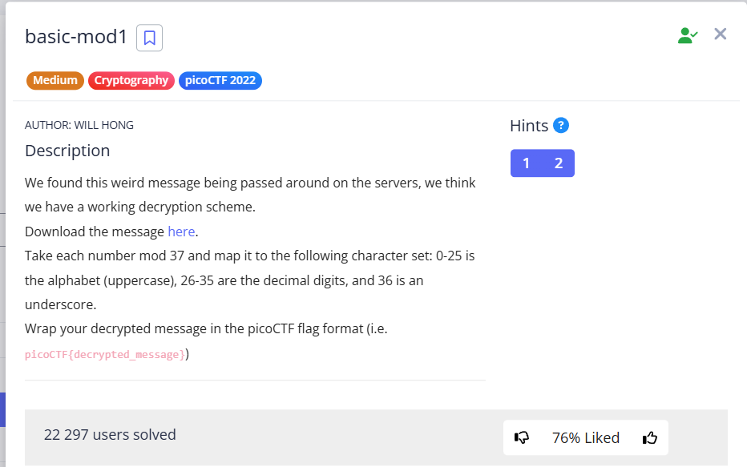
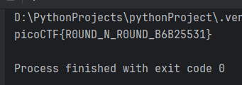
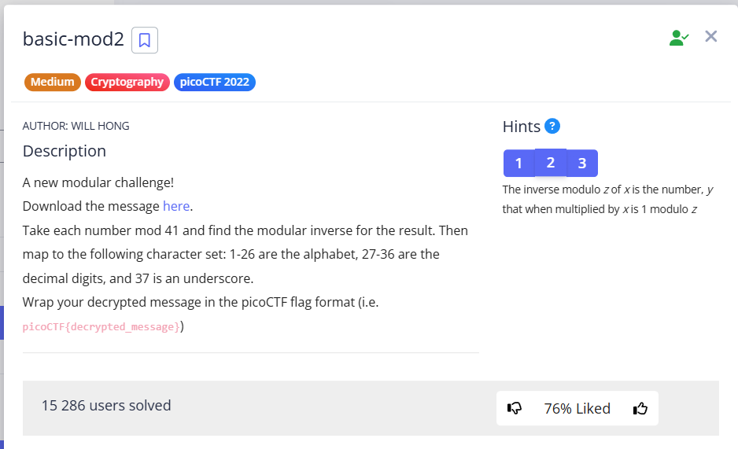
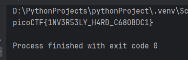

In this task, we need to implement the logic described in the task conditions. The file `message.txt` contains decimal ASCII character codes: 


```
dec = [165, 248, 94, 346, 299, 73, 198, 221, 313, 137, 205, 87, 336, 110, 186, 69, 223, 213, 216, 216, 177, 138]
```


Next, you need to perform the following actions: take each of the numbers `dec[i] mod 37` and:


* if the remainder is between 0 and 25, it is an uppercase Latin letter
* if the remainder is between 26 and 35, it is a decimal number 
* if the remainder is 36 or more, it is "_"

> [!TIP]
> I left scripts for both tasks here: [*click*](../scripts/cryptography/basic-mod1-2)

<br/>

```python
dec = [165, 248, 94, 346, 299, 73, 198, 221, 313, 137, 205, 87, 336, 110, 186, 69, 223, 213, 216, 216, 177, 138]

decoded_string = ""
for d in dec:
    d_mod = d % 37
    if d_mod in range(0, 26):
        decoded_string += chr(d_mod + ord('A'))
    elif d_mod in range(26, 36):
        decoded_string += str(d_mod - 26)
    else:
        decoded_string += "_"

print(f"picoCTF{{{decoded_string}}}")
```


There are several nuances in the code for it to work correctly:


* In the `range(0, 26)` method, the first number is included and the second is excluded. That is, the notation (0, 26) will mean 0-25.
* ```python
  if d_mod in range(0, 26): 
        decoded_string += chr(d_mod + ord('A'))` 
  ```
The condition states “Take each number mod 37 and map it to the following character set”. That is, we take the module `d_mod` and convert it into an [ASCII](https://byte-tools.com/en/ascii/) character. 
Since the uppercase letters of the English alphabet in the ASCII [table](https://byte-tools.com/en/ascii/) start at 65, and the module `d_mod` will be in the range from 0 to 25, then we must add `ord('A')` (i.e., 65) to each value.


we get:
```
d_mod = 0 -> 0 + 65 = ‘A’
d_mod = 1 -> 1 + 65 = ‘B’
…
```

* ```python
  elif d_mod in range(26, 36): 
        decoded_string += str(d_mod - 26)
  ```


The condition states "26-35 are the decimal digits", i.e. a comparison is also formed:


```
d_mod = 26 -> 26 - 26 = 0 (The result of module 26 corresponds to the number 0)
…
d_mod = 35 -> 35 - 26 = 9 (The result of module 35 corresponds to the number 9)
```





`picoCTF{R0UND_N_R0UND_B6B25531}`

---

<br/>




Similar to the previous task, we also need to write a program, but with some minor differences:

* Values 1-26 correspond to letters a-z (was 0-25)
* 27-36 correspond 0-9 (was 26-35)
* The inverted modulus is calculated ([how to do](https://stackoverflow.com/questions/4798654/modular-multiplicative-inverse-function-in-python) for Python 3.8+)

<br/>

```python
dec = [432, 331, 192, 108, 180, 50, 231, 188, 105, 51, 364, 168, 344, 195, 297, 342, 292, 198, 448, 62, 236, 342, 63]

def mod_inverse(decimal, module):
    #calculate the usual modulus.
    basic_mod = decimal % module
    return pow(basic_mod, -1, 41)

decoded_string = ""
for d in dec:
    d_mod_inverse = mod_inverse(d, 41)
    if d_mod_inverse in range(1, 27):
        decoded_string += chr(d_mod_inverse + ord('A') - 1) #A = 65, so we add 64 to the value 1
    elif d_mod_inverse in range(27, 37):
        decoded_string += str(d_mod_inverse - 27)
    else:
        decoded_string += "_"

print(f"picoCTF{{{decoded_string}}}")
```


pay attention to the following things:


* `decoded_string += chr(d_mod_inverse + ord('A') - 1)` Since letters a-z now correspond to numbers 1-26 (previously 0-25), we need to add 64, not 65 (or `ord('A') - 1`)
* ```python
  basic_mod = decimal % module 
    return pow(basic_mod, -1, 41)
  ``` 
  To invert the modulus, you must first calculate the usual modulus, and then `pow(basic_mod, -1, 41)` ([here](https://stackoverflow.com/questions/4798654/modular-multiplicative-inverse-function-in-python))





`picoCTF{1NV3R53LY_H4RD_C680BDC1}`
