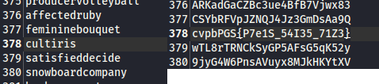

  
  
 

We are interested in the user `cultiris`, for whom we need to find a password.

According to the condition, 1st user corresponds to 1st password in the list, 2nd to 2nd, and so on. We find the desired user:  

 

`picoCTF{C7r1F_54V35_71M3}`
