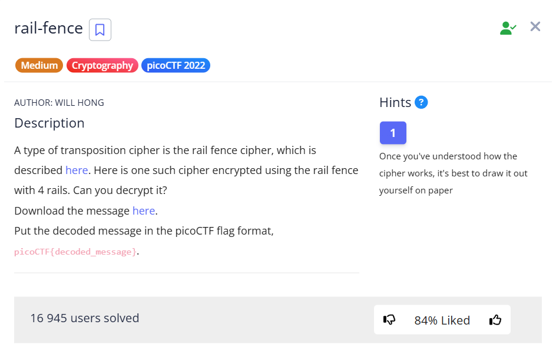
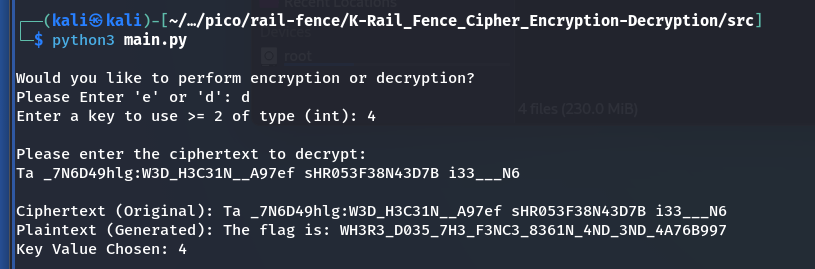

In this task, we need to decrypt the message `message.txt`, which was previously encrypted using the Rail Fence Cipher..


```
Ta _7N6D49hlg:W3D_H3C31N__A97ef sHR053F38N43D7B i33___N6
```
> [!NOTE]
> Resources that may help:
> * Rail Fence Cipher - Encryption and Decryption | GeekForGeeks : [*click*](https://www.geeksforgeeks.org/rail-fence-cipher-encryption-decryption/)
> * K-Rail Fence Cipher Encryption/Decryption Algorithm | GitHub : [*click*](https://github.com/LeoMartinezTAMUK/K-Rail_Fence_Cipher_Encryption-Decryption)

---

Let's use the decryption [tool](https://github.com/LeoMartinezTAMUK/K-Rail_Fence_Cipher_Encryption-Decryption) I've found on GitHub:


```bash
git clone https://github.com/LeoMartinezTAMUK/K-Rail_Fence_Cipher_Encryption-Decryption.git
```


According to the condition, there were 4 "rails.":  





`picoCTF{WH3R3_D035_7H3_F3NC3_8361N_4ND_3ND_4A76B997}`
