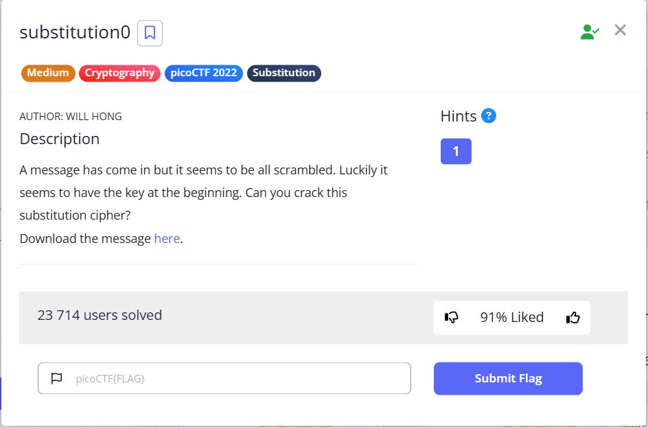
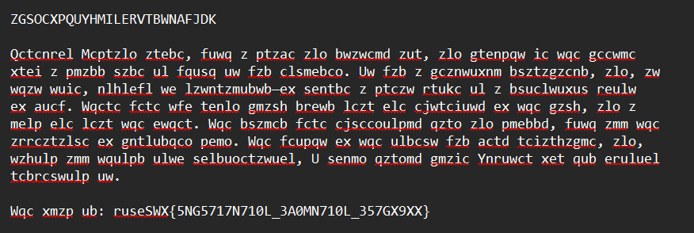
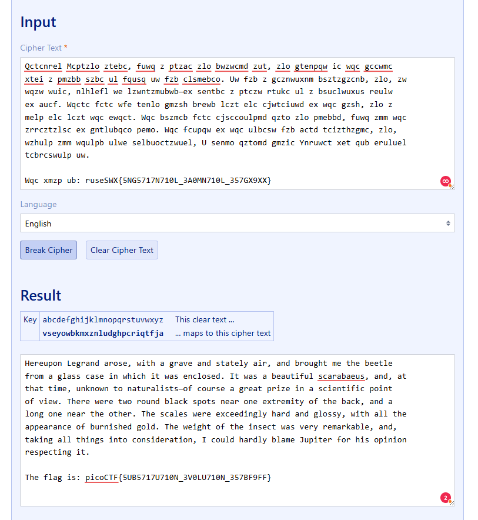
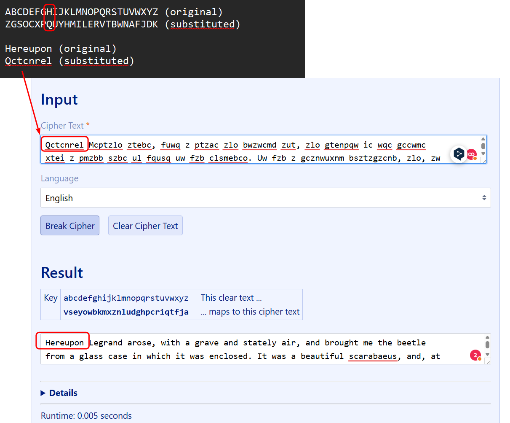

In this task, we need to solve a substitution cipher. In the message `message.txt`, we are given:

* a "shifted" alphabet
* a message written in this alphabet
* a flag, also shifted

---

The name of the task gives a hint on how to find the right [tool](https://www.guballa.de/substitution-solver)

I tried to compare the original alphabet with the shifted one and decrypt some text myself to better understand the algorithm:  

`picoCTF{5UB5717U710N_3V0LU710N_357BF9FF}`
