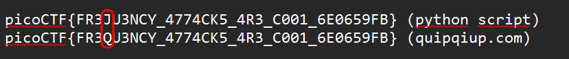

---

## substitution1

As in [substitution0](substitution0.md), we need to decrypt the given text:

```
LKOb (bwvek ove lgqkhej kwj osgx) gej g kyqj vo lvrqhkje bjlhetky lvrqjktktvu. Lvukjbkgukb gej qejbjukjz dtkw g bjk vo lwgssjuxjb dwtlw kjbk kwjte lejgktftky, kjlwutlgs (guz xvvxstux) bitssb, guz qevmsjr-bvsftux gmtstky. Lwgssjuxjb hbhgssy lvfje g uhrmje vo lgkjxvetjb, guz dwju bvsfjz, jglw ytjszb g bketux (lgssjz g osgx) dwtlw tb bhmrtkkjz kv gu vustuj blvetux bjeftlj. LKOb gej g xejgk dgy kv sjgeu g dtzj geegy vo lvrqhkje bjlhetky bitssb tu g bgoj, sjxgs juftevurjuk, guz gej wvbkjz guz qsgyjz my rguy bjlhetky xevhqb gevhuz kwj dvesz ove ohu guz qeglktlj. Ove kwtb qevmsjr, kwj osgx tb: qtlvLKO{OE3AH3ULY_4774LI5_4E3_L001_6J0659OM}
```

At first I found a [Python module](https://pypi.org/project/cipher-solver/) for decryption purposes and wrote a script to decryption:


```python
from cipher_solver.simple import SimpleSolver

with open("message.txt", "r") as f:
    ciphertext = f.read()

solver = SimpleSolver(ciphertext)

solver.solve()

print("Decrypted text:")
print(solver.plaintext())

print("\nDecryption key:")
print(solver.decryption_key())
```


The above given script searches for the key and decodes the text correctly, but makes a mistake in one of the symbols on the flag, which makes it unsuitable:  


```
Decrypted text:
CTFs (short for capture the flag) are a type of computer security competition. Contestants are presented with a set of challenges which test their creativity, technical (and googling) skills, and problem-solving ability. Challenges usually cover a number of categories, and when solved, each yields a string (called a flag) which is submitted to an online scoring service. CTFs are a great way to learn a wide array of computer security skills in a safe, legal environment, and are hosted and played by many security groups around the world for fun and practice. For this problem, the flag is: picoCTF{FR3XU3NCY_4774CK5_4R3_C001_6E0659FB}

Decryption key:
gmlzjoxwtcisruvqnebkhfdayp
```


Therefore, let's use the tool to recheck key : [quipquip](https://quipqiup.com):<br/>


Let's compare the flags from the script and the online tool:<br/>




Flag extracted by quipquip is suitable: 

`picoCTF{FR3QU3NCY_4774CK5_4R3_C001_6E0659FB}`

---

## substitution2


<br/>

This time, the text is without spaces.

```
fnjdjjzqsfsjpjdxwmfnjdcjwwjsfxhwqsnjynqensknmmwkmuvafjdsjkadqftkmuvjfqfqmgsqgkwayqgekthjdvxfdqmfxgyaskthjdknxwwjgejfnjsjkmuvjfqfqmgslmkasvdquxdqwtmgstsfjusxyuqgqsfdxfqmglagyxujgfxwscnqknxdjpjdtasjlawxgyuxdojfxhwjsoqwwsnmcjpjdcjhjwqjpjfnjvdmvjdvadvmsjmlxnqensknmmwkmuvafjdsjkadqftkmuvjfqfqmgqsgmfmgwtfmfjxknpxwaxhwjsoqwwshafxwsmfmejfsfayjgfsqgfjdjsfjyqgxgyjzkqfjyxhmafkmuvafjdskqjgkjyjljgsqpjkmuvjfqfqmgsxdjmlfjgwxhmdqmasxllxqdsxgykmujymcgfmdaggqgeknjkowqsfsxgyjzjkafqgekmglqeskdqvfsmlljgsjmgfnjmfnjdnxgyqsnjxpqwtlmkasjymgjzvwmdxfqmgxgyquvdmpqsxfqmgxgymlfjgnxsjwjujgfsmlvwxtcjhjwqjpjxkmuvjfqfqmgfmaknqgemgfnjmlljgsqpjjwjujgfsmlkmuvafjdsjkadqftqsfnjdjlmdjxhjffjdpjnqkwjlmdfjknjpxgejwqsufmsfayjgfsqgxujdqkxgnqensknmmwsladfnjdcjhjwqjpjfnxfxgagyjdsfxgyqgemlmlljgsqpjfjkngqiajsqsjssjgfqxwlmdumagfqgexgjlljkfqpjyjljgsjxgyfnxffnjfmmwsxgykmglqeadxfqmglmkasjgkmagfjdjyqgyjljgsqpjkmuvjfqfqmgsymjsgmfwjxysfayjgfsfmogmcfnjqdjgjutxsjlljkfqpjwtxsfjxknqgefnjufmxkfqpjwtfnqgowqojxgxffxkojdvqkmkflqsxgmlljgsqpjwtmdqjgfjynqensknmmwkmuvafjdsjkadqftkmuvjfqfqmgfnxfsjjosfmejgjdxfjqgfjdjsfqgkmuvafjdskqjgkjxumgenqensknmmwjdsfjxknqgefnjujgmaenxhmafkmuvafjdsjkadqftfmvqiajfnjqdkadqmsqftumfqpxfqgefnjufmjzvwmdjmgfnjqdmcgxgyjgxhwqgefnjufmhjffjdyjljgyfnjqduxknqgjsfnjlwxeqsvqkmKFL{G6D4U_4G41T515_15_73Y10A5_42JX1770}
```


Above given Python script works on this ciphertext:<br/><br/>


```
Decrypted text:
thereexistseveralotherwellestablishedhighschoolcomputersecuritycompetitionsincludingcyberpatriotanduscyberchallengethesecompetitionsfocusprimarilyonsystemsadministrationfundamentalswhichareveryusefulandmarketableskillshoweverwebelievetheproperpurposeofahighschoolcomputersecuritycompetitionisnotonlytoteachvaluableskillsbutalsotogetstudentsinterestedinandexcitedaboutcomputersciencedefensivecompetitionsareoftenlaboriousaffairsandcomedowntorunningchecklistsandexecutingconfigscriptsoffenseontheotherhandisheavilyfocusedonexplorationandimprovisationandoftenhaselementsofplaywebelieveacompetitiontouchingontheoffensiveelementsofcomputersecurityisthereforeabettervehiclefortechevangelismtostudentsinamericanhighschoolsfurtherwebelievethatanunderstandingofoffensivetechnijuesisessentialformountinganeffectivedefenseandthatthetoolsandconfigurationfocusencounteredindefensivecompetitionsdoesnotleadstudentstoknowtheirenemyaseffectivelyasteachingthemtoactivelythinklikeanattackerpicoctfisanoffensivelyorientedhighschoolcomputersecuritycompetitionthatseekstogenerateinterestincomputerscienceamonghighschoolersteachingthemenoughaboutcomputersecuritytopijuetheircuriositymotivatingthemtoexploreontheirownandenablingthemtobetterdefendtheirmachinestheflagispicoCTF{N6R4M_4N41Y515_15_73D10U5_42EA1770}

Decryption key:
xhkyjlenqiowugmvbdsfapcztr
```
<br/>

`picoCTF{N6R4M_4N41Y515_15_73D10U5_42EA1770}`
