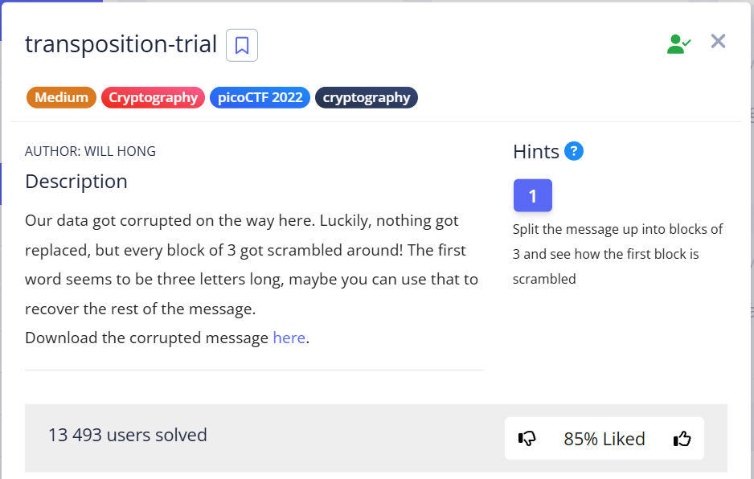

Given text:

```
heTfl g as iicpCTo{7F4NRP051N5_16_35P3X51N3_V6E5926A}4
```

and a hint that it is worth breaking this text into blocks of 3 and seeing in what order the characters were rearranged.

---

In the first block, the word "`The`" is clearly visible:

```
213     123
heT --> The
```

Following this principle, I divide the entire text into blocks of 3 characters and form 2 columns: with mixed and correct order:  

```
231 123 look at the last -->  first -->  middle
heT The 
fl   fl
g a ag 
s i is 
icp pic
CTo oCT
{7F F{7
4NR R4N
P05 5P0
1N5 51N
_16 6_1
_35 5_3
P3X XP3
51N N51
3_V V3_
6E5 56E
926 692
A}4 4A}

The flag is picoCTF{7R4N5P051N6_15_3XP3N51V3_56E6924A} 
```

