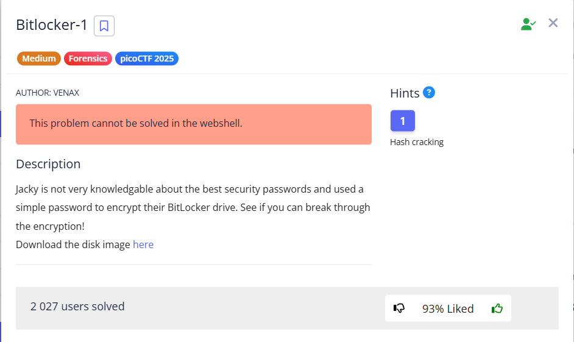


In this task, we need to extract the password from the encrypted disk image `bitlocker-1.dd`.


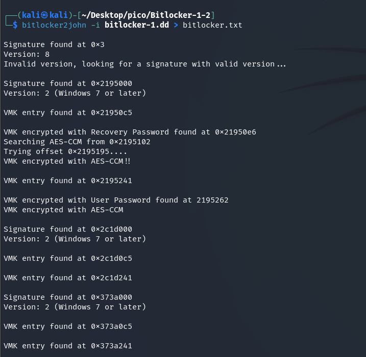


```bash
bitlocker2john -i bitlocker-1.dd > bitlocker.txt
```

> [!NOTE]
> `bitlocker2john` – extracts the BitLocker hash password from the disk image. `-i (input)` – specify the input file


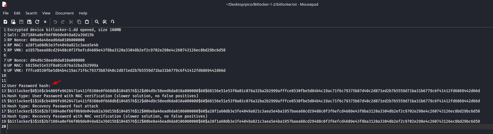


```
User Password hash:
$bitlocker$0$16$cb4809fe9628471a411f8380e0f668db$1048576$12$d04d9c58eed6da010a000000$60$68156e51e53f0a01c076a32ba2b2999afffce8530fbe5d84b4c19ac71f6c79375b87d40c2d871ed2b7b5559d71ba31b6779c6f41412fd6869442d66d
```

Found a hash that now needs to be cracked. We will brute force it with the `rockyou.txt` dictionary. Let's take the first 10,000 passwords so that the process would not be too long:  

```bash
head -n 10000 /usr/share/wordlists/rockyou.txt > 1-10000.txt
```


We will perform the substitution using 'hashcat':


```bash
hashcat -m 22100 -a 0 bitlocker.txt 1-10000.txt -w 3
```

* `-m 22100`: This argument `-m` (from *mode*) tells `hashcat` **which type of hash to crack**. Each hash type has its own unique identifier
    * `22100 `– this is the identifier for **BitLocker**
* `-a 0`: (*attack mode*) specify `hashcat` which attack method to use.
    * `0` – identifier for a dictionary attack (Wordlist Attack)

        `hashcat` will take each word from `1-10000.txt`, hash it using the `BitLocker (-m 22100)` algorithm, and compare the resulting hash with `bitlocker.txt`.

* `-w 3`: (*workload profile*) specify `hashcat` how intensively to use PC resources.
    * `1`: Conservative, less resource consumption.
    * `2`: Standard.
    * `3`: **Intensive (aggressive)**. Uses maximum GPU or CPU resources to achieve the highest cracking speed.


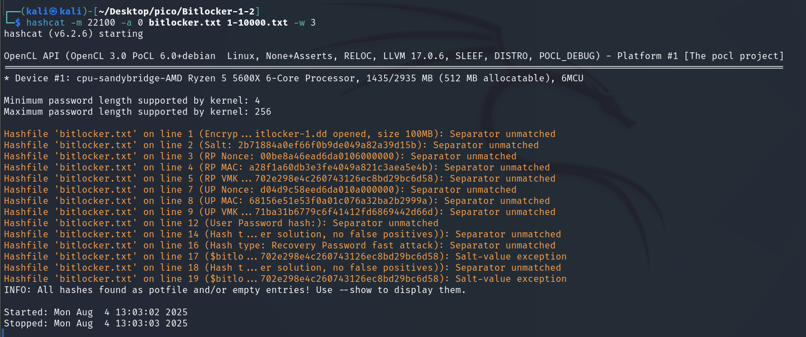


I had searched for this hash before, so hashcat saved it in `potfile`:

> [!NOTE]
> `hashcat.potfile` (or simply `hashcat.pot`): This is done to not to crack the same hash several times if the attack is launched several times.

Let's review it:

```bash
hashcat -m 22100 bitlocker.txt --show
```

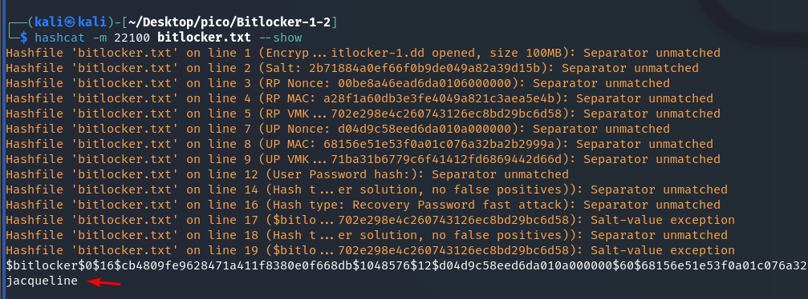


So the password is `jacqueline`. Now we can decrypt the BitLocker file with this password and view its contents.

Create a directory under `dislocker-file`. This is a virtual device representing a decrypted volume.

```bash
mkdir dislocker
```

Decryption will perform with tool `dislocker` with `-u` parameter:

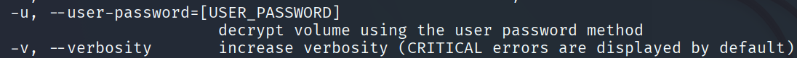


```bash
sudo dislocker -v bitlocker-1.dd -ujacqueline dislocker
```

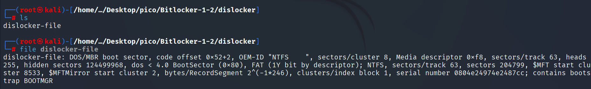


Create a directory in `/mnt` where we will mount our decrypted disk image:

```bash
sudo mkdir /mnt/bitlocker1
```

Mount:


```bash
sudo mount -o loop dislocker-file /mnt/bitlocker1
```

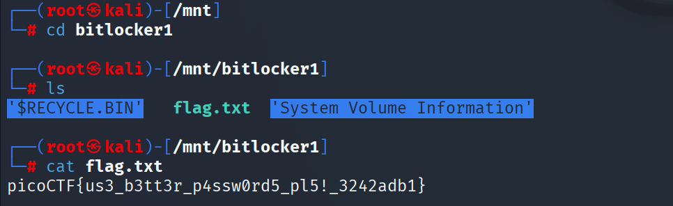

---

##  How to unmount

Let's see what's mounted now:  

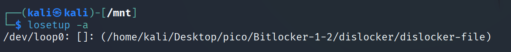

Unmount:


If you get this error:

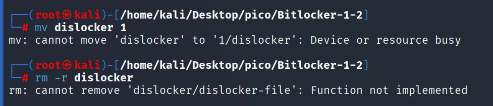

> [!TIP] 
> found solution here: [*click*](https://linuxhandbook.com/umount-target-busy/)

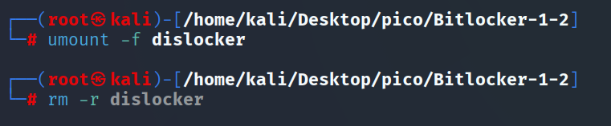

`picoCTF{us3_b3tt3r_p4ssw0rd5_pl5!_3242adb1}`
