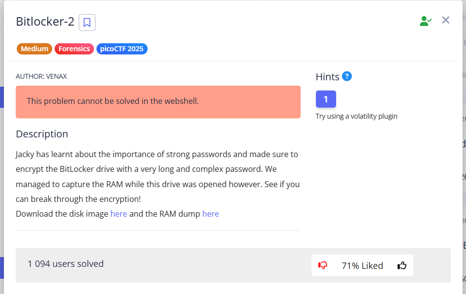
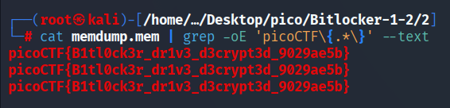

This task probably should not have been solved in this way, but nevertheless, it can be solved this way.

> [!WARNING]
> I tried to solve this task using `volatility2` version 2.6.1 framework and Python 2.7 but ran into a lot of problems, so I dropped this.
>
> **If you solved it with volatility and want to share your solution**, write me on `yura661tao@gmail.com`

 `picoCTF{B1tl0ck3r_dr1v3_d3crypt3d_9029ae5b}`
