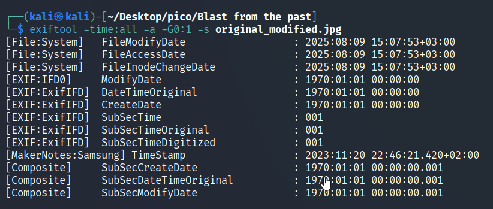
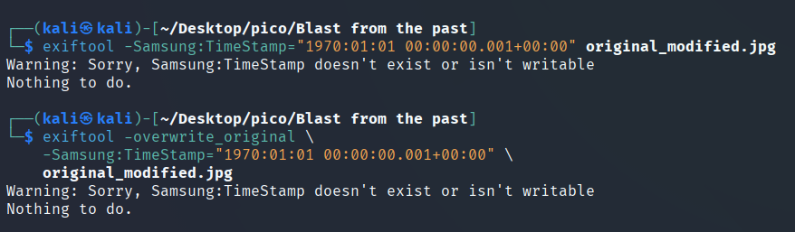

The hint in the task prompted me to look for some tools other than `exiftool` for modifying metadata. 


### jexiftoolgui

After searching for tools with a GUI, I found `jExifToolGUI`. (GitHub [README](https://github.com/hvdwolf/jExifToolGUI/blob/master/README.md) | [Releases](https://github.com/hvdwolf/jExifToolGUI/releases/tag/2.0.2))

```bash
sudo dpkg -i jexiftoolgui-2.0.2.deb
``` 

Copy the task file and open for modification:

```bash
jexiftoolgui original_modified.jpg 
```

I tried all the options on this list:<br/>

<table>
<tr>
<td></td>
<td></td>
</tr>
</table>

<!--


-->

Let's try sending:

```bash
nc -w 2 mimas.picoctf.net 60913 < original_modified.jpg
nc mimas.picoctf.net 51523
```


4 more tags are missing modifications. Searching in `jExifToolGUI` for those that have not been changed:


and those who has been overwritten:


tried command:

```bash
exiftool -AllDates="1970:01:01 00:00:00.001" original_modified.jpg
```

But server that checks the tags returns the same 3/7.

According to the task, the time must be: `1970:01:01 00:00:00.001+00:00`, where `.001` – milliseconds, so in addition to time tags, `Sub Sec Time*` tags are needed to be modified.

In total, 7 tags need to be configured:<br/>

✅ `IFD0: ModifyDate` - done

✅ `ExifIFD: DateTimeOriginal` - done

✅ `ExifIFD: CreateDate` - done

❌ `Composite: SubSecCreateDate` - requires milliseconds `.001`

❌ 3 other tags (need to find out which ones)

<br/>

### exiftool

First, let's look at all the dates in the file:

```bash
exiftool -time:all -a -G0:1 -s original_modified.jpg
```


Add milliseconds to `Sub Sec Time*` tags:


```bash
exiftool -SubSecTime="001" original_modified.jpg 
exiftool -SubSecTimeOriginal="001" original_modified.jpg 
exiftool -SubSecTimeDigitized="001" original_modified.jpg
```

Let's look at the changes:





Sending to server: \


Only 1 tag remains: `Samsung: TimeStamp`. This is a specific tag for Samsung phone cameras.

Let's find out which Samsung-specific tags are in the file.:


```bash
exiftool -Samsung:all -s original_modified.jpg
```


Let's try to overwrite this tag in two ways:  

#### I method

```bash
exiftool -Samsung:TimeStamp="1970:01:01 00:00:00.001+00:00" original_modified.jpg
```

#### II method

```bash
exiftool -overwrite_original \
    -Samsung:TimeStamp="1970:01:01 00:00:00.001+00:00" \
    original_modified.jpg
```

#### III method

```bash
exiftool -MakerNotes:TimeStamp="1970:01:01 00:00:00.001+00:00" -s original_modified.jpg
```





But to no avail. 

I pocked aroung and discovered, that we need to use `strings` to look at the timestamp in **milliseconds** that have passed since `January 1, 1970`. At the very end of the file, we find:

```bash
strings original_modified.jpg > strings_original_modified.txt
```


<br/>

### Time Calc

Let's use the online tool [Time Calcuator](https://www.timecalculator.net/milliseconds-to-date):


> [!NOTE]
> Timestamp - time in seconds/milliseconds that has elapsed since January 1, 1970.  


Date `1970:01:01 00:00:00.001+00:00 ` means, that since the start of the count **1 millisecond** has passed. So:


<br/>

### ghex

Since this Samsung/MakerNotes tag is **not writable**, let's change the bytes in `ghex`:


 
This is what we need to change to `00001` (probably `1` would work too).:


Save and send:


`picoCTF{71m3_7r4v311ng_p1c7ur3_83ecb41c}`
