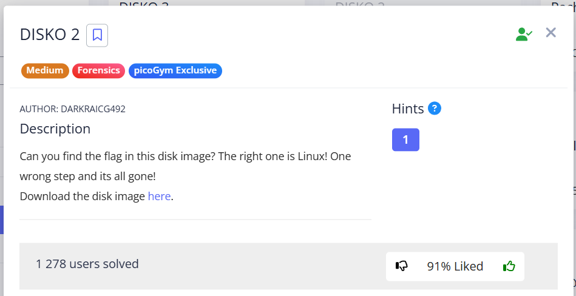

In this task, we need to examine the disk `disko-2.dd`, specifically its Linux partition, and find the flag there.

---

Let's start by reviewing the sections on the disk, the sector size, and the offset of the sections from the beginning of the files:

> [!TIP]
> Algorithm of using Sleuth kit tools for examining disks in Forensics challenges I left here: [*click*](../../notes/Examining%20disk%20with%20Sleuth%20Kit.md) 

```bash
mmls disko-2.dd
```

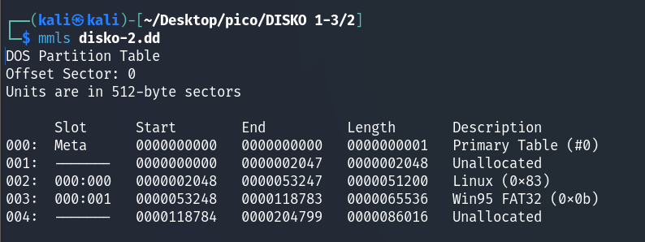


or:

```bash
fdisk -l disko-2.dd
```


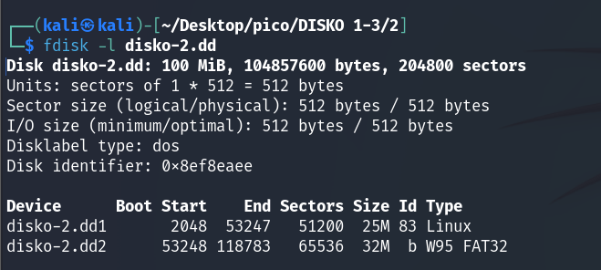


There are several partitions, but for the purposes of this task, we are interested in Linux (0x83). Let's mount the disk:


```bash
dd if=disko-2.dd of=part1.img bs=512 skip=2048 count=51200
sudo mkdir /mnt/part1
sudo mount -o loop part1.img /mnt/part1/
```


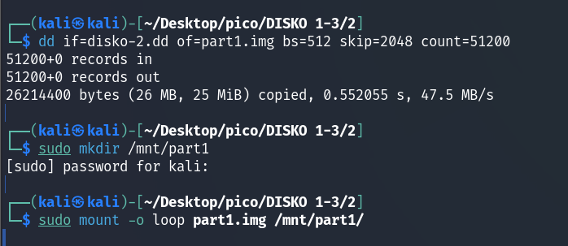

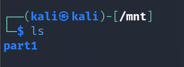


where:


* `dd` (dataset definition) — is a powerful tool for copying and converting files. It copies data from the input file (`if=...`) to the output file (`of=...`).
* `if=disko-2.dd`: `if`  **input file**. We specify that the input file is our disk image `disko-2.dd`.
* `of=part1.img`: `of`  **output file**. We create a new file `part1.img`, which will contain only our Linux partition.
* `bs=512`: `bs`  **block size**. We set the copy block size to 512 bytes because `mmls` said that the sector size is 512 bytes.
* `skip=2048`: `skip`  **skip N blocks**. We skip 2048 blocks (sectors) from the beginning of `disko-2.dd` (from 0 to 2047) because our Linux partition starts at sector 2048.
* `count=51200`: `count`  **copy N blocks**. We copy 51200 blocks (sectors) because the length of our Linux partition is exactly 51200 sectors.

Use the `lsblk` command to verify that `/mnt/part1` is mounted as `loop0`:


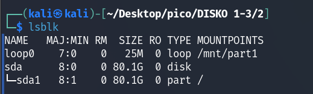


> [!NOTE]
> **Loop-device** - it is a virtual block device. It allows you to open a file (for example, a disk image) and "trick" the system into thinking that it is a real physical device (such as a hard drive or flash drive). This is necessary for mounting.
>
> How to manage loop devices: [*click*](https://itsfoss.com/loop-device-linux/)

or use `losetup -a`:


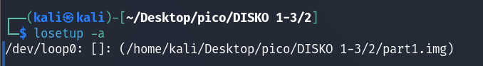


But there is nothing useful in either `/mnt/part1/bin` or `/mnt/part1/lost+found`.<br/><br/>


Let's look for strings:


```bash
strings disko-2.dd | grep -F 'picoCTF{'
```


where `-F` (fixed strings) allows to avoid character escaping. All special characters will be treated as regular characters.


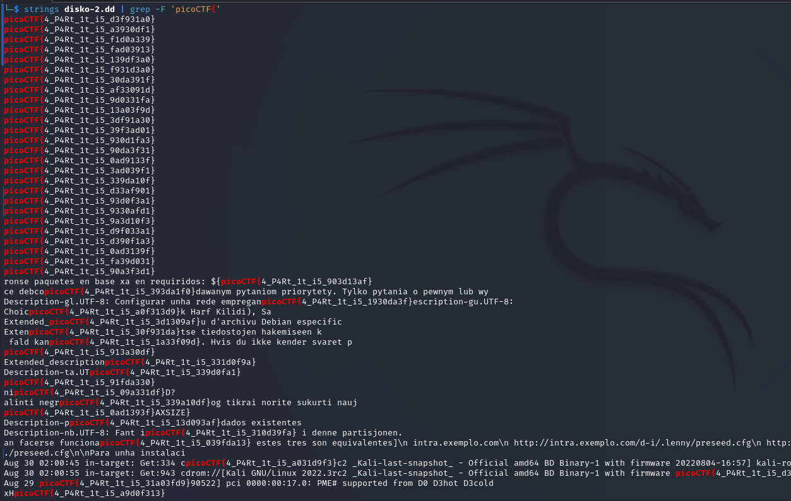


We have a bunch of flags that can be sorted manually, or done in 2 methons which I peeked at this [write-up](https://omapol.medium.com/disko2-picoctf-writeup-eaf31ebebecf): 


## I method

For the first method `strings` and `grep` is enough to get a valid flag:


Since `losetup -a` showed us that `part1.img` is in the same directory as `disko-2.dd`, we execute it there:


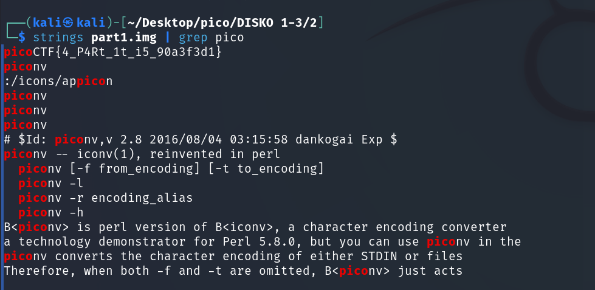

<br/>

## II method

Let's use BurpSuite to brute force the flags.

First configure the proxy to 127.0.0.1:8080:


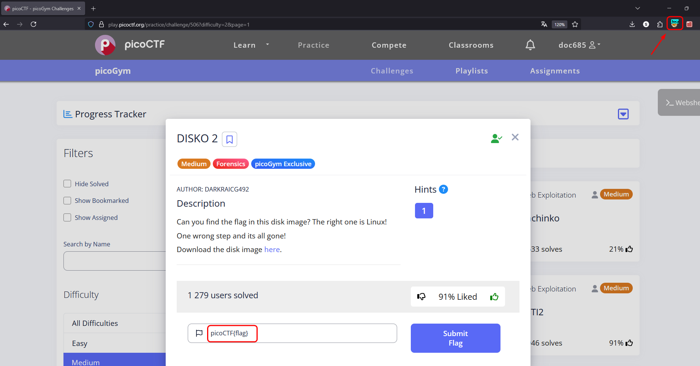


Catch the request with an arbitrary flag and `Send to Intruder`:


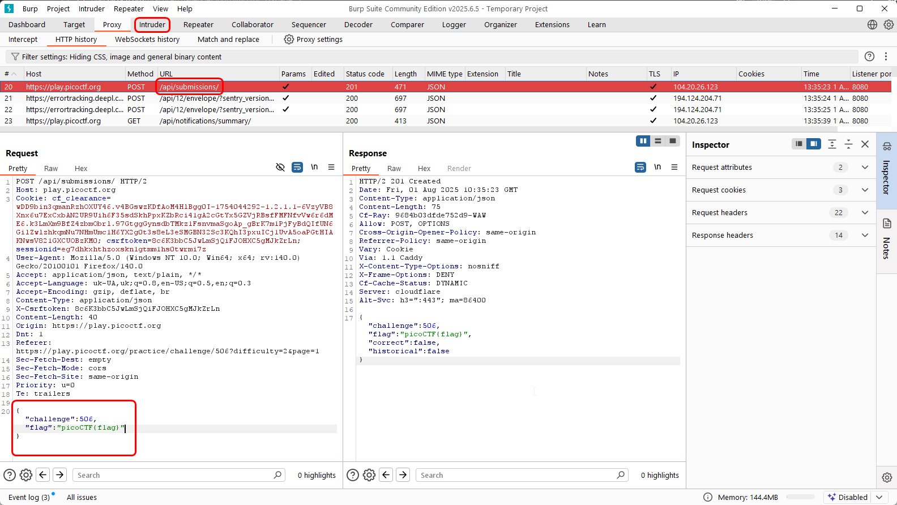


Before creating a `Simple List` to iterate through payloads, we need to extract flags without unnecessary text. To do this, we will use a regular expression for `grep`:


```bash
strings disko-2.dd | grep -o -E 'picoCTF\{.*\}'
```

let's examine this command:
* `grep -o -E`: Runs `grep` with the options "only match" and "Extended regular expressions".
* `\{`: We escape `{` symbol, because it has a special meaning in regular expressions.
* `.*`: This is a pattern that means "any character (`.`) zero or more times (`*`)". This will capture the content inside the brackets.
* `\}`: escaped `}` symbol.

We can make the pattern even more precise, since we know that the flag contains only letters, numbers, and underscores.:


```bash
strings disko-2.dd | grep -o -E 'picoCTF\{[a-zA-Z0-9_]+\}'
```


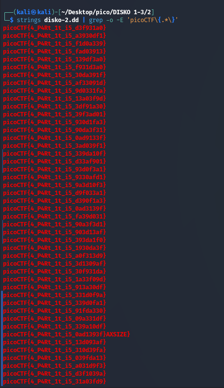

> [!TIP]
> If you want to try on your own and have Burp Professional, I left list with flags here: [*click*](../scripts/forensics/DISKO%202/Brute_flag_Burp_list.txt)


then `Simple List`:


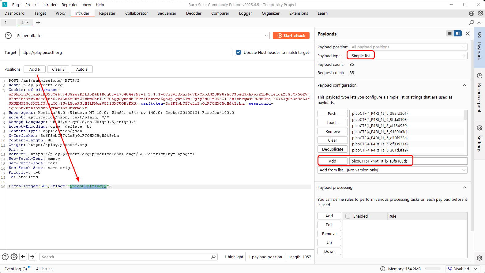


Be sure to disable URL Encoding:  

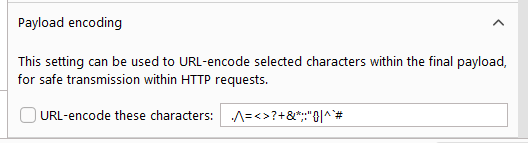


Otherwise we'll get:  

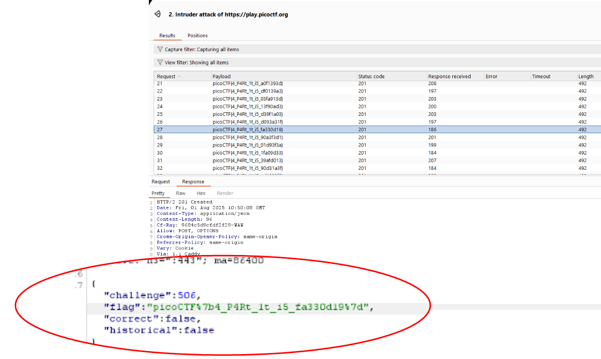


Start Attack: 

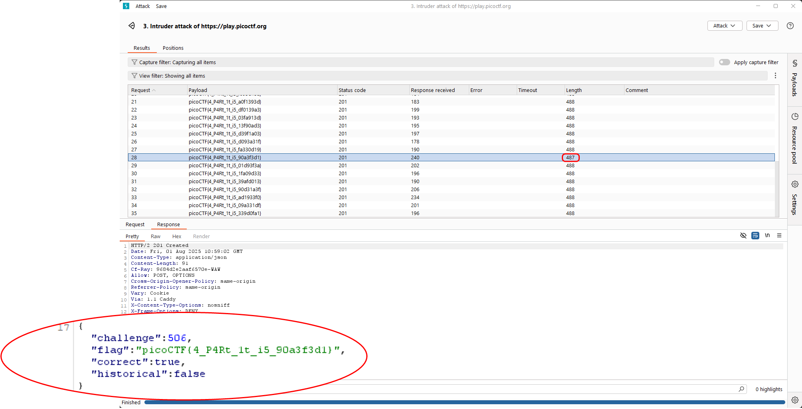


`picoCTF{4_P4Rt_1t_i5_90a3f3d1}`

<br/>

## Notes

> [!NOTE]
> notes I wrote during solving this task. I already mentioned this commands in [my note](../../notes/Examining%20disk%20with%20Sleuth%20Kit.md) for examining disks, but, anyway, let it be here.

  
#### partitions:

```bash
mmls disko-2.dd
```

or:

```bash
fdisk -l disko-2.dd
```


#### check file system:

```
fsstat -o 2048 disko-2.dd > 'fsstat Linux (0x83) 2048.txt'
fsstat -o 53248 disko-2.dd > 'fsstat Win95 FAT32 (0x0b) 53248.txt'
```


```
<name txt> | grep 'File System Type'
```


#### check directories:


```
fls -i raw -f ext4 -o 2048 -r disko-2.dd > 'dir Linux (0x83) 2048'.txt
fls -i raw -f fat16 -o 53248 -r disko-2.dd > 'dir Win95 FAT32 (0x0b) 53248'.txt
```


#### read:


```
icat -i raw -f ext4 -o 2048 -r disko-2.dd <inode>
```


#### Extract the partition into an `.img` format and mount the volume 


```
dd if=disko-2.dd of=part1.img bs=512 skip=2048 count=51200 (skip 0-2047)
sudo mkdir /mnt/part1
sudo mount -o loop part1.img /mnt/part1/
```

