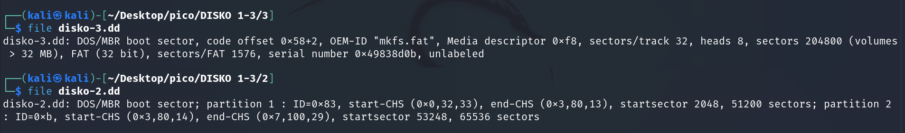
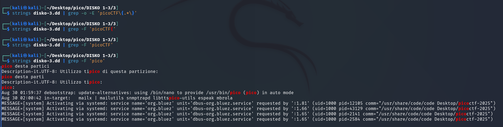
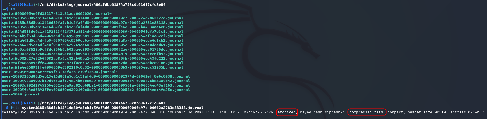
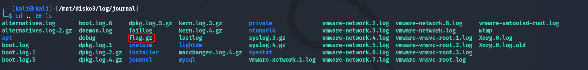
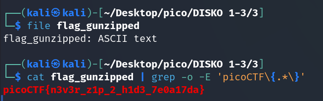

We try the `file` command for `disko-2.dd` from [previous task](DISKO%202.md) and `disko-3.dd` and immediately see the difference:  




`disko-2.dd` has partitions, while `disko-3.dd` is a single partition with the FAT32 file system. 

> [!NOTE]
> **`OEM-ID "mkfs.fat"`**: OEM-ID (Original Equipment Manufacturer ID) — field in the boot sector of the FAT-partition, that identifies the program that created the file system.
> 
> **`mkfs.fat`** — is a standard utility in Linux used to create FAT file systems (FAT12, FAT16, FAT32).


This means that such disk can be mounted immediately, without "extracting" partition 1 or 2 from it:

```bash
sudo mkdir /mnt/disko3
sudo mount -o loop disko-3.dd /mnt/disko3
```


Trying the same method as for [DISKO 2](DISKO%202.md):   




Next, I move on to `/mnt/disko3/log/journal/480afdbb61874a758c0b53617cfc8e8f`:  




`archived` means that this file is no longer used for writing new logs.


`compressed zstd` means that logs in this file are compressed with `zstd` algorithm 

So `strings` or `cat` won't. I tried `journalctl`. First, let's find out the absolute path to any file from the journal so that we can easily copy it:  

```bash
realpath <filename>
```


```bash
journalctl --directory=/mnt/disko3/log/journal/480afdbb61874a758c0b53617cfc8e8f | grep "picoCTF
```

with time filtering:

```bash
journalctl --directory=/mnt/disko3/log/journal/480afdbb61874a758c0b53617cfc8e8f --since "2024-12-26 07:00:00" | grep -o -E "picoCTF\{.*\}"
```


Since the files are compressed with `zstd`, `zstdcat` is needed to read them:

```bash
zstdcat /mnt/disko3/log/journal/480afdbb61874a758c0b53617cfc8e8f/*.journal | grep -o -E "picoCTF\{.*?\}"
```


to avoid mistakes alerts:


```bash
zstdcat /mnt/disko3/log/journal/480afdbb61874a758c0b53617cfc8e8f/*.journal 2>/dev/null | grep -E "picoCTF\{.*?\}"
```


But to no avail.

Then, I noticed file `flag.gz` in `/mnt/disko3/log`:





extracted it to specified output file:


```bash
gunzip -c flag.gz > ~/Desktop/pico/DISKO\ 1-3/3/flag_gunzipped
```

and all of a sudden it was enough:




`picoCTF{n3v3r_z1p_2_h1d3_7e0a17da}`
