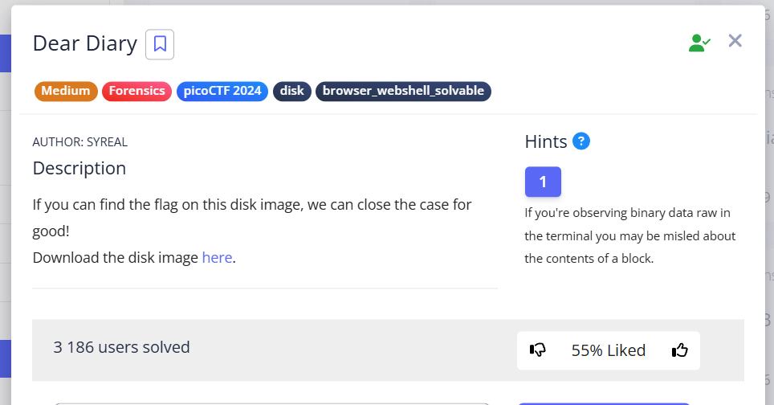

In this task, we examine the `.img` file and find a flag that is hidden in a somewhat unusual way.


## I method

For this method, we will use commands from the [Sleuth Kit](https://wiki.sleuthkit.org/index.php?title=The_Sleuth_Kit_commands) set for Linux.

First, let's see what sections are on the disk:


```bash
┌──(kali㉿kali)-[~/Desktop/pico/Dear_Diary]
└─$ mmls disk.flag.img
DOS Partition Table
Offset Sector: 0
Units are in 512-byte sectors

      Slot      Start        End          Length       Description
000:  Meta      0000000000   0000000000   0000000001   Primary Table (#0)
001:  -------   0000000000   0000002047   0000002048   Unallocated
002:  000:000   0000002048   0000616447   0000614400   Linux (0x83)
003:  000:001   0000616448   0001140735   0000524288   Linux Swap / Solaris x86 (0x82)
004:  000:002   0001140736   0002097151   0000956416   Linux (0x83)
```


In tasks of this type, the most interesting items are usually found in the `/root` directory. Let's take a look at the directories on the partitions in the `/root` search. 
For Linux (0x83) with Offset `2048`:


```bash
└─$ fls -o 2048 disk.flag.img 
d/d 11: lost+found
r/r 13: ldlinux.sys
r/r 14: ldlinux.c32
r/r 16: config-virt
r/r 17: vmlinuz-virt
r/r 18: initramfs-virt
l/l 19: boot
r/r 21: libutil.c32
r/r 20: extlinux.conf
r/r 22: libcom32.c32
r/r 23: mboot.c32
r/r 24: menu.c32
r/r 15: System.map-virt
r/r 25: vesamenu.c32
V/V 76913:      $OrphanFiles
```


And for Linux (0x83) with Offset `1140736`: 


```bash
└─$ fls -o 1140736 disk.flag.img 
d/d 32513:      home
d/d 11: lost+found
d/d 32385:      boot
d/d 64769:      etc
d/d 32386:      proc
d/d 13: dev
d/d 32387:      tmp
d/d 14: lib
d/d 32388:      var
d/d 21: usr
d/d 32393:      bin
d/d 32395:      sbin
d/d 32539:      media
d/d 203:        mnt
d/d 32543:      opt
d/d 204:        root
d/d 32544:      run
d/d 205:        srv
d/d 32545:      sys
d/d 32530:      swap
V/V 119417:     $OrphanFiles
```


We see `/root` in the last one. We see that its inode (identifier in the file system) is `204`. Let's recursively view its contents by its inode (in case there are still directories in root that contain something):

```bash
└─$ fls -o 1140736 disk.flag.img -r 204
r/r 1837:       .ash_history
d/d 1842:       secret-secrets
+ r/r 1843:     force-wait.sh
+ r/r 1844:     innocuous-file.txt
+ r/r 1845:     its-all-in-the-name
```


Now we need to find out the file system of the partition. I do it this way:

```
fsstat -o 1140736 disk.flag.img > 'disk fsstat Linux'.txt
```

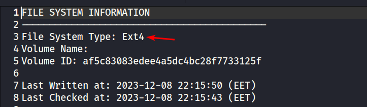


To view the contents of the file, we will use:

```bash
icat -i raw -f ext4 -o 1140736 -r disk.flag.img 1844
```


To download the file:

```bash
icat -o 1140736 disk.flag.img 1844 > innocuous-file.txt
``` 

The file is completely empty. 

The ext4 file system has special system inodes:


```
inode 1: reserved (not used)
inode 2: root directory (/)           ← Readable data
inode 3: ACL index (Access Control List)
inode 4: ACL data  
inode 5: boot loader
inode 6: undelete directory
inode 7: reserved
inode 8: journal inode                ← Readable data
inode 9: reserved
inode 10: reserved
```


Let's see if there are any readable lines behind these inodes. Going through 1-10, I noticed:  


```bash
icat -o 0001140736  disk.flag.img 8 | strings
``` 

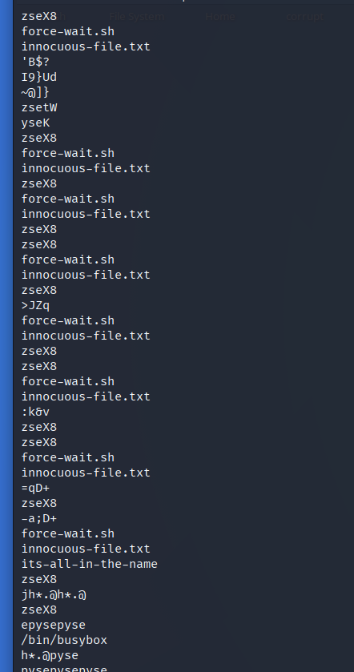


The name of the suspicious file is repeated several times.


```bash
icat -o 1140736  disk.flag.img 8 | xxd | grep '.txt' -A4 -B2
```

Let's break down this command:


* `icat -o 1140736 disk.flag.img 8` — extracts **raw binary data** from inode 8 (ext4 file system journal). As a result, an unencoded byte stream will be output to the console.
* `| xxd `— displays these raw bytes in **hex dump** format. Shows **offset + hex bytes + ASCII interpretation**.
* `| grep '.txt' -A4 :`
    * `grep '.txt' `— shows all matches with `.txt`
    * `-A4` (--after-context=NUM) — will show 4 lines **AFTER** the line with the match found
    * `-B2` (--before-context=NUM) — will show 2 lines **BEFORE** the line with the found match


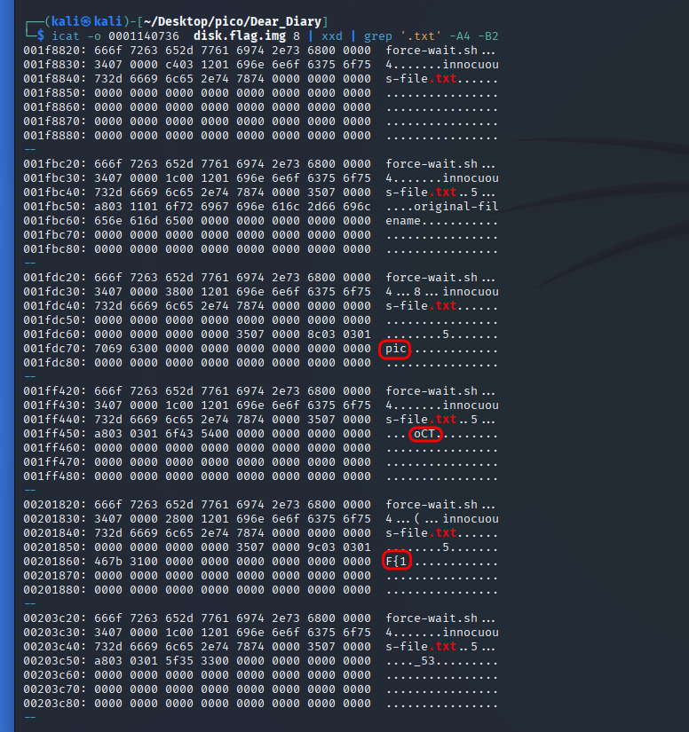


From this conclusion, we can draw a flag.


## II method

The following method is simpler and involves using autopsy, both for Windows and Kali Linux (older version).

First, let's create a new Case for Windows and view the files in the sections on the disk. We are particularly interested in the directory `/root`

`/root` contains `secret-secrets` with files suspiciously named `innocuous-file.txt` and `its-all-in-the-name`. But the problem is that the files are empty and none of them can be displayed in hex format.


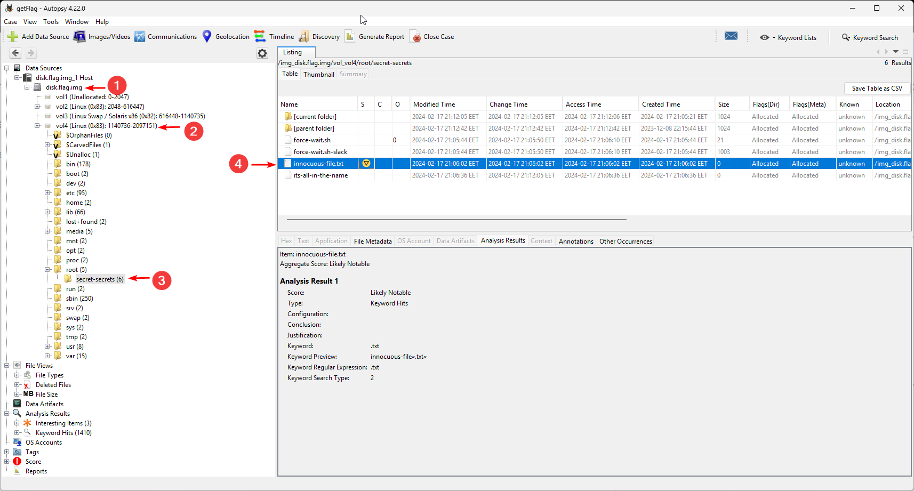


So let's move on to autopsy on Kali Linux.

```
sudo autopsy
```

Create a new Case and specify the absolute path to `.img`. It is important that there are **no spaces** in the path. For example, in my case it is:


```
/home/kali/Desktop/pico/Dear_Diary/disk.flag.img
```


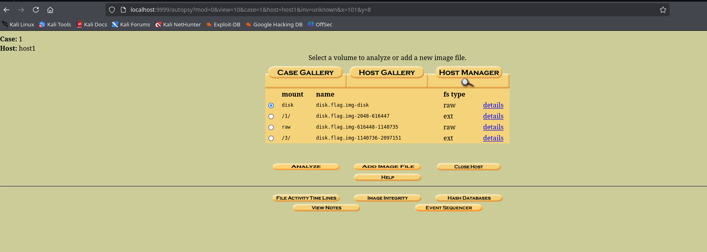


Select `Analyze`. Next, select `Keyword Search` and search for `innocuous-file.txt`:


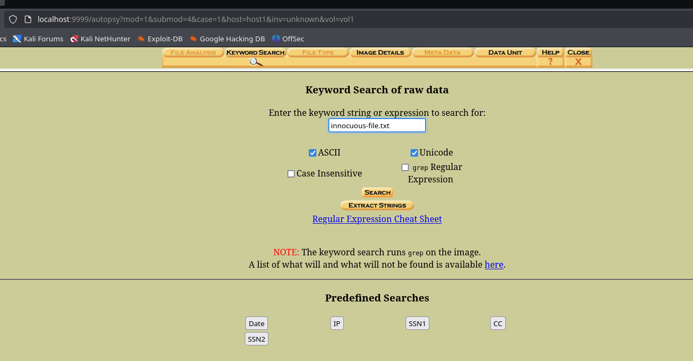


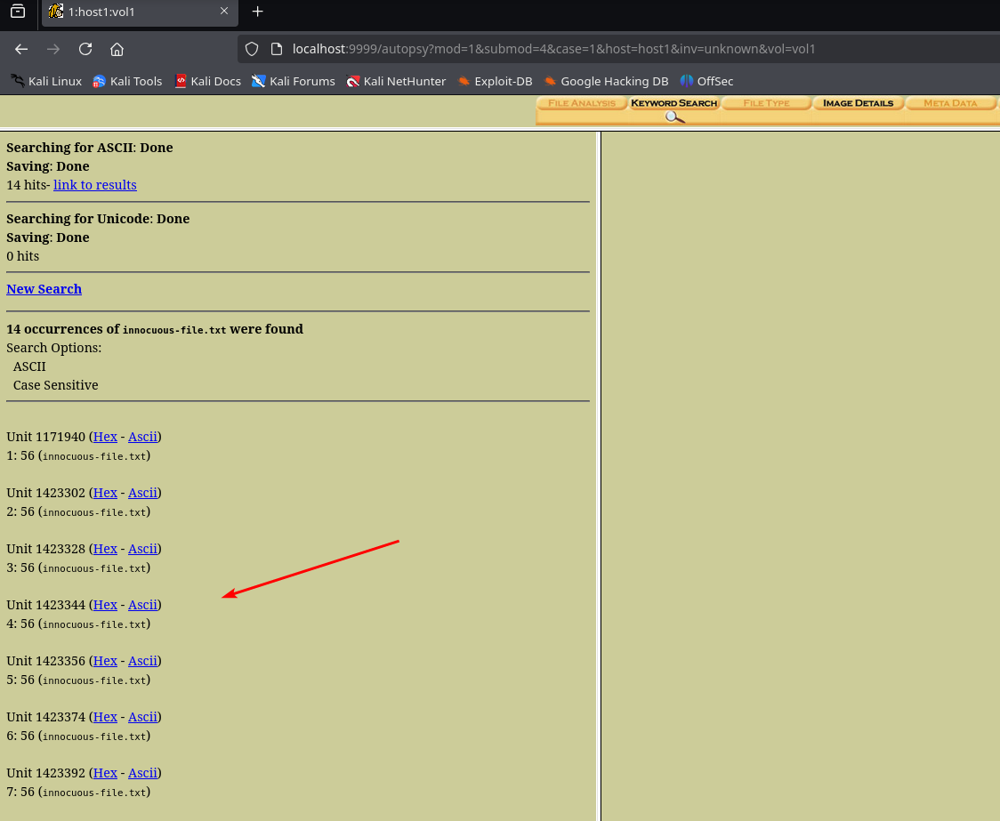


14 cases found, let's scroll through them all.


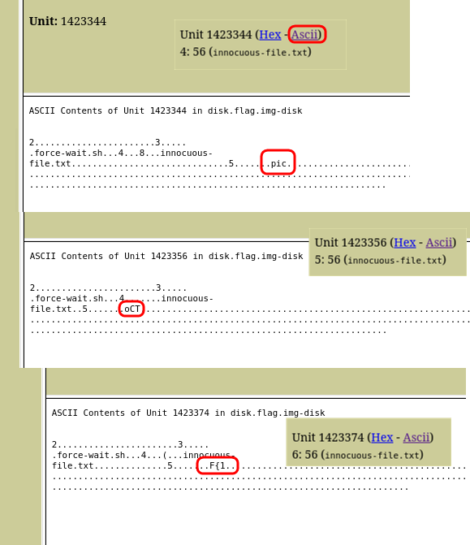


Starting with 4, we see that the flag is split across blocks in the file system. It is possible that the file `innocuous-file.txt` is stored in several blocks.

> [!NOTE]
> Blocks are the smallest unit of space allocation for files.
> The file system groups sectors into larger blocks

We'll use this command for detailed information about the volume on the disk:


```bash
┌──(kali㉿kali)-[~/Desktop/pico/Dear_Diary]
└─$ fsstat -o 1140736 -f ext4 disk.flag.img
FILE SYSTEM INFORMATION
--------------------------------------------
File System Type: Ext4
...
CONTENT INFORMATION
--------------------------------------------
Block Groups Per Flex Group: 16
Block Range: 0 - 478207
Block Size: 1024
Reserved Blocks Before Block Groups: 1
Free Blocks: 378721
...
```


As we can see, the size of one block is 1024 bytes.

Find out the size of the sector:  


```bash
┌──(kali㉿kali)-[~/Desktop/pico/Dear_Diary]
└─$ fdisk -l disk.flag.img
Disk disk.flag.img: 1 GiB, 1073741824 bytes, 2097152 sectors
Units: sectors of 1 * 512 = 512 bytes
Sector size (logical/physical): 512 bytes / 512 bytes
I/O size (minimum/optimal): 512 bytes / 512 bytes
...
```


```
disk.flag.img:
┌───────────────────────────────────────────────────────┐
│ MBR │ Partition 1 │ Partition 2 │ ... │ Partition 4   │
└───────────────────────────────────────────────────────┘
                                           ↑
                                    vol4 (Linux ext4)
                                           ↓
┌───────────────────────────────────────────────────────┐
│ Block 0 │ Block 1 │ ... │ Block 1423344 │Block 1423345│
└───────────────────────────────────────────────────────┘
                                    ↑
                              Contains "pic"
```


Now we need to collect all the pieces of the flag by units.


## III method

After finding the directory with the files in Autopsy, we will upload the entire `disk.flag.img` file to `HxD` on Windows:


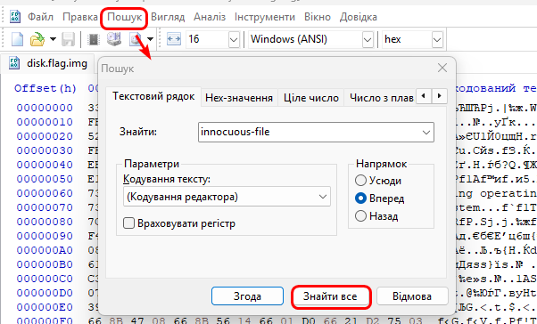


We see 14 matches, as found by autopsy on Kali Linux. And starting with 4, pieces of the flag appear:  


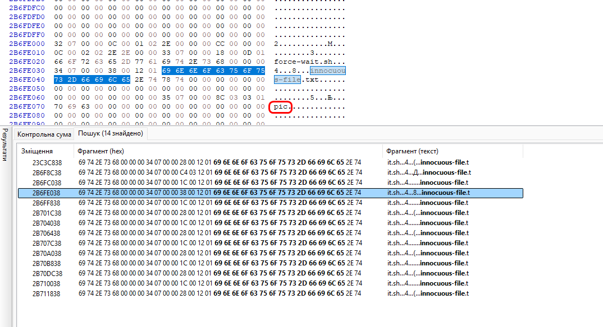


`picoCTF{1_533_n4m35_80d24b30}`
