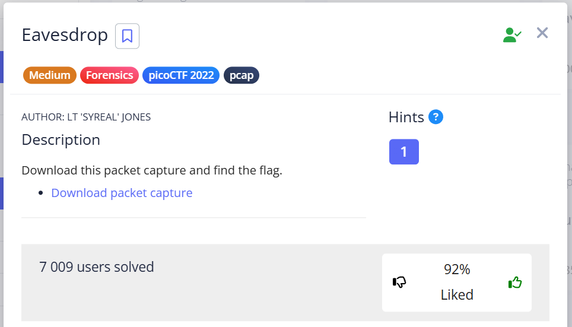
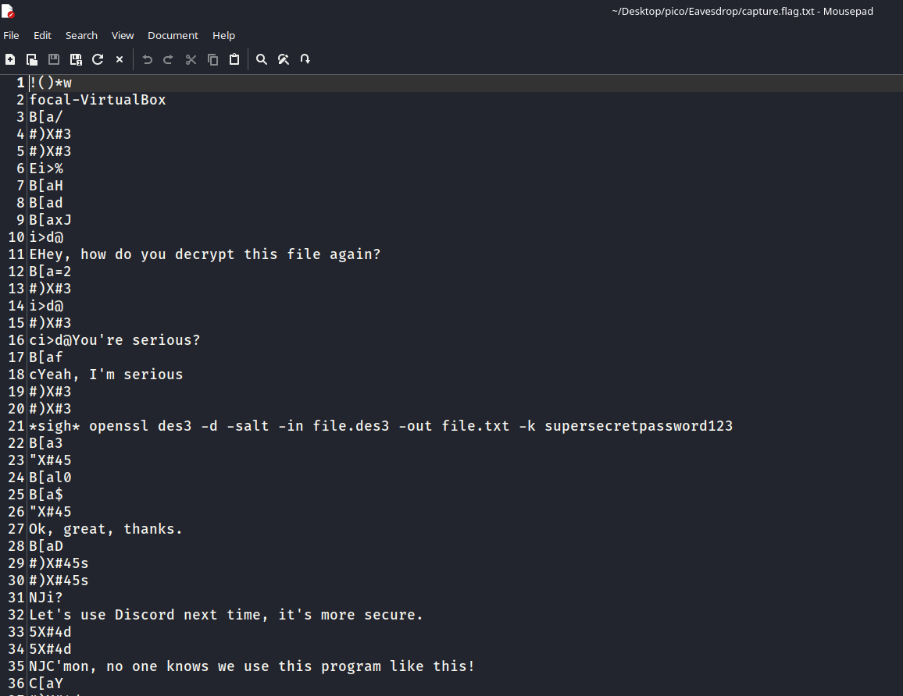
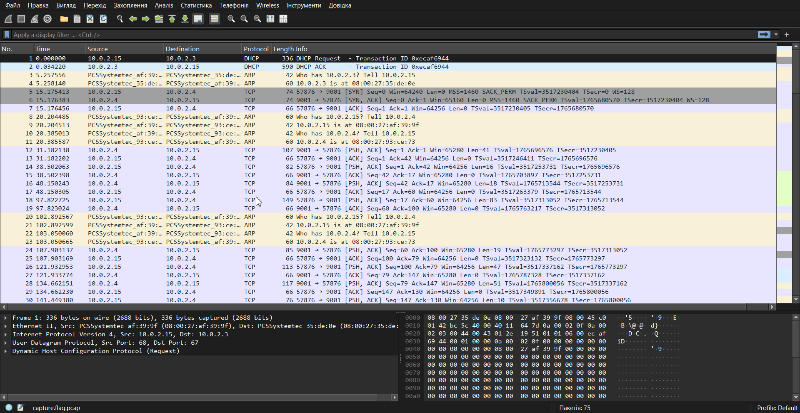
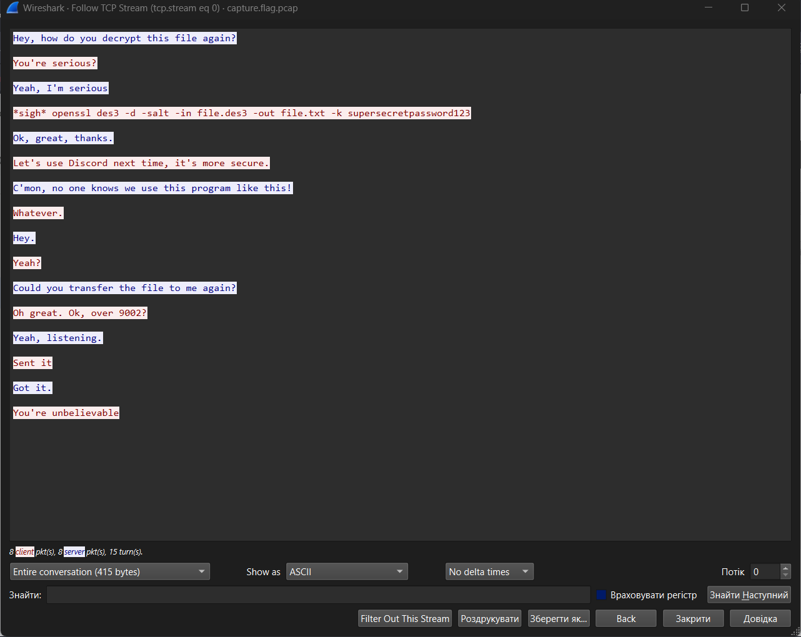
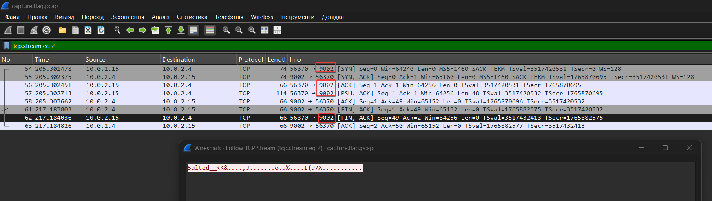
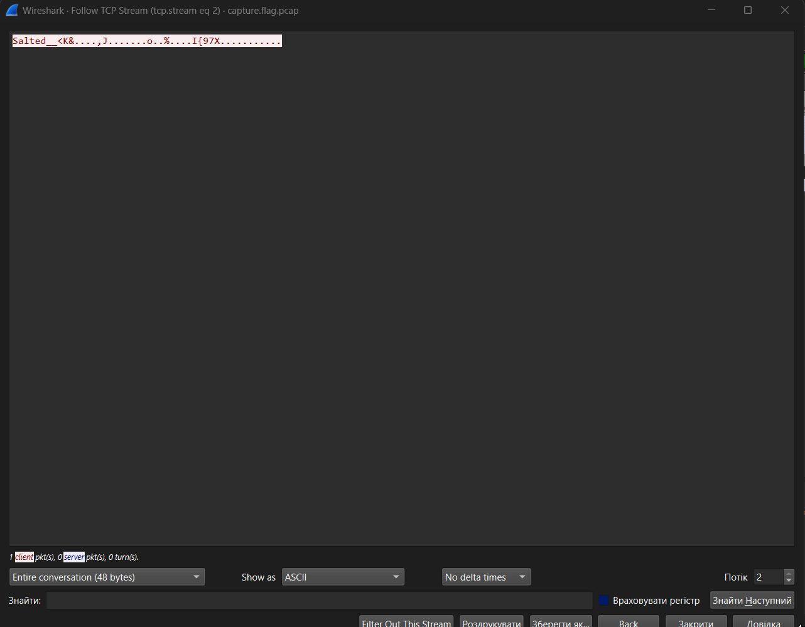
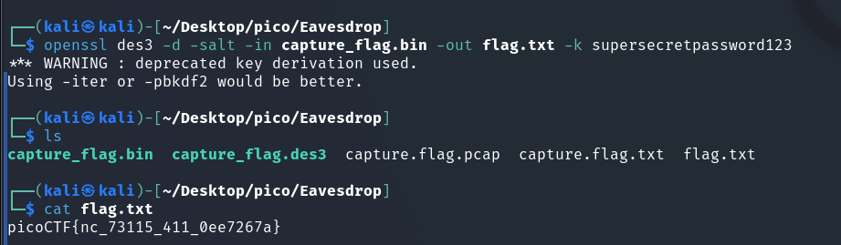

In this task, we need to analyze the `capture.flag.pcap` file, find the TCP streams of communication between two clients, understand what they were talking about, and extract the encrypted flag.


### Strings

`strings capture.flag.pcap` outputs the following result:




This suggests that there was a TCP stream between two clients. Let's try to trace these streams.


### Wireshark




As can be seen from the GIF above, stream 0 (`tcp.stream eq 0`) gives us the following:





Here you can see the chat between two clients about transferring a file with: 

* adding salt to the message
* encryption using the 3DES algorithm
* transfer via port 9002
* Discord would be better here *pog*

Let's take a look at the streams. In stream 2, we find a "salted" and Triple DES-encrypted message: 

```sql
tcp.stream eq 2
```



```
Salted__<K&....,J.......o..%....I{97X...........
```

### openssl

In conversation we saw the following command: 

```bash
openssl des3 -d -salt -in file.des3 -out file.txt -k supersecretpassword123
```

> [!NOTE]
> The 3DES algorithm is a block symmetric algorithm, so the same key is used for encryption and decryption.
Let's break down the command:

* `des3`: the encryption algorithm used, specify it explicitly
* `-d`:  flag tells `openssl` that it needs to perform decryption. If we wanted to encrypt, we would use the `-e` (encrypt) flag. 
* `-salt`:  flag informs OpenSSL that **salt** was used during encryption (and therefore for successful decryption).

> [!NOTE]
> When `-salt` is used for decryption, OpenSSL expects the encrypted file to begin with an 8-byte string `Salted__` (in ASCII) followed by an 8-byte salt (a total of 16 bytes at the beginning of the file). These 16 bytes are not part of the original data, but are metadata necessary for decryption.

* ` -in file.des3`: specifies the input file (`-in`) to be decrypted.
* `-out file.txt`: This flag specifies the output file (`-out`) where the decrypted content will be written.
* `-k supersecretpassword123`: specifies the passphrase used to generate the encryption key.


### Export to Raw




We export in RAW Bytes format, because the block algorithm operates with bytes.

```
53616c7465645f5f3c4b26e8b8f91e2c4af8031cfaf5f8f16fd40c25d40314e6497b39375808aba186f48da42eefa895
```

Put this in a `.bin` file and apply the same command we found:




picoCTF{nc_73115_411_0ee7267a} 

