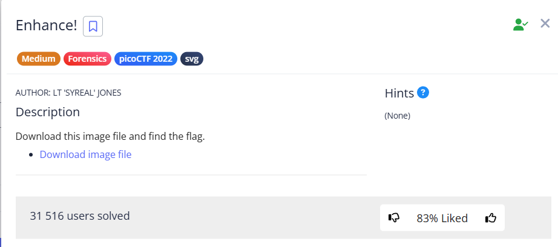
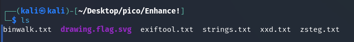
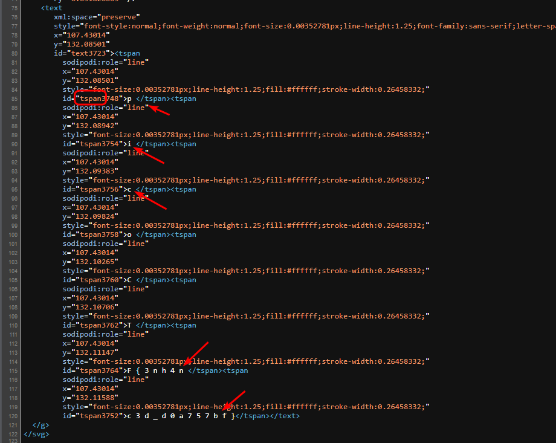
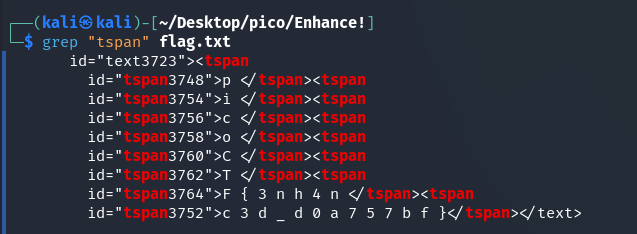

In this task, we have an SVG file that hides a flag. 

I tried various tools to find the flag in the image, such as: 

`binwalk -e`, `exiftool`, `strings`, `xxd`, `zsteg` but there is no mention of the flag in their outputs

The image does not provide us with any information about the flag, so let's look at the source code: 

The parts of the flag are located near `tpan`. Let's copy the code into a separate file: 

picoCTF{3nh4nc3d_d0a757bf}
