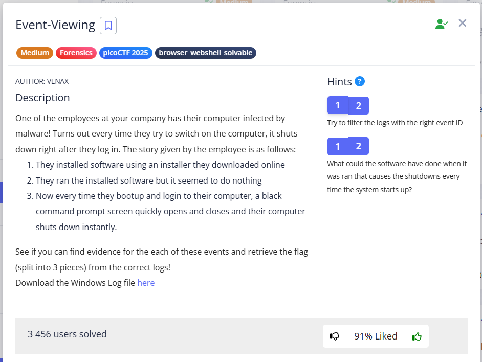
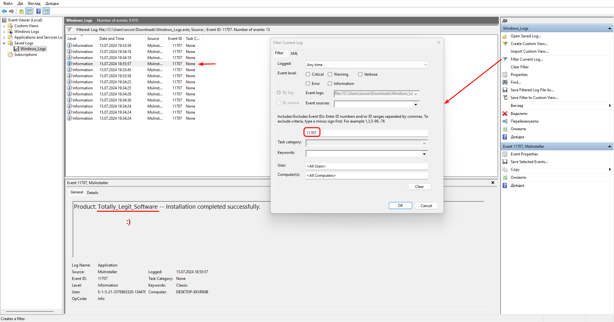
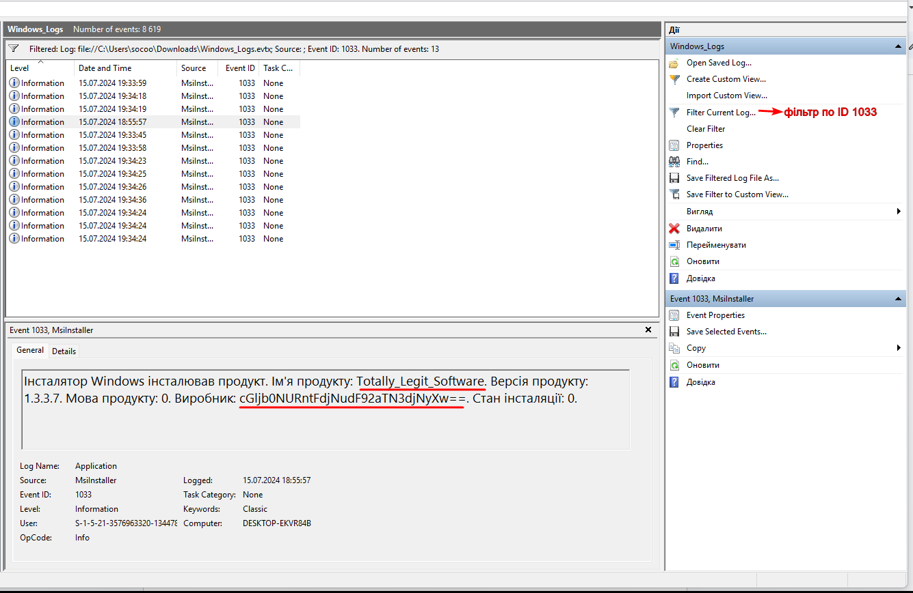
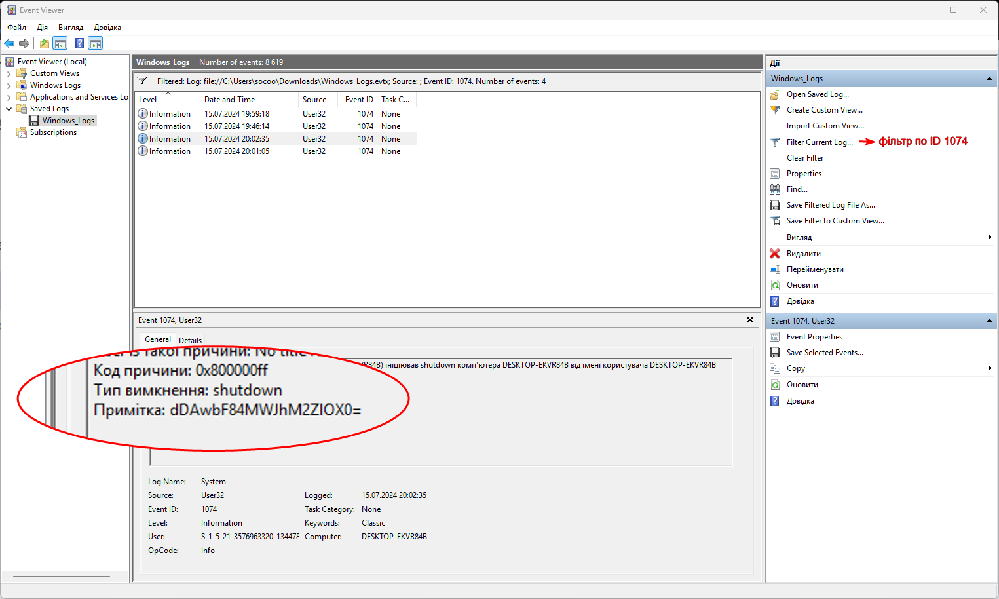
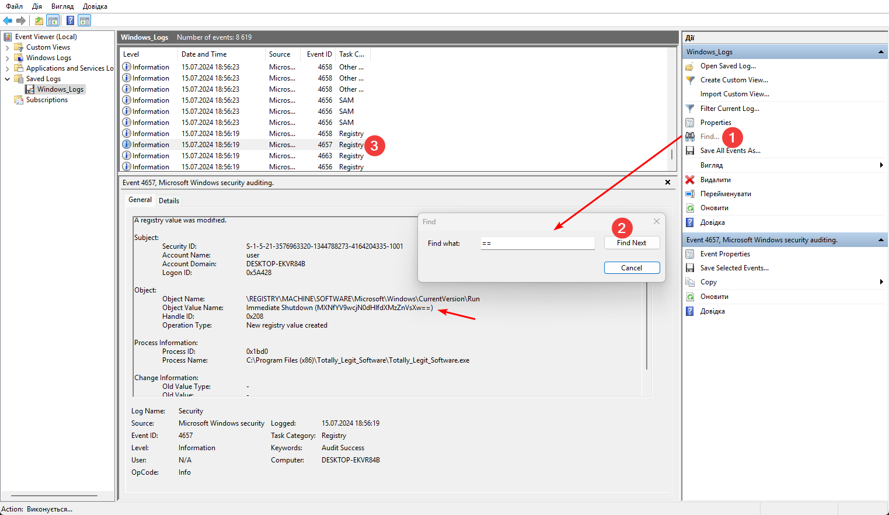
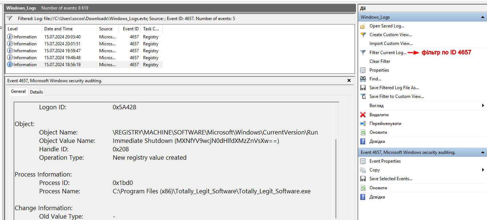
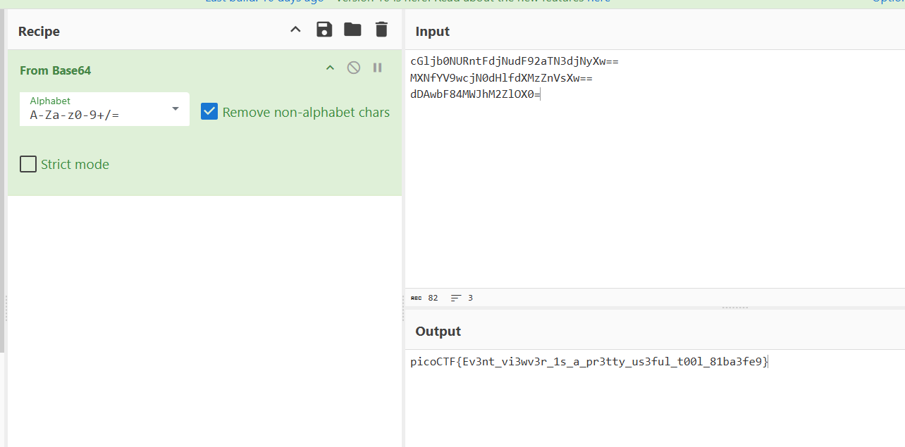

In this task, you need to find the events specified in the condition, namely:  

```
1. Installation  					 
2. Run/launch installed software 		 
3. Bootup/login --> execute and shutdown
```

---

I explored, that in Windows Event Logs, **specific IDs indicate certain actions behind them**.

So I start googling for the ID for `windows event viewer id install` (Google search prompt). These IDs are `1033` and `11707`.

Searching for `11707` in `Filter Current Log` gave us the name of the software being downloaded:


```
Totally_Legit_Software
```




We search for `1033` and find the first part (it is in base64).:





Next googled `windows event viewer id shutdown`, that logs under ID `1074`. Using this ID, we find the third part (also base64):




I couldn't find the second part right away because I was searching for something like "`windows event viewer id Run/launch installed software`", but this is not exactly what the task conditions indicate to us. 
Therefore, I tried to find a match using `==`, which uniquely identifies base64:





<br/>


I got stuck, and this [write up](https://youtu.be/aRlhyXJseuI?si=AR4UrVSnFSDFIeAR) suggested me, that `Totally_Legit_Software` – is a Malware, which modifies the registry to run every time you log in, and I had to google it the following way:
`windows event viewer id modify registry`

written under ID `4657` with only 5 entries:




**Event ID 4657:** `A registry value was modified.`  


When the employee installed and launched "Totally_Legit_Software," the program did not perform any visible actions. Instead, it quietly:

1. **Modified the registry** to start every time the user logs in.
2. **Has written the registry key a command to run** (`C:\Program Files (x86)\Totally_Legit_Software\Totally_Legit_Software.exe`) and, probably, another command that contained part of the flag (`==`).

> [!IMPORTANT]
> Thus, the program did not just start, it **configured itself to start during system boot**. This action, "registy modify", is what we see in the log with ID `4657`.





`picoCTF{Ev3nt_vi3wv3r_1s_a_pr3tty_us3ful_t00l_81ba3fe9}`
