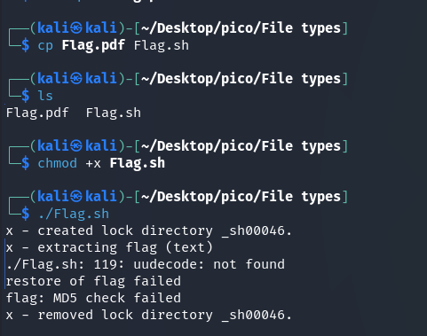
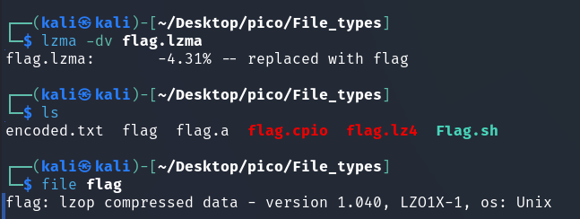
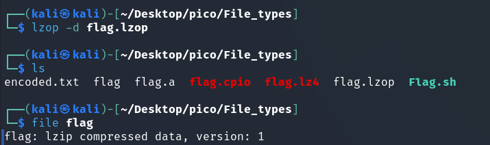

In this task, we need to unpack a flag that has been archived/encoded multiple times.


> [!NOTE]
> **shell archive text** – A shell archive is similar to a tar file, but is only used to pack source code and other text files. This is a convenient way to combine all the source files of a project into a single file that can be sent by email. ([Source](https://lowfatlinux.com/linux-shell-archives.html))





`./Flag.sh: 119: uudecode: not found`: This is the **main mistake**. The script attempted to execute the `uudecode` command (probably on line 119 of its code), but the system **could not find this command**.


> [!NOTE]
> `uudecode` – command used to decode files that have been previously encoded with `uuencode`, which in turn is used to encode binary data such as images, documents, or executable files into a format that can be safely transmitted over text communication channels.
> 
> Data encoded in this way has a recognizable appearance:
> 
> 


Let's take a look inside `Flag.pdf.sh`:


Here is a bash script and a pattern that points to uuencoded data. Next, you can proceed in two ways:

<h3>I method</h3>

Copy this pattern to a separate file and apply command:

```bash
uudecode encoded.txt
```


<h3>II method</h3>

When `./Flag.sh` was run, a file named flag was created with the extension: 


In both cases, we get an `ar` archive. This format has the extension `.a` or `.ar`. ([More here](https://uk.wikipedia.org/wiki/Ar_(Unix))) so let's rename it for convenience:

```bash
mv flag flag.a
```

 
For unpacking ([Source](https://www.geeksforgeeks.org/ar-command-in-linux-with-examples/)):

```bash
ar -xv flag.a
```


> [!NOTE]
> `cpio` can be interpreted as copy in, copy out. It is a basic archive format, like `tar`. It has the `.cpio` format. Unpack it like this ([Source](https://www.geeksforgeeks.org/cpio-command-in-linux-with-examples/)): 

 ```bash
 cpio -iv < flag.cpio
 ```

* `&lt; flag.cpio `– by default, cpio reads archive data from **standard input** when the `-i` (extract) flag is used.

    The command `cpio -iv flag.cpio` is interpreted by `cpio` not as "unpack the archive from the file `flag`", but probably as "unpack files named `flag` from **standard input**". Since nothing is fed to standard input, the command simply waits for data.  
 \
Therefore, you need to redirect the contents of the `flag.cpio` file to the standard input of the `cpio -iv` command.


Also, if you open `flag.cpio` in a text editor, you will notice something interesting: 


in line `BZh91AY&SY`: 


* **<code>BZh</code>**: These are **magic bytes** that clearly indicate that the file is **compressed using the bzip2 algorithm**.
* **<code>9</code>**: The number after `BZh` indicates the block size used for compression (900 KB).

This suggests that a bz2 archive may be present in the following layers.


And here is the bz2 archive.


```bash
bunzip2 flag.bz2
```


>[!NOTE]
> The lzip file format is designed for data exchange and long-term archiving, taking into account both data integrity and the availability of decoders. ([Source](https://www.nongnu.org/lzip/lunzip.html))


archive has an extension `.lz`.


Next layer (LZ4 [Source](https://stackoverflow.com/questions/68550282/how-to-decompress-lz4-file)):


[LZMA command](https://www.quora.com/How-do-I-extract-an-LZMA-file-in-Linux)




`lzop` very similar to `gzip` ([Source](https://www.lzop.org/lzop_man.php))




The author of the task clearly loves the `lzip` format, which he used to archive the flag twice. 


Finally ASCII-текст. Let's see: 


Or you can decode the hex-code directly in the terminal ([Source](https://www.ubuntumint.com/convert-hex-to-ascii-characters-linux/)): 


```bash
cat flag | xxd -r -p && echo ''
```


picoCTF{f1len@m3_m@n1pul@t10n_f0r_0b2cur17y_3c79c5ba}


