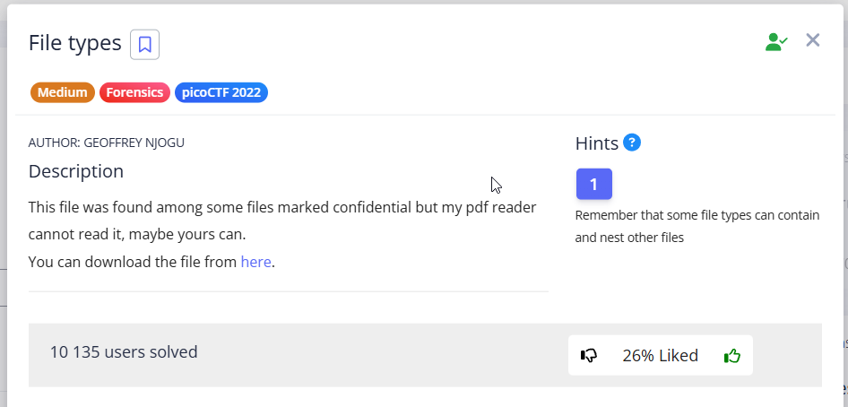


In this task, we need to unpack a flag that has been archived/encoded multiple times.


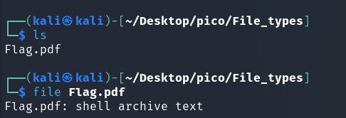


shell archive text – A shell archive is similar to a tar file, but is only used to pack source code and other text files. This is a convenient way to combine all the source files of a project into a single file that can be sent by email. ([Source](https://lowfatlinux.com/linux-shell-archives.html))


`./Flag.sh: 119: uudecode: not found`: This is the **main mistake**. The script attempted to execute the `uudecode` command (probably on line 119 of its code), but the system **could not find this command**.

**

`uudecode` – це команда, що використовується для декодування файлів, що були попередньо закодовані `uuencode`, яка своєю чергою використовується для кодування двійкових даних, таких як зображення, документи або виконувані файли, у формат, який можна безпечно передавати текстовими каналами зв'язку. ([джерело](https://labex.io/ru/tutorials/linux-linux-uudecode-command-with-practical-examples-422990))

Дані які були закодовані в такий спосіб мають впізнаваний вигляд: \


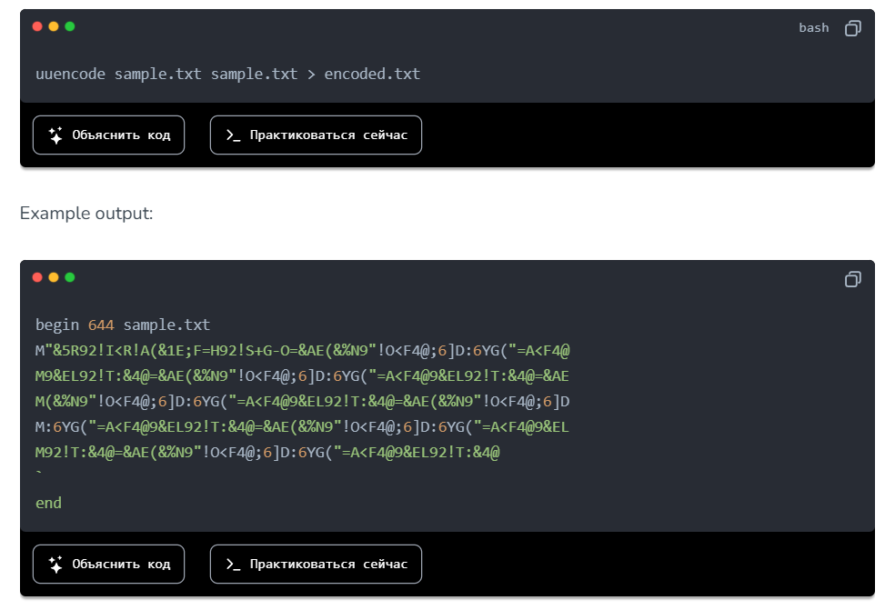

**

поглянемо всередину Flag.pdf/.sh:


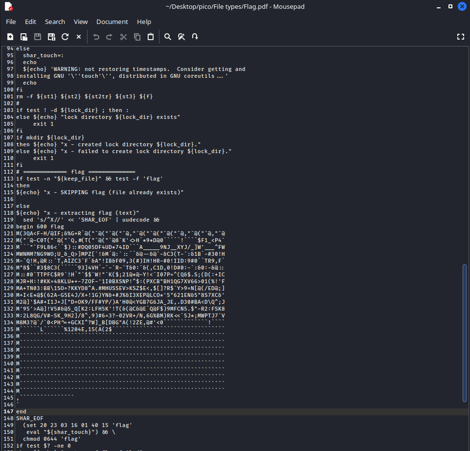

Тут є bash-скрипт, і паттерн, який якраз вказує на uuencoded дані. Далі можна піти 2 способами:

I

скопіювати цей паттерн в окремий файл і застосувати


```
uudecode encoded.txt
```


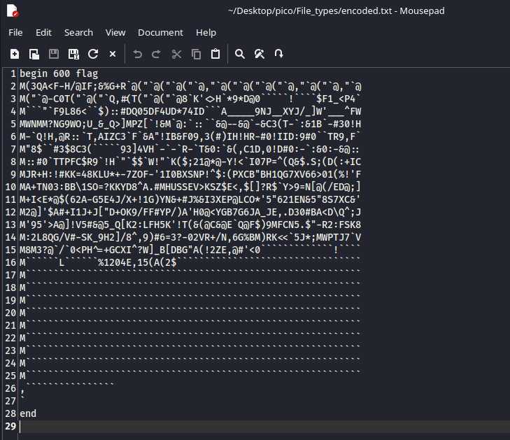


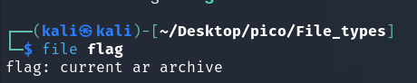

II

коли було запущено `./Flag.sh`, створився файл flag з розширенням: 


В обох варіантах отримуємо ar-архів. Такий формат має розширення .a або .ar ([тут](https://uk.wikipedia.org/wiki/Ar_(Unix))) тому перейменуємо для зручності:


```
mv flag flag.a
```


 \
Для розпакування ([Source](https://www.geeksforgeeks.org/ar-command-in-linux-with-examples/)):


```
ar -xv flag.a
```


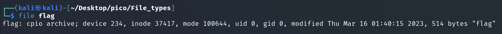

cpio можна розшифрувати як copy in, copy out. Це базовий формат архіву, як tar. Має формат .cpio. Розпакувати так ([джерело](https://www.geeksforgeeks.org/cpio-command-in-linux-with-examples/)): 


```
cpio -iv < flag.cpio
```


* `&lt; flag.cpio `– cpio за замовчуванням читає архівні дані зі **стандартного вводу**, коли використовується прапор `-i` (extract).

    Команда `cpio -iv flag.cpio `інтерпретується `cpio `не як "розпакуй архів з файлу `flag`", а, ймовірно, як "розпакуй файли з іменем `flag `зі **стандартного вводу**". Оскільки на стандартний ввід нічого не подається, команда просто чекає на дані.  \
 \
Тому потрібно перенаправити вміст файлу `flag.cpio `на стандартний ввід команди `cpio -iv`


Також якщо відкрити flag.cpio в текстовому редакторі можна помітити цікаву річ: \


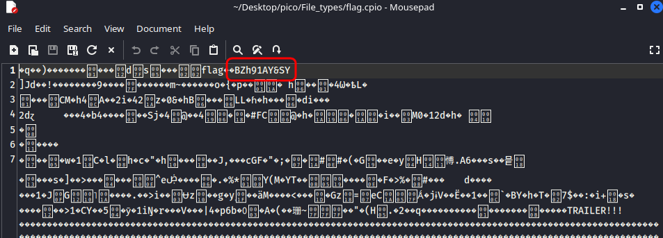

в рядку BZh91AY&SY: 


* **<code>BZh</code>**: Це **магічні байти (magic bytes)**, які однозначно вказують на те, що файл є **стисненим за допомогою алгоритму bzip2**.
* **<code>9</code>**: Цифра після `BZh` вказує на розмір блоку, що використовувався при стисненні (900 КБ).

Це натякає на те, що в наступних шарах може трапитись bz2-архів


А ось і bz2-архів.


```
bunzip2 flag.bz2
```


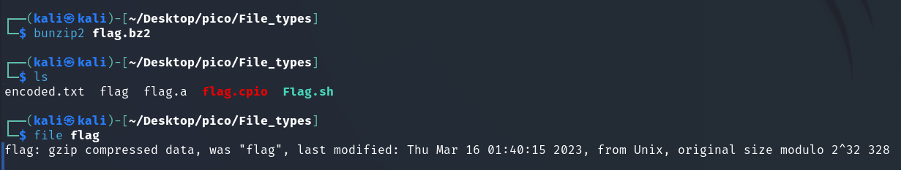


**

Формат файлів lzip призначений для обміну даними та довгострокового архівування, враховуючи як цілісність даних, так і доступність декодерів ([джерело](https://www.nongnu.org/lzip/lunzip.html))

**

архів має розширення .lz.


Наступний шар (LZ4 [тут](https://stackoverflow.com/questions/68550282/how-to-decompress-lz4-file)):


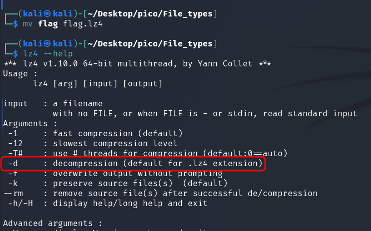


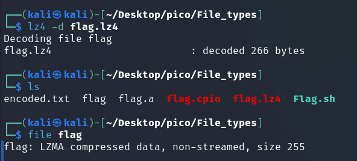


[LZMA команда](https://www.quora.com/How-do-I-extract-an-LZMA-file-in-Linux)


lzop дуже схожий на gzip ([джерело](https://www.lzop.org/lzop_man.php))


Автор завдання явно дуже полюбляє формат lzip, яким заархівував прапор аж двічі. \


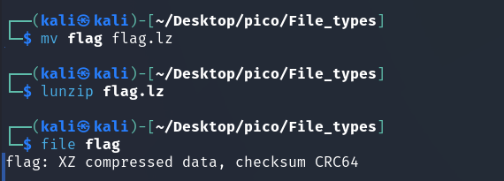


Нарешті ASCII-текст. Поглянемо: \


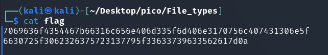


Або можна розкодувати hex-код прямо в терміналі ([тут](https://www.ubuntumint.com/convert-hex-to-ascii-characters-linux/)): \


```
cat flag | xxd -r -p && echo ''
```


 \


picoCTF{f1len@m3_m@n1pul@t10n_f0r_0b2cur17y_3c79c5ba}

 \


 \

