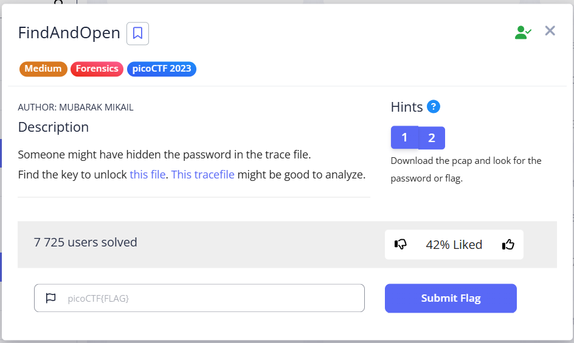
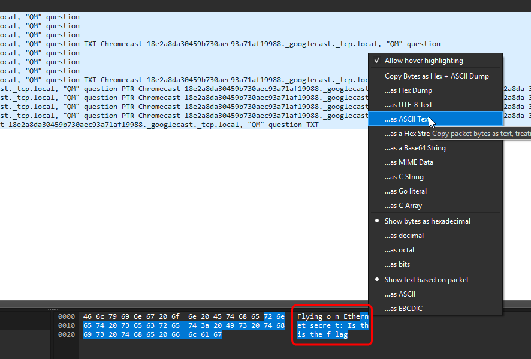
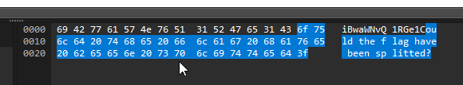
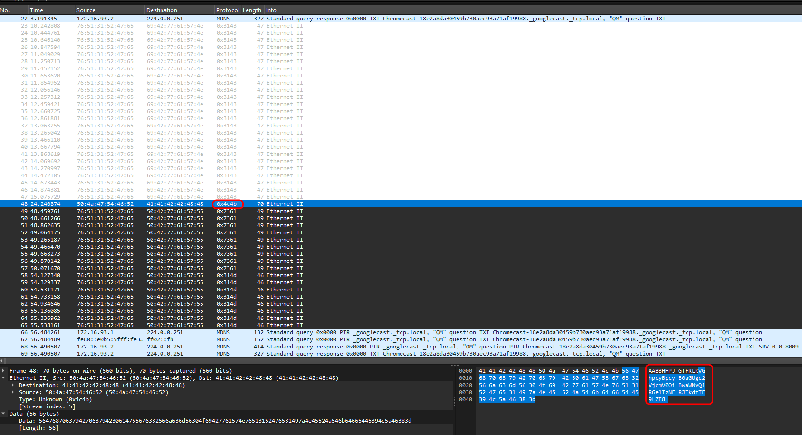
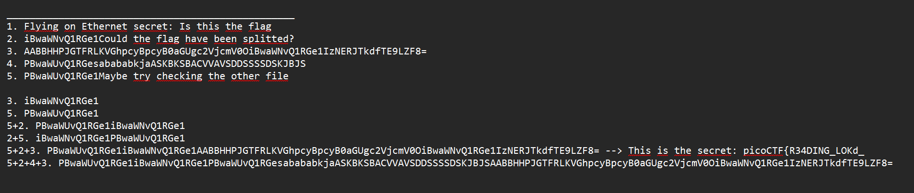
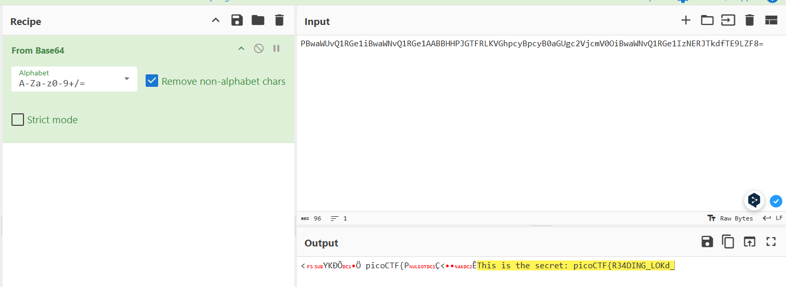

In this task, we need to find the password in the `.pcap` file to unpack the archive, in which the flag.  

---

In `dump.pcap` I find several pieces of readable text:

  

  

Among the variety of different Protocols in hex format, one stands out and contains text similar to base64.

  

In total, I collected 5 parts. Then I rearranged them, forming strings of potential base64, and substituted them into Cyberchef:  

  

  

That was the password for the archive (part of the flag): `picoCTF{R34DING_LOKd_`

`picoCTF{R34DING_LOKd_fil56_succ3ss_5ed3a878}`
