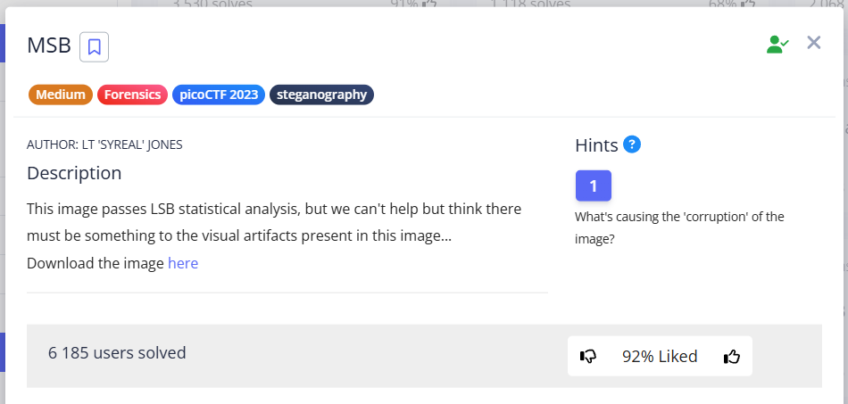
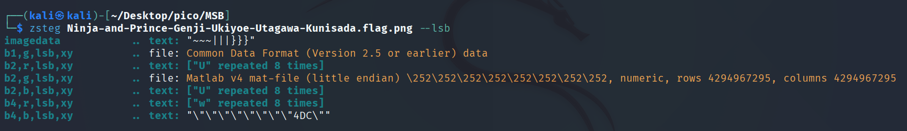
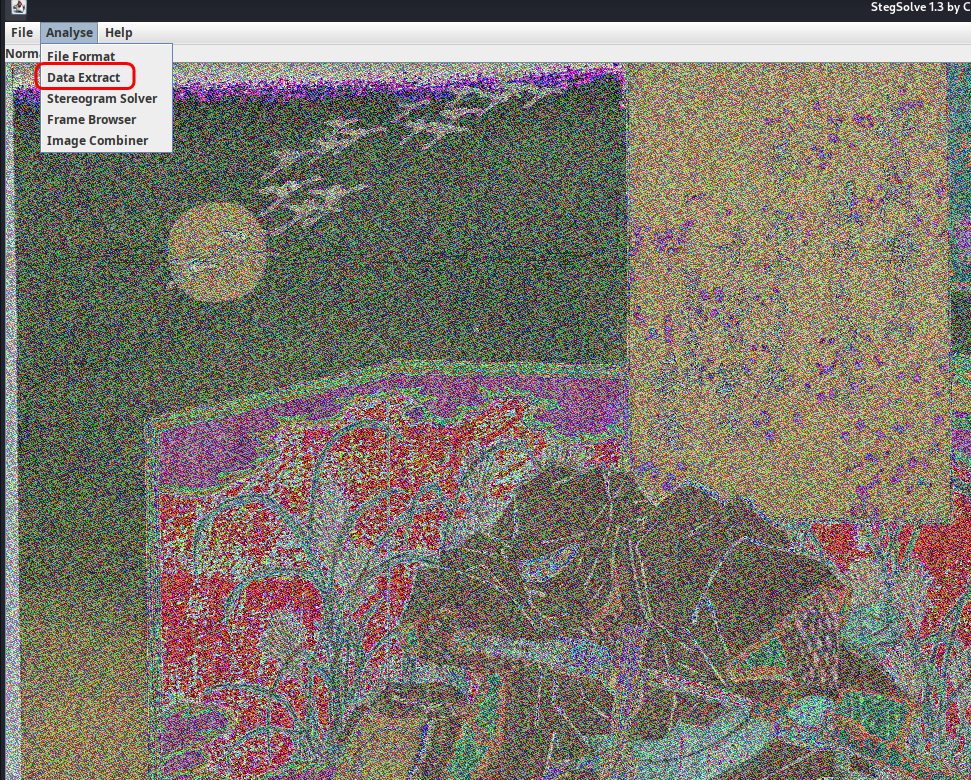
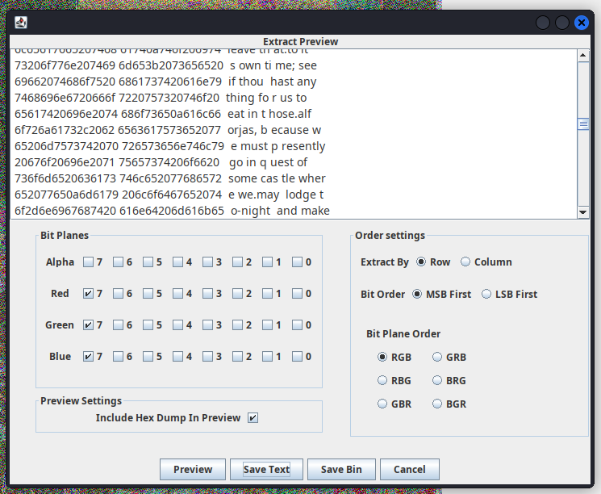
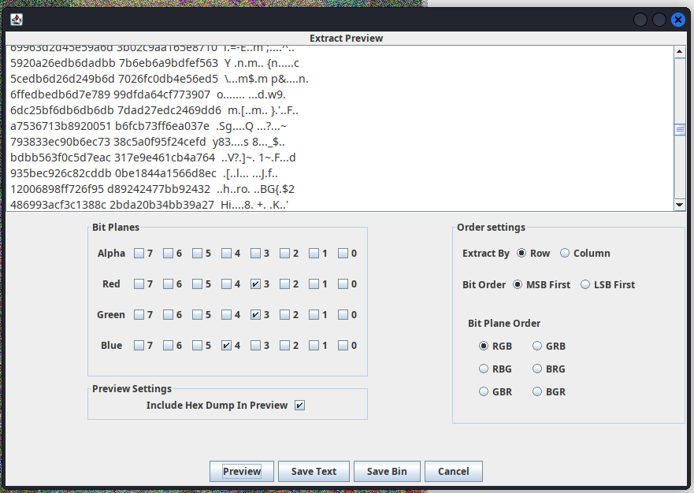
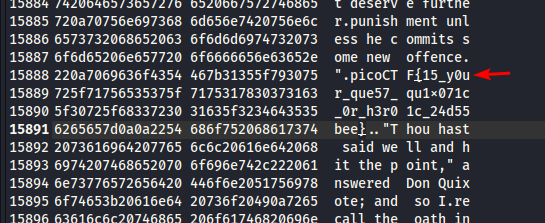

This task is related to MSB (most significant bit) and LSB (least significant bit).


```
Byte: 11010110
      ↑      ↑
     MSB    LSB (this bit)
```

> [!NOTE]
> **LSB Statistical Analysis** – a test for the presence of certain patterns in the change of bits in a file.
> For example, in natural images, LSB bits are usually random (50% zeros, 50% ones).
> If image contains **hidden data**, there may be **patterns** among the LSB bits.


According to task condition, “image passes LSB statistical analysis”, what means that tests, that look for these patterns, do not detect them, which means that visual effects may hint at them. In our case, the colors of the image are messed up, as if the pixels have been swapped.

So, if it's not the deal in the LSB bits, the name of the task hints to pay attention to MSB bits.





`zsteg` shows repeating sequences. Hidden data would not contain identical characters in a row. 


```shell
imagedata           .. text: "~~~|||}}}"
b4,b,lsb,xy         .. text: "\"\"\"\"\"\"\"\"4DC\""
```


We also see noise, meaningless text:


```shell
b1,g,lsb,xy .. file: Common Data Format (Version 2.5 or earlier) data
b2,g,lsb,xy .. file: Matlab v4 mat-file...
```


We see technical artifacts of the files; `zsteg` attempts to interpret noise as files, but this is actually a false positive. 

Let's use the stegsolve tool with GUI from [GitHub](https://github.com/zardus/ctf-tools/blob/master/stegsolve/install).








#### What does StegSolve do at 7-7-7 + Preview:

StegSolve goes through each pixel and extracts 7th bit from each channel:


```
RGB pixel: (Red=214, Green=156, Blue=98)

Red:   11010110  → bit 7 = 1
       76543210

Green: 10011100  → bit 7 = 1  
       76543210

Blue:  01100010  → bit 7 = 0
       76543210

Result: 110 (3 bits from one pixel)
```


Collects every seventh bit into a sequence:


```
Pixel 1: RGB bits 7 → 110
Pixel 2: RGB bits 7 → 101  
Pixel 3: RGB bits 7 → 011
...
Output sequence: 110101011...
```


And tries to interpret them as text:  


```
110101011 → groups by 8 bits → 11010101 = ASCII 'Õ'
and so on...
```


A more generalized example:  


```
Image 3x2 pixels:
[Pixel1] [Pixel2] [Pixel3]
[Pixel4] [Pixel5] [Pixel6]

Pixel1 RGB: (200, 150, 100)
Red:   11001000 → bit 7 = 1
Green: 10010110 → bit 7 = 1  
Blue:  01100100 → bit 7 = 0

Pixel2 RGB: (180, 90, 200)  
Red:   10110100 → bit 7 = 1
Green: 01011010 → bit 7 = 0
Blue:  11001000 → bit 7 = 1

Sequence: 110 101 ... (continues)
```


In other words, `stegsolve` does not change anything, it only reads the elder bits, combines them, and interprets each octet of bits as text.

In general, if you play with app and try different combinations of bits, none except 7-7-7 produces readable text.




So, let's save the text in a `.txt` file and search for matches using `Ctrl+F`:




`picoCTF{15_y0ur_que57_qu1x071c_0r_h3r01c_24d55bee}`
