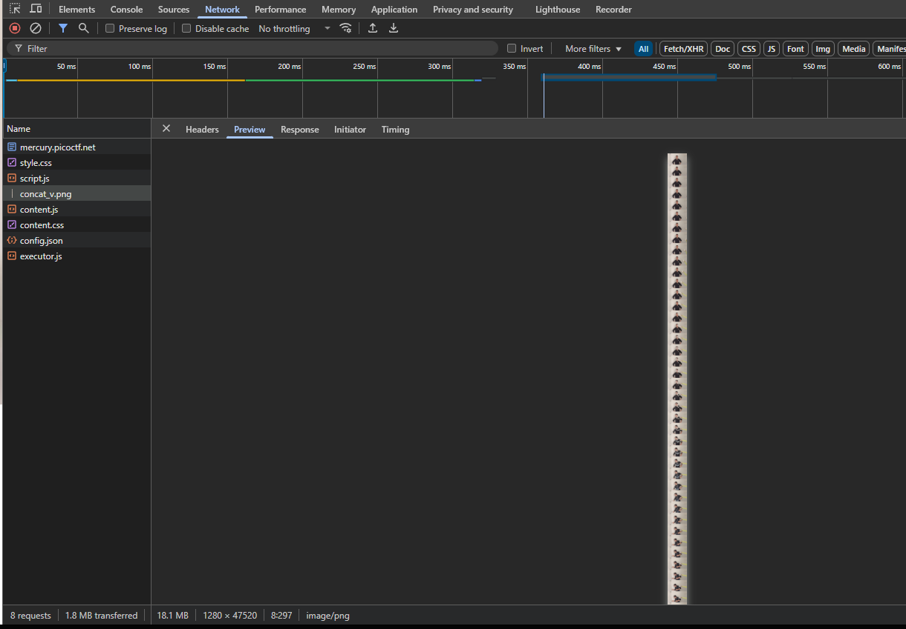

At first glance, this task appears to belong to the `Web Exploitation` category, but the hint suggests looking elsewhere.


First, we see a web application with a single `GIF` (at first glance) that plays when you move the cursor from right to left over it. Let's take a look at `DevTools → Network`:



After looking through all the files, I couldn't find any mention of `pico` or `ctf`, but there is a very long png file with concatenated frames from an image. Such images are called `'Sprite Sheets'`.

The hint that this is the `Forensics` category suggests that the flag is probably hidden using steganography in this png.
`binwalk -e concat_v.png` didn't give any results. 
Trying `zsteg`:

```bash
zsteg concat_v.png
```


The image has a resolution of `1280x47520`, which causes the `zsteg` buffer overflow.

So I came up with the idea of splitting this file into frames and applying zsteg to each of them.

First, I counted the frames manually, there are `66` of them.
`47520/66=720` divides evenly. Therefore, we get that each frame has a resolution of `1280x720`.

<br/>

### Cutting frames
Let's write a Python-script `cut_frames.py` for cutting frames from a sprite sheet:

> [!TIP]
> Scripts and explanations to them I left here: [*click*](../scripts/forensics/milkslap)

```python
#usage:
# need to place in one directory with *.png
# chmod +x cut_frames.py
# python3 cut_frames.py
from PIL import Image

def extract_frames():
    print('Start frame extraction')

    img = Image.open('concat_v.png')
    print(f'Sprite sheet size (pix): {img.size}')

    frame_height = 720
    frame_width = 1280

    for i in range(66): #0-65
        frame_num = i + 1

        y_start = i * frame_height
        y_end = y_start + frame_height

        print(f'==Extracting frame {frame_num} (y: {y_start}-{y_end})==')

        # Cutting the frame (left, top, right, bottom)
        frame = img.crop((0, y_start, frame_width, y_end))

        frame_name = f"frame_{frame_num}.png"
        frame.save(frame_name)
        print(f'==Saved frame {frame_num}.png==')

    print('Extraction completed')

if __name__ == "__main__":
    extract_frames()
```
Result:


### Automate flag search

Let's apply zsteg. Writing bash-ascrpt `zteg_to_each_frame.sh` to automate this process:
```bash
#!/bin/bash

echo "==zsteg scan=="

for frame in frame_*.png; do 
  if zsteg $frame 2>/dev/null | grep -iE "pico|ctf|flag"; then
  	echo "FOUND FLAG"
  	zsteg $frame 2>/dev/null | grep -iE "pico|ctf|flag"
  else
  	echo "NOTHING YET"
  fi
done
```

Result:


`picoCTF{imag3_m4n1pul4t10n_sl4p5}`
