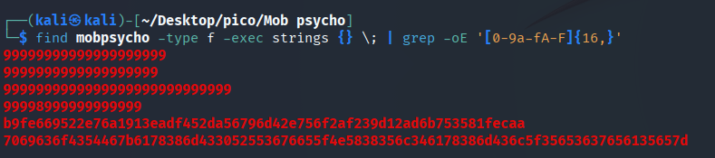
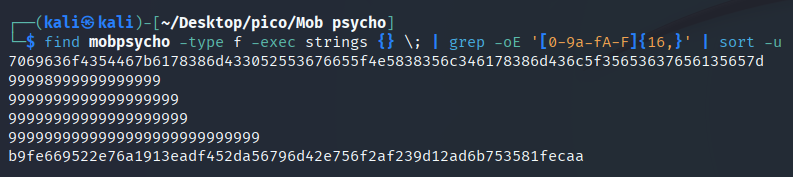
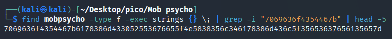
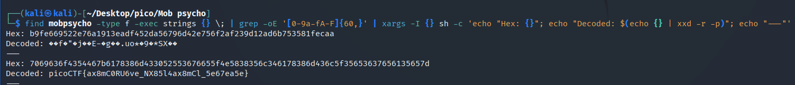

Download the file `mobpsycho.apk`, which is recognized by the `file` command as `Zip archive data`.

---

### Unpacking

There are three ways to unpack this apk:


```bash
apktool d mobpsycho.apk
unzip mobpsycho.apk -d mobpsycho
binwalk -e mobpsycho.apk
```


### Search by `'picoCTF\{.*\}'` 

Each time I unpacked a challenge file a separate directory was created, so I started searching for the string "picoCTF" in each of these directories:

Search for strings with `grep` recursively across all files:

```bash
find mobpsycho -type f -exec strings {} \; | grep -oE 'picoCTF\{.*\}'
```

Alternative version with `xargs`:


```bash
find mobpsycho -type f -print0 | xargs -0 strings | grep -oE 'picoCTF\{.*\}'
```

> [!TIP]
> Full list of commands with explanations to solve this challenge I left here: [*click*](../scripts/forensics/mob-psycho/bash_to_solve.md)


Tried searching manually through files:

```bash
strings mobpsycho/AndroidManifest.xml | grep -oE 'picoCTF\{.*\}'
strings mobpsycho/classes.dex | grep -oE 'picoCTF\{.*\}'
strings mobpsycho/classes2.dex | grep -oE 'picoCTF\{.*\}'
strings mobpsycho/classes3.dex | grep -oE 'picoCTF\{.*\}'
```

Search in `/res` directory:

```bash
find mobpsycho/res -type f -exec strings {} \; | grep -oE 'picoCTF\{.*\}'
```

Search in both text and binary files:

```bash
grep -r -a -oE 'picoCTF\{.*\}' mobpsycho/
```

### Search by `'[0-9a-fA-F]{16,}'` 

Then I caught a thought that perhaps the flag **was encoded** in some way, for example in **hex code**. So I wrote a regular expression that would contain:

* numbers 0-9
* letters of the English alphabet in lower and upper case
* minimum sequence length of 16 characters

Let's try a basic search using the above rules:

```bash
find mobpsycho -type f -exec strings {} \; | grep -oE '[0-9a-fA-F]{16,}'
```





One of the sequences looks long enough to be a flag, but let's try some more search options.

Let's add `sort -u`:

```bash
find mobpsycho -type f -exec strings {} \; | grep -oE '[0-9a-fA-F]{16,}' | sort -u 
```




Since we have found a potential flag, let's try to form a command that outputs only it, without cluttering up the terminal as much as possible. To do this, we will take the first characters of the flag's hex code:

```bash
find mobpsycho -type f -exec strings {} \; | grep -i "7069636f4354467b" | head -5
```




Command that will **search for and decode** the flag:

```bash
find mobpsycho -type f -exec strings {} \; |
grep -oE '[0-9a-fA-F]{60,}' | 
xargs -I {} sh -c 'echo "Hex: {}"; echo "Decoded: $(echo {} | xxd -r -p)"; echo "---"'
```




`picoCTF{ax8mC0RU6ve_NX85l4ax8mCl_5e67ea5e}`
