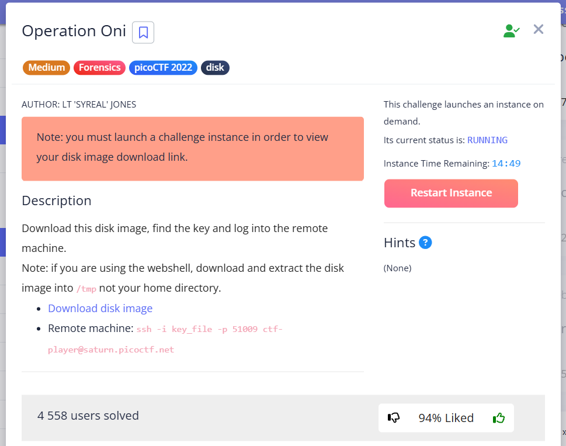
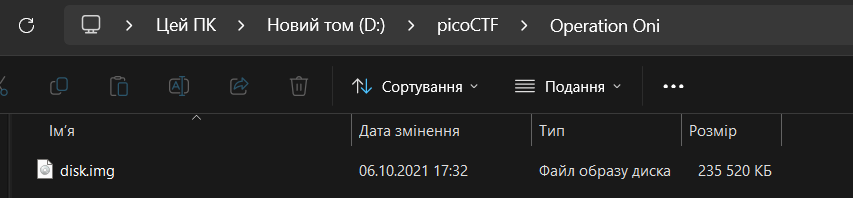
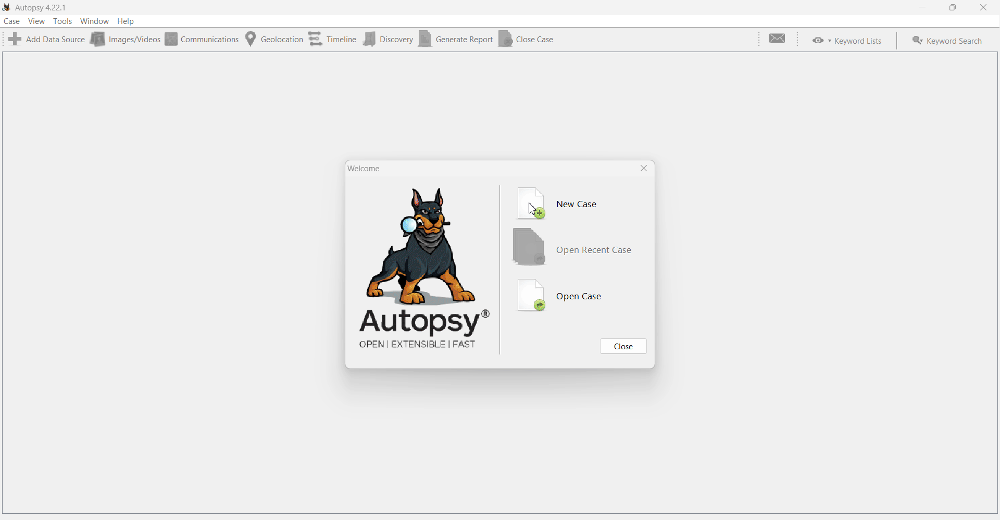
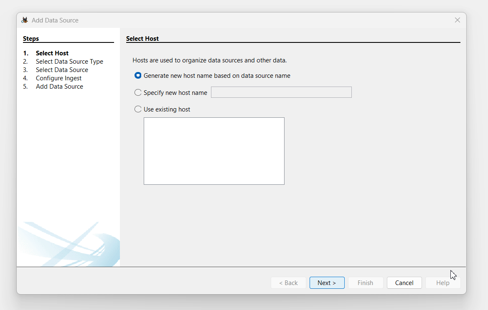
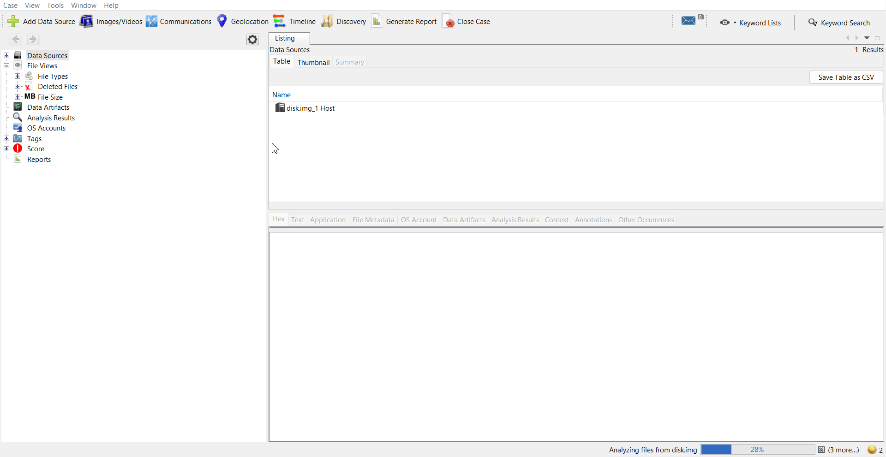
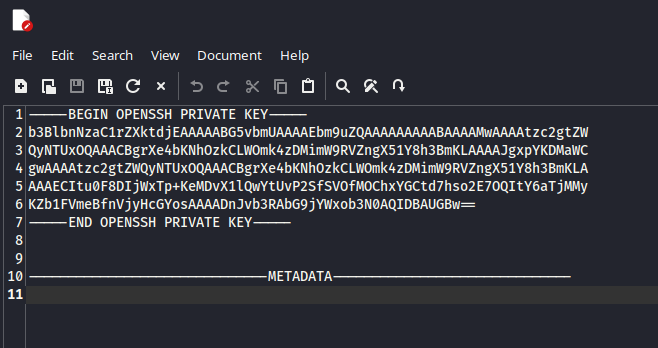
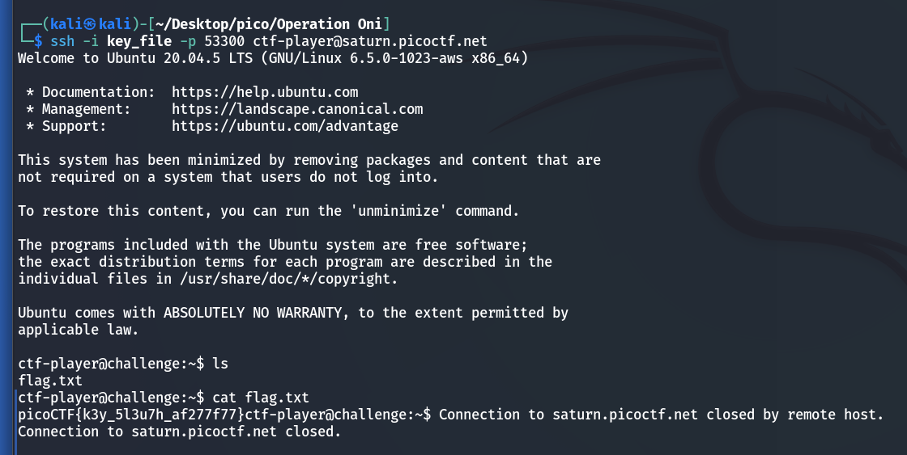

In this task, we need to extract the public SSH key from the `.img` file and use it to connect to the remote host where the flag will be located.


## Autopsy

First, let's set up the Autopsy environment by creating a project in the same directory as the file we are investigating.




### Create New Case

Create a `New Case` for research:



### Choose `disk.img`  

Next, we download `disk.img` for further analysis:



### Search for SSH-key

Now we need to find the key that will be used to log in. 



As can be seen from the command in the task description, the file name with the key `key_file`: 
```bash
ssh -i key_file -p 51009 ctf-player@saturn.picoctf.net
```
<br>

## VM Kali


### Login to `ctf-player`


 
### chmod

For the key to work correctly, you need to change its access rights:

```bash
chmod 600 key_file 
```




`picoCTF{k3y_5l3u7h_af277f77}`
