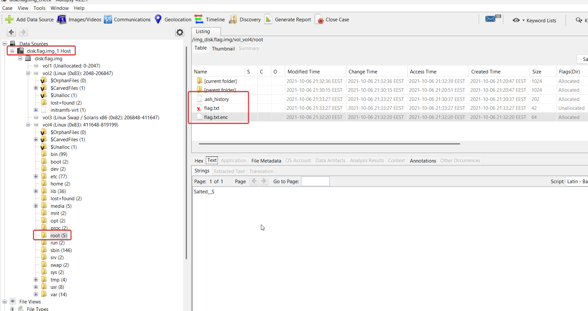
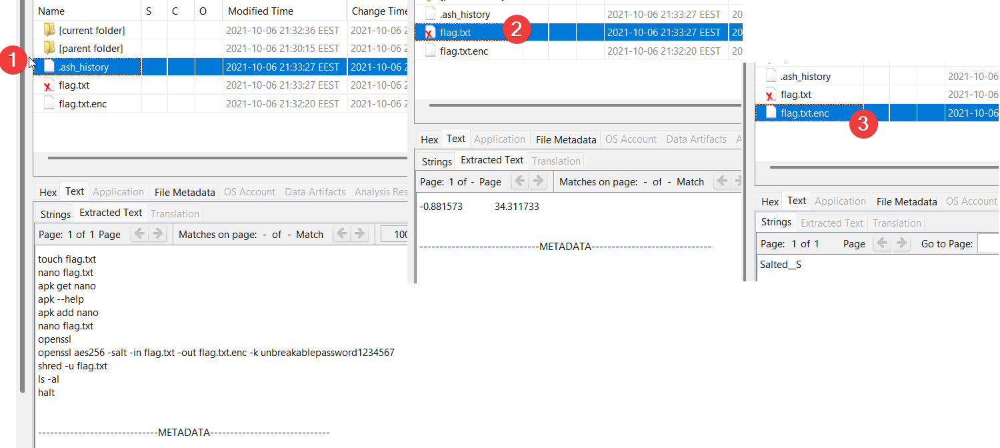
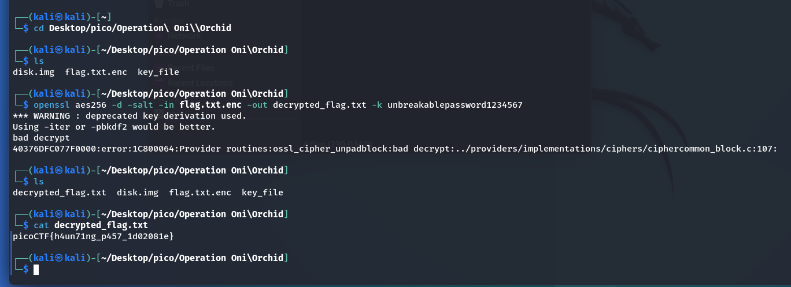

In this task, just like in the previous [Operation Oni](../Operation-Oni.md), we need to analyze `disk.flag.img` and find the files related to the flag there.

## Autopsy

We will use Autopsy for analysis. Instructions for creating a project and uploading the file under investigation can be found in the write-up [Operation Oni](../Operation-Oni.md).

In the `/root` directory, we find three files that provide us with information about actions on the flag:



### File analysis

let's look at the files `.ash_history`, `flag.txt`, `flag.txt.enc`:



we see the `openssl` command that is very similar to what we have seen in [Eavesdrop](Eavesdrop.md) task:

`openssl` uses AES with a block length of 256 bits, adding salt to the contents of `flag.txt` and the key `unbreakablepassword1234567`.

Let's decrypt our flag.

# VM kali

## Decryption

Since AES is a symmetric algorithm, like 3DES from task [Eavesdrop](Eavesdrop.md), the decryption process is the same: 

* Export the file `flag.txt.enc`
* Let's use the command we found: 

```bash
openssl aes256 -d -salt -in flag.txt.enc -out decrypted_flag.txt -k unbreakablepassword1234567
```



`picoCTF{h4un71ng_p457_1d02081e}`

