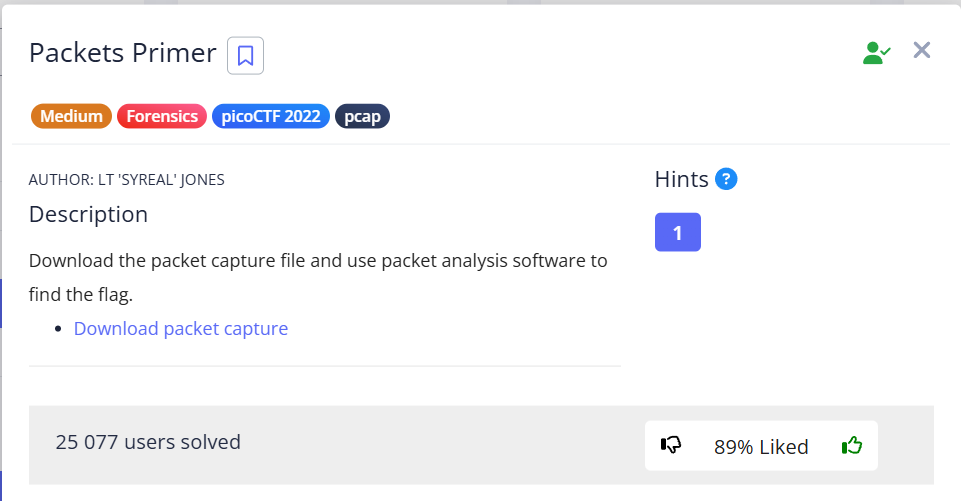

In this task, we need to extract the flag from `network-dump.flag.pcap`.

Follow TCP-stream:


We need to remove spaces from this stream. Let's create a script for this:
flag.txt:
```
p i c o C T F { p 4 c k 3 7 _ 5 h 4 r k _ b 9 d 5 3 7 6 5 }
```

```python
delete spaces.py:
with open("flag.txt", "r") as file:
    flag = file.read()
    no_spaces_flag = ""
    for i in flag:
        if i != " ":
            no_spaces_flag += i
print(no_spaces_flag)
```


`picoCTF{p4ck37_5h4rk_b9d53765}`
