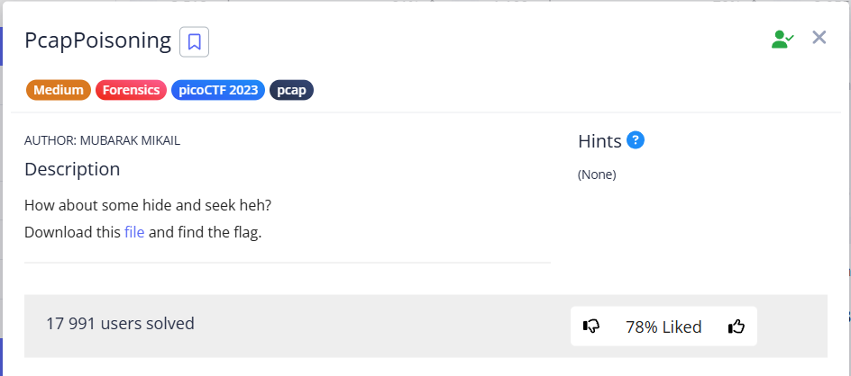
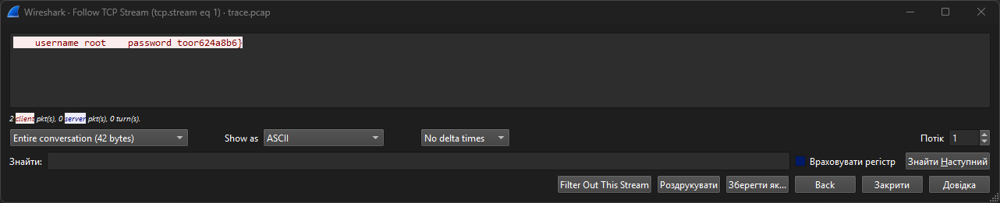
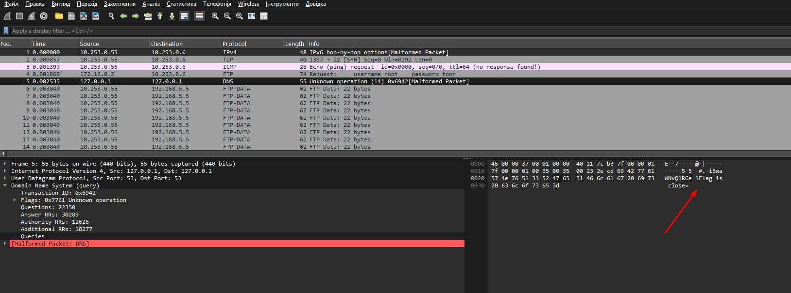
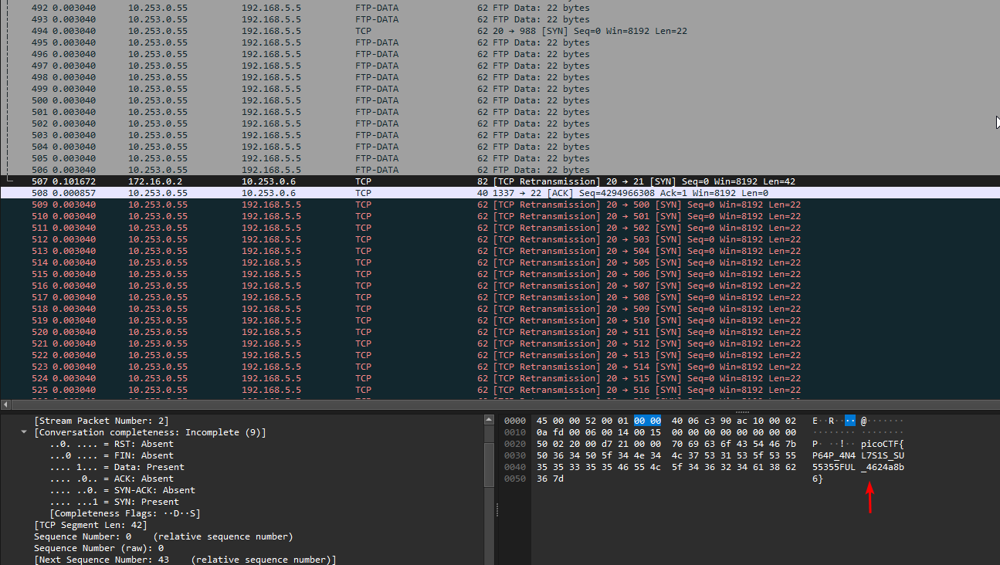
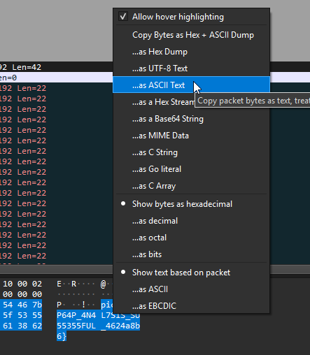

This task boils down to simply reviewing packages and looking for clues.

---

The traffic itself consists mainly of FTP Data protocols and related TCP packets.

Let's try to trace the TCP stream:




Found: `username root    password toor624a8b6}`





Leafing through the packages, I found the following clues:


```
iBwaWNvQ1RGe1 Flag is close=
gc2VjcmV0OiBwaWNvQ1RGe
```


None of these entries produce readable text when decoded from base64.

And finally, in package 507, we find the flag:






`picoCTF{P64P_4N4L7S1S_SU55355FUL_4624a8b6}`
 
