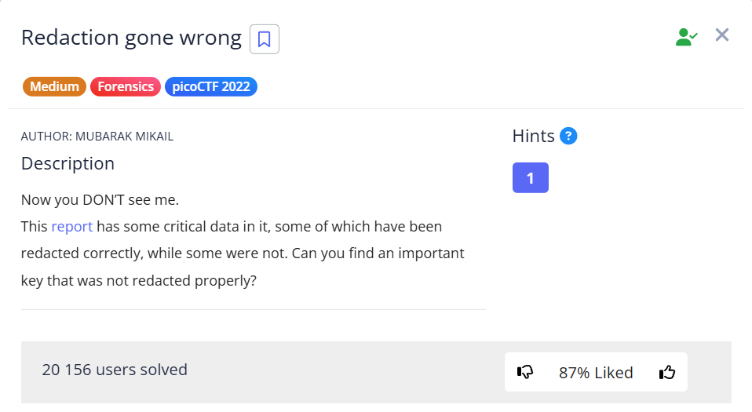
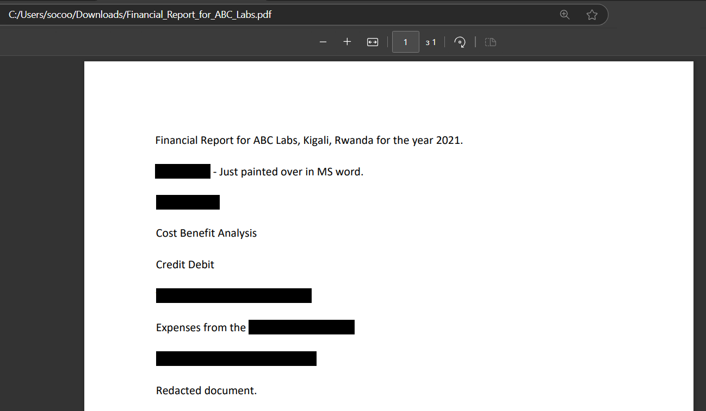
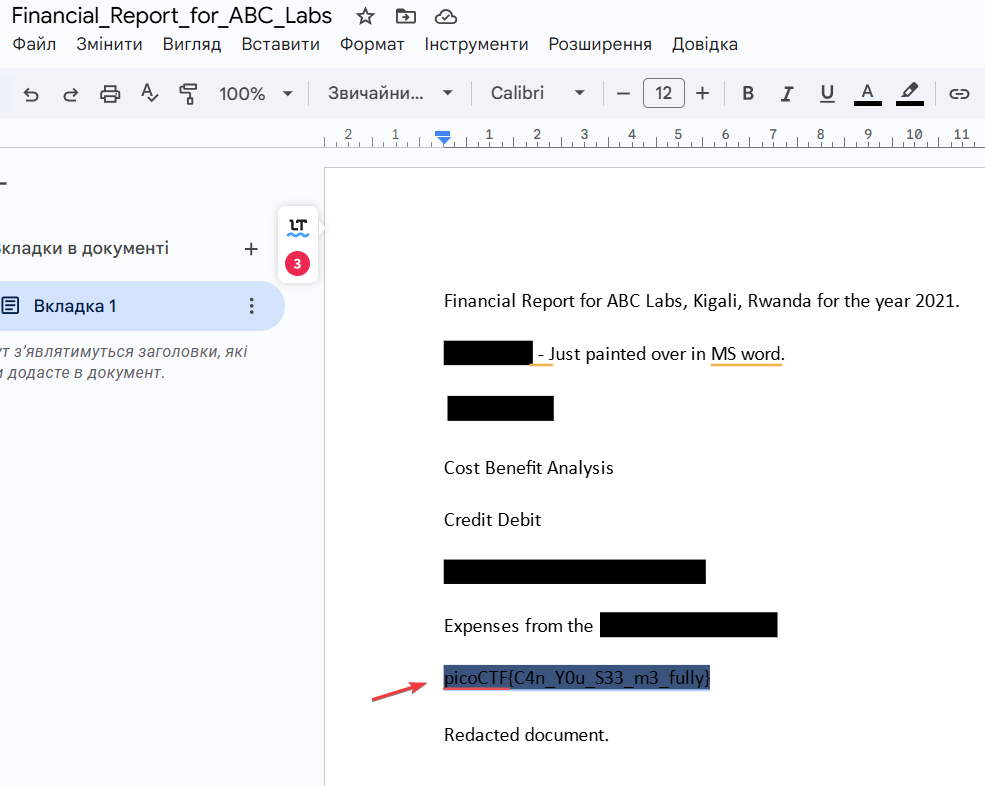

In this task, we need to read the "sketched" lines in `Financial_Report_for_ABC_Labs.pdf`.

I'll use [Convertio](https://convertio.co/pdf-docx/) tool to convert `pdf` to `docx`.

Next, select the text and copy the flag:

`picoCTF{C4n_Y0u_S33_m3_fully}`
