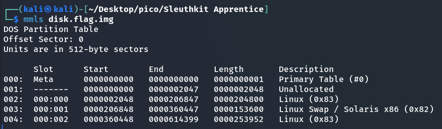

In this task, we need to find the flag in the disk image `disk.flag.img`.

## I method
### Autopsy

For more details on how to create a project and add a file to Autopsy for analysis, check [Operation Oni](Operation%20Oni.md) write-up.


<br>
## II method 
### VM kali
#### mmls

> [!NOTE]
> `mmls` used to list the partition table contents so that you can determine where each partition starts. ([Source](https://wiki.sleuthkit.org/index.php?title=Mmls))

First, let's look at the partitions on the disk. Here you can see the offset at which each partition begins.

```bash
mmls disk.flag.img
```


Comparison how to do the same in Autopsy:


#### fsstat

> [!NOTE]
> `fsstat` displays the details associated with a file system. The output of this command is file system specific. ([Source](https://www.systutorials.com/docs/linux/man/1-fsstat/))

Next, we will learn more about each section in detail, including the file system (needed for parameters in subsequent commands):
```bash
fsstat -o 2048 disk.flag.img > fsstat_Linux_(0x83)_2048.txt
fsstat -o 360448 disk.flag.img > fsstat_Linux_(0x83)_360448.txt
```


In Autopsy: 


#### fls

> [!NOTE]
> `fls` lists the files and directory names in a file system ([Source](https://wiki.sleuthkit.org/index.php?title=Fls))

Next, we will use `fls` to display the names of files and directories:

```bash
fls -i raw -f ext4 -o 360448 -r disk.flag.img
```
here:
* `-i raw` – indicates that the input file `disk.flag.img` is a **raw** disk image
  
> [!NOTE]
> Why `raw`: Because `fls` (and other Sleuth Kit tools) need to know how to interpret the input file. If it were an `E01` (EnCase) image, we would use `-i ewf`. If it were an `aff` (Advanced Forensic Format) image, it would be `-i aff`. But since `disk.flag.img` is a simple sequence of bytes, `raw` is the correct choice.

* `-f ext4` – the type of file system partition.
* `-o 360448` – offset (number of sectors from the beginning of the image)


or: 


#### icat
> [!NOTE]
> `icat` output the contents of a file based on its inode number. ([Source](https://sleuthkit.org/sleuthkit/man/icat.html))
> 
> `Inodes` (from "index node" or "index descriptor") — This is a fundamental concept in Unix-like operating systems (such as Linux, macOS, Unix). Every file and directory on the file system has its own unique inode.
>
> An inode stores **metadata** about a file or directory, but **does NOT store the actual file contents**. This metadata includes:
> 
>
> 
> 1. **File type:** regular file, directory, symbolic link, device, etc.
> 2. **Access rights:** read, write execute permissions.
> 3. **Owner and group:** The user ID (UID) and group ID (GID) that own the file.
> 4. **Timestamps:**
>     * **atime** (access time): Time of last access (read) to the file.
>     * **mtime** (modification time): Time of last file content change.
>     * **ctime** (change time): Time of the last inode change (e.g., change in access rights, owner, file content).
> 5. **File size:** in bytes.
> 6. **Number of hard links:** The number of times a file is referenced in the directory structure. When a file is deleted, the hard link count is decremented. When it reaches 0, the data can be freed.
> 7. **Pointers to data blocks:** Most importantly, an inode contains pointers (addresses) to data blocks on the disk where the file content is actually stored.


> [!IMPORTANT]
> **`inode` importance in forensics:**
> * **Deleted files:** When a file is deleted, its name is simply removed from the directory, and the pointers to the data blocks in the inode may remain unchanged until those blocks are overwritten.

```bash
icat -i raw -f ext4 -o 360448 -r disk.flag.img 2371
```


`picoCTF{by73_5urf3r_adac6cb4}`
