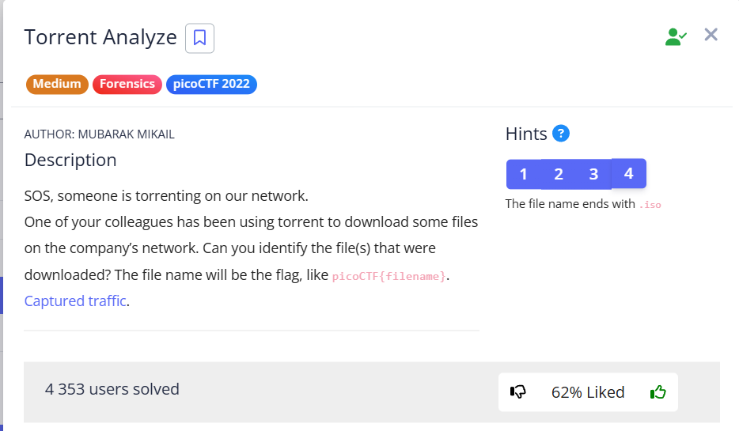

In this task, we need to analyze a `.pcap` file and extract information about the `.iso` file that was downloaded via torrent.

---
> [!NOTE]
> ### BitTorrent terms
> **Leecher** - someone who downloads a file
>
> **Seed** - someone who has already downloaded it and **has not deleted it from their downloads, *and therefore SHARES it*** (has downloaded 100% of the file and continues to download subsequent files in *swarm*) 
>
> **Peer** - someone who is in a swarm of users and uploads and downloads

> [!TIP]
> If you're intersted in Torrents theory, I wrote this [**guide**](../../notes/Torrents%20theory.md) to this topic.

Enable protocols, `BT-DHT`, `BitTorrent`, `uTP`, `DHT`, so that Wireshark can recognize and parse them correctly.

Next, enter `bt-dht` in the `Current filter` field. We receive many packages with the same hash repeated: `e2467cbf021192c241367b892230dc1e05c0580e` 

 

Search by hash on VirusTotal: 

 \
 \
The flag must end with `.iso`:  

`picoCTF{ubuntu-19.10-desktop-amd64.iso}`
