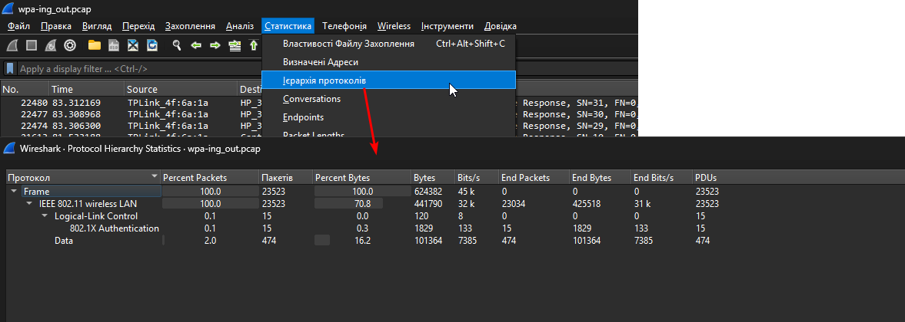

In this task, we need to crack a WPA-protected password. The task provides hints, namely to use `aircrack-ng` for cracking and the `rockyou.txt` dictionary for obtaining values for brute force. But in general, this task can be solved in several ways.

---

## I method: aircrack-ng

```bash
aircrack-ng -help
```  


We are interested in the option for specifying the path to the dictionary:

```bash
aircrack-ng -w /usr/share/wordlists/rockyou.txt wpa-ing_out.pcap
```


To accomplish the task, this is sufficient:

`picoCTF{mickeymouse}`


## II method: hashcat

`hashcat` operates in numerous modes, one of which is WPA. The modes suitable for this are listed here: [*click*](https://hashcat.net/wiki/doku.php?id=cracking_wpawpa2) : 


Each mod has its own identifier, specified via `-m`.

To crack the WPA password, we first need to convert `wpa-ing_out.pcap` to the appropriate format. It also mentioned in source from above: [*click*](https://hashcat.net/wiki/doku.php?id=cracking_wpawpa2)


```bash
hcxpcapngtool -o hashCrack.hc22000 wpa-ing_out.pcap
```


From the inside it looks like this:

```
WPA*02*32989a79f86d839eadd1aaa21c03d3f9*005f674f6a1a*1cbfce17b0be*476f6e655f53757266696e67*25ef6a1eeb8bb313b72ec06dfdd149549b1ace84ff992fbeb380e2591ccac1d2*01030077020109000000000000000000018451310d2c932f59694295cef35c115d59d4499436f7bec311b233108bbc1470000000000000000000000000000000000000000000000000000000000000000000000000000000000000000000000000001830160100000fac020100000fac020100000fac0200000000*82
```

Launch cracking process:

```bash
hashcat -m 22000 hashCrack.hc22000 /usr/share/wordlists/rockyou.txt
```


The phrase "Gone_Surfing" is the name of the WiFi network (access point) to which all devices involved in the transfer were connected.  


This data can be used to decrypt traffic in Wireshark.

First, let's look at the protocol hierarchy:  





This is what it looks like BEFORE decryption. There are no transfer protocols from the TCP/IP stack, as everything is encrypted. 

Для розшифрування використаємо пару `<password>:<SSID>`:

```
mickeymouse:Gone_Surfing
```


The protocol hierarchy has become more detailed, indicating that the key is correct.

However, there is no mention of the flag in the decrypted traffic in UDP/TCP streams.:


Therefore, the task was simply to crack the password using a dictionary.

`picoCTF{mickeymouse}`
