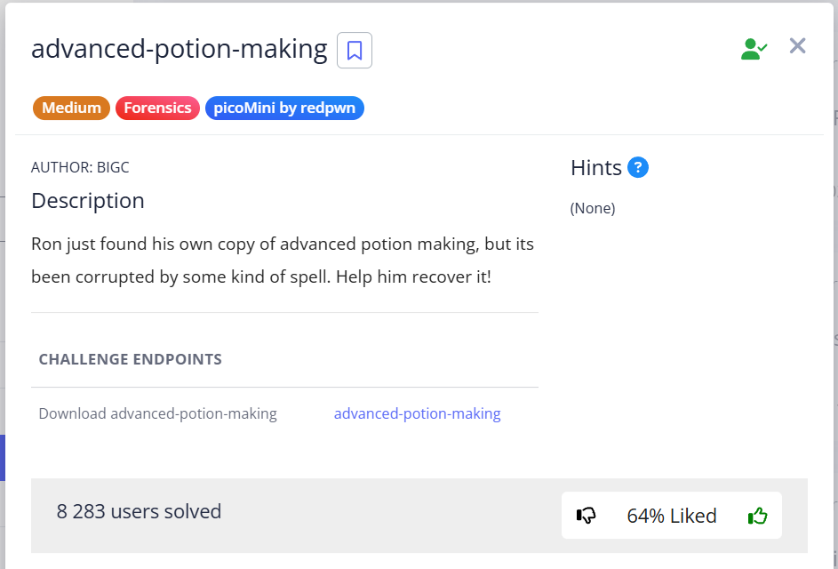
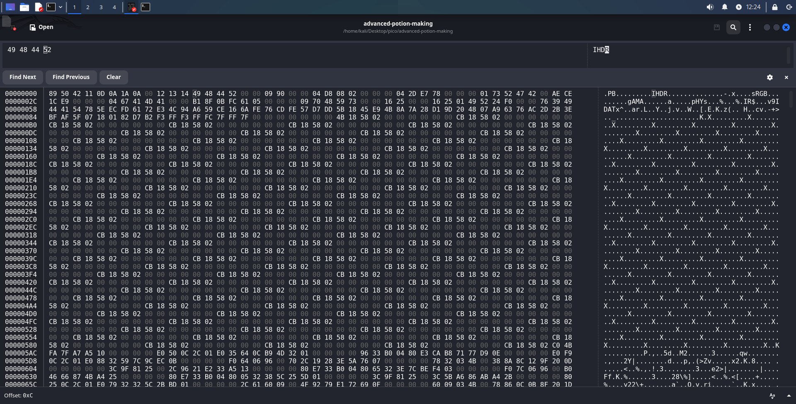
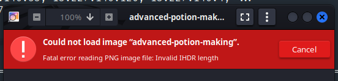
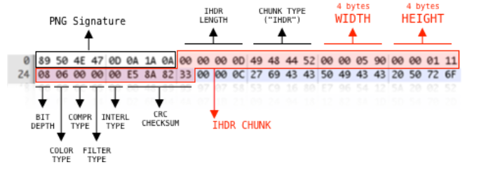
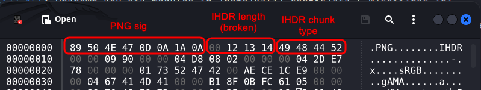
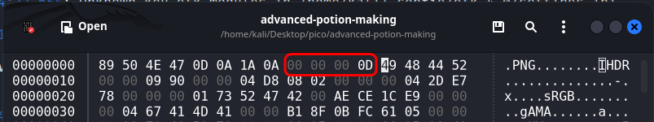
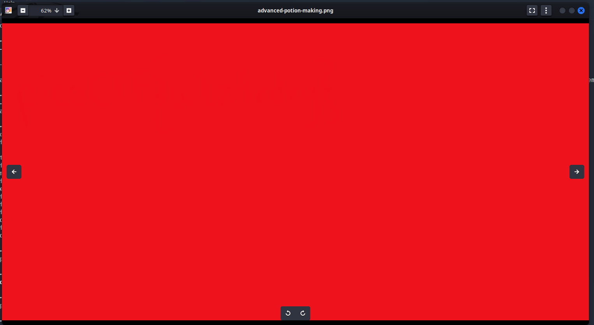
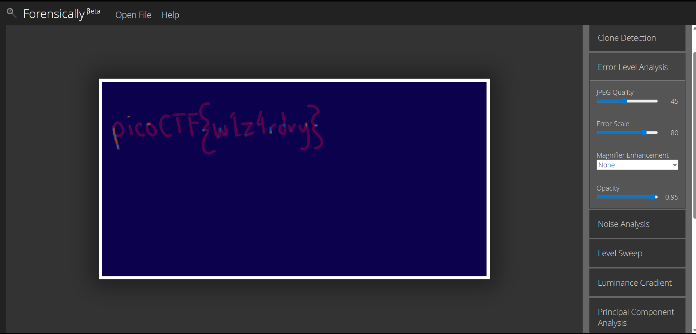

Download and check `file advanced-potion-making`:


```bash
┌──(kali㉿kali)-[~/Desktop/pico/advanced-potion-making]
└─$ file advanced-potion-making 
advanced-potion-making: data
```




Open the file in `ghex` and you will immediately see IHDR, sRGB, gAMA, pHYs, IDAT chunks, which indicates that it is a PNG, but some bytes have been changed.

Let's start by checking whether the PNG signature has been broken. More sigs here: ([File sigs](https://en.wikipedia.org/wiki/List_of_file_signatures))

```
89 50 4E 47 0D 0A 1A 0A
```

In file:  


Replace and try to open Eye of Gnome `eog advanced-potion-making` 





```
┌──(kali㉿kali)-[~/Desktop/pico/advanced-potion-making]
└─$ pngcheck -v advanced-potion-making
zlib warning:  different version (expected 1.2.13, using 1.3.1)

File: advanced-potion-making (30372 bytes)
  chunk IHDR at offset 0x0000c, length 1184532:  EOF while reading data
ERRORS DETECTED in advanced-potion-making
```


```
┌──(kali㉿kali)-[~/Desktop/pico/advanced-potion-making]
└─$ identify advanced-potion-making
identify: IHDR: too long `advanced-potion-making' @ error/png.c/MagickPNGErrorHandler/1491.
```


It is clear from above output that the problem lies in the bytes that indicate the length of the IHDR chunk. 

> [!TIP]
> You can read more about the structure of the IHDR chunk and CRC calculation in my cheat sheet: [*click*](../../notes/IHDR-chunk%20structure%20and%20CRC%20calculate.md)

We'll focus on IHDR-length only.  





I googled "Invalid IHDR length" and found on Stack Overflow an [article](https://stackoverflow.com/questions/54845745/not-able-to-read-ihdr-chunk-of-a-png-file) about IHDR-chunk structure (I took the image from there).
As it can be seen from image, 4 bytes IHDR come right after PNG-signature. **IHDR length is fixed and always equal to 13 bytes**! 


In hex `13` is `0D`. In file it looks like:  




```
13(dec) → 0D(hex) → 00 00 00 0D
```




```
┌──(kali㉿kali)-[~/Desktop/pico/advanced-potion-making]
└─$ file advanced-potion-making 
advanced-potion-making: PNG image data, 2448 x 1240, 8-bit/color RGB, non-interlaced
```


To open this image, you need to add its format to the name:


```bash
mv advanced-potion-making advanced-potion-making.png
eog advanced-potion-making.png
```





After searching for various Photo Forensics tools, I settled on [this tool](https://29a.ch/photo-forensics/#error-level-analysis). I tried various settings suggested here and settled on `Error Level Analysis`:  



`picoCTF{w1z4rdry}`
