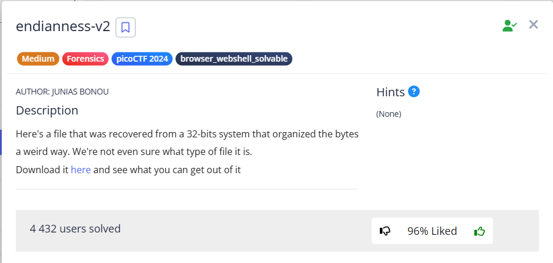
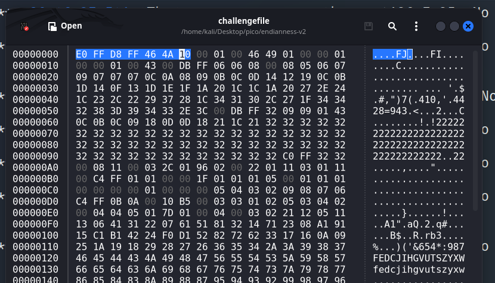
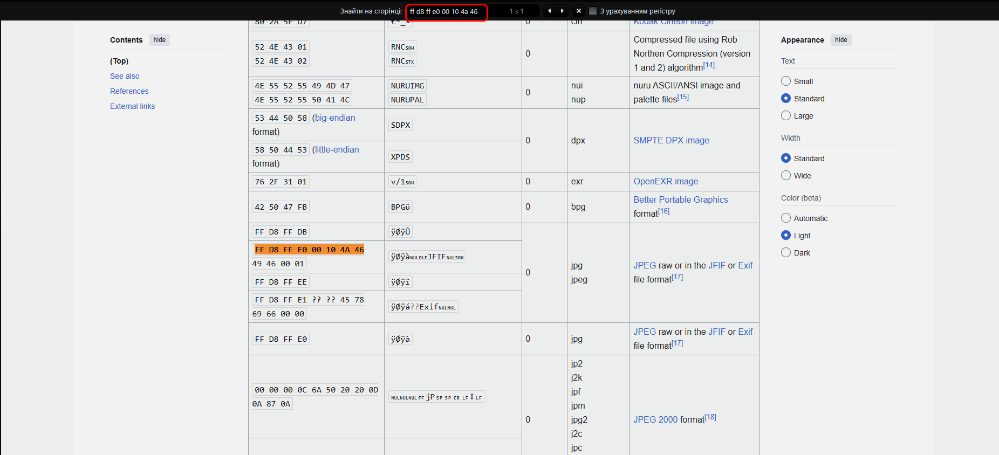
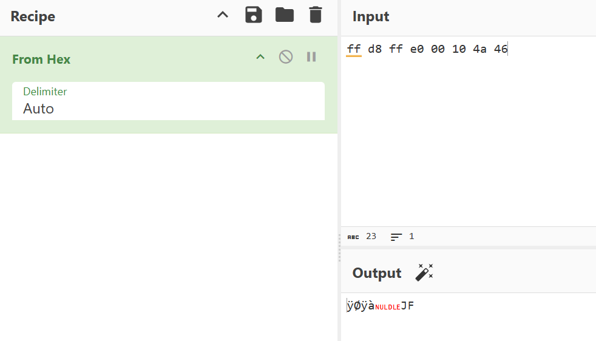
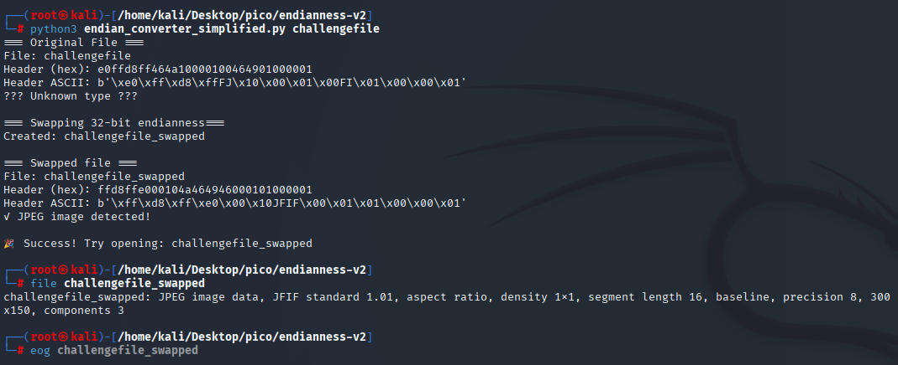
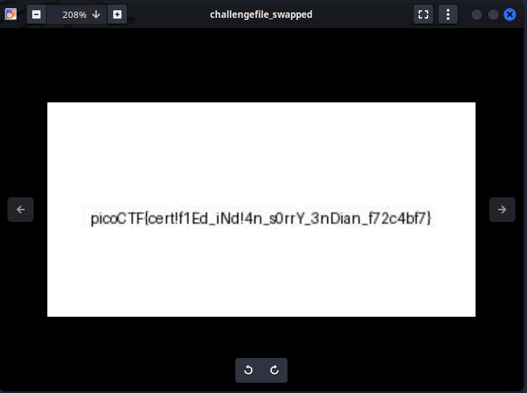

In this task, we need to change the order of bytes in the `challengefile` file block by block.  
The task description suggests that byte reversal should be performed in a 32-bit system, i.e., take blocks of 4 bytes and reverse them.

---

First, let's look at the file itself in `hexeditor` or `ghex` to see if there is anything readable there:





The first bytes resemble the magic bytes of `.jpeg`:  





Since the system is 32-bit, we take 4 bytes, reverse them, and see if they match:  


```
E0 FF D8 FF 46 4A 10 00 (BROKEN)
ff d8 ff e0 00 10 4a 46 (AFTER SWAP)
```





The ASCII signature also matches the one provided in [list](https://en.wikipedia.org/wiki/List_of_file_signatures) of file signatures.

Let's write a Python program that 

* captures 4 bytes
* mirrors them and writes them to a newly created file `<input_name>_swapped`
* determines the file type based on the first 16 bytes (to ensure that all magic bytes are captured)

[Here](https://en.wikipedia.org/wiki/List_of_file_signatures) I've chosen possible file formats and their magic bytes:  


```
PNG  b'\x89\x50\x4E\x47'
GIF  b'\x47\x49\x46'
JPEG b'\xFF\xD8\xFF'
BMP  b'\x42\x4D'
ZIP  b'\x50\x4B'
ELF  b'\x7F\x45\x4C\x46'
PDF  b'\x25\x50\x44\x46'
```

Then I wrote `endian_converter.py`, that does all the stuff automatically. 
> [!TIP]
> I left it here: [*click*](../scripts/forensics/endianness-v2/endian_converter.py) 








`picoCTF{cert!f1Ed_iNd!4n_s0rrY_3nDian_f72c4bf7}`
