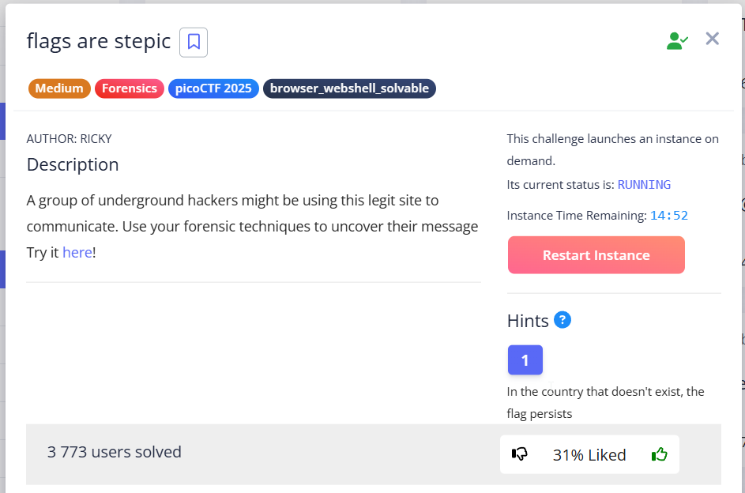
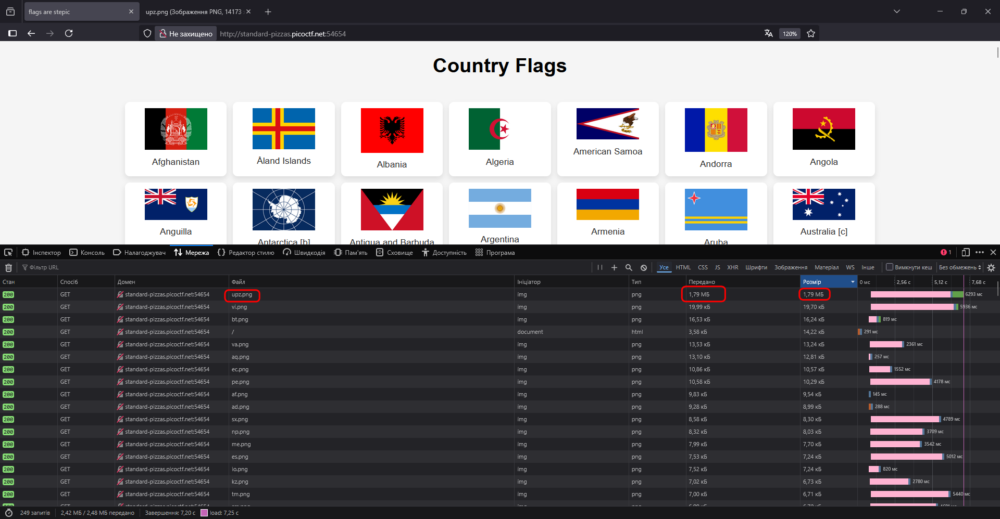

One of the files weighs an unusually large 1.79 MB, suggesting that there is something hidden there using steganography.  





It was [stepic](https://pypi.org/project/stepic/) algorithm, which hides text in images by slightly changing their color.  

> [!TIP]
> This example helped me to write a solution script : [*click*](https://stackoverflow.com/questions/49155658/how-to-use-stepic-encode)


```python
from PIL import Image
import stepic

img = Image.open('upz.png')
flag = stepic.decode(img)
print(flag)
```

`picoCTF{fl4g_h45_fl4g51d83cb1}`
