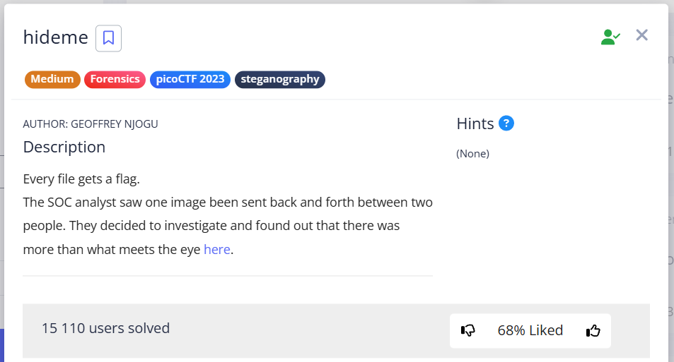
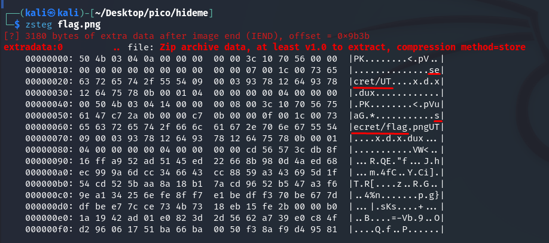
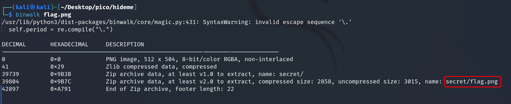
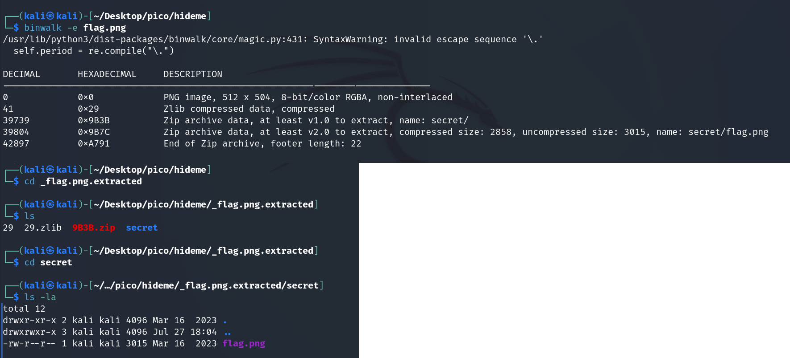
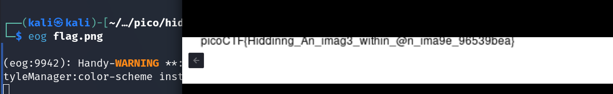
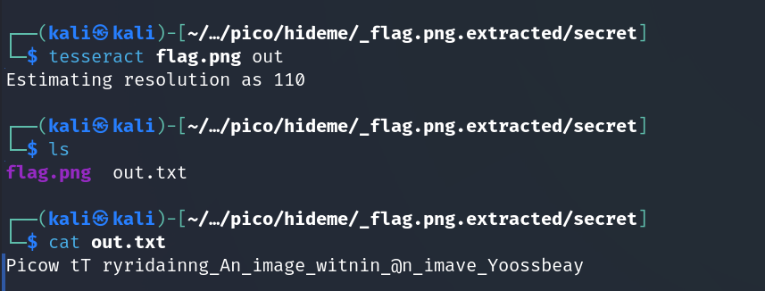

    

---

Try `zsteg` and see that there is a directory and at least 1 file in it.  

  

Same is confirmed by `binwalk`:  

  

Extract with the `-e` parameter:  

  

  

You can try the OSR tool `tesseract`, but it didn't work very well, so let's rewrite it manually:  

  

`picoCTF{Hiddinng_An_imag3_within_@n_ima9e_96539bea}`  
