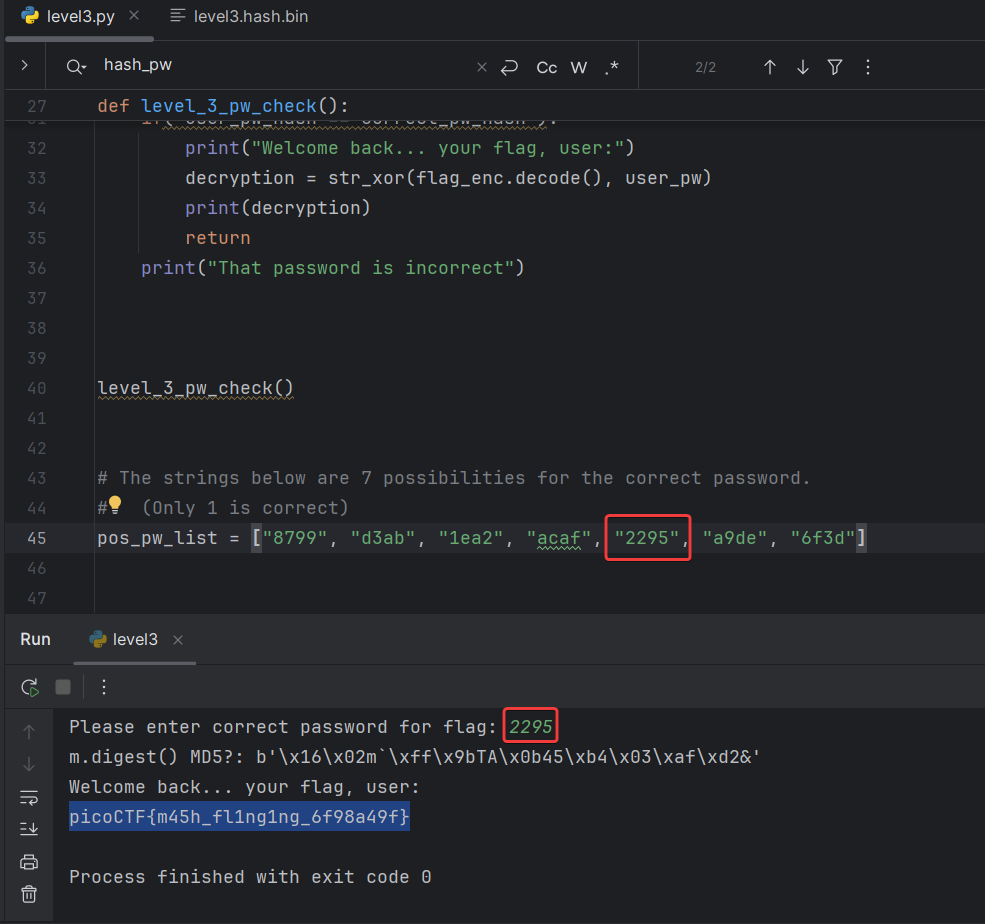
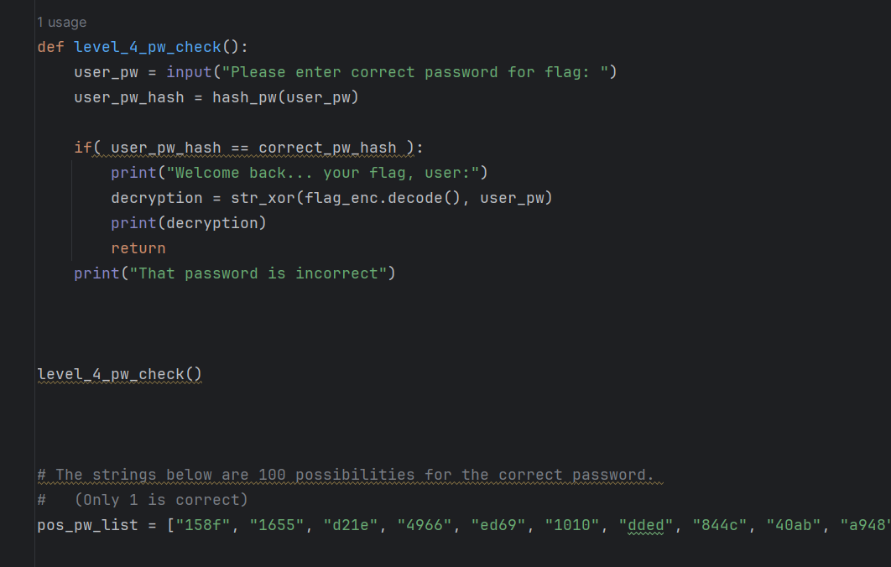
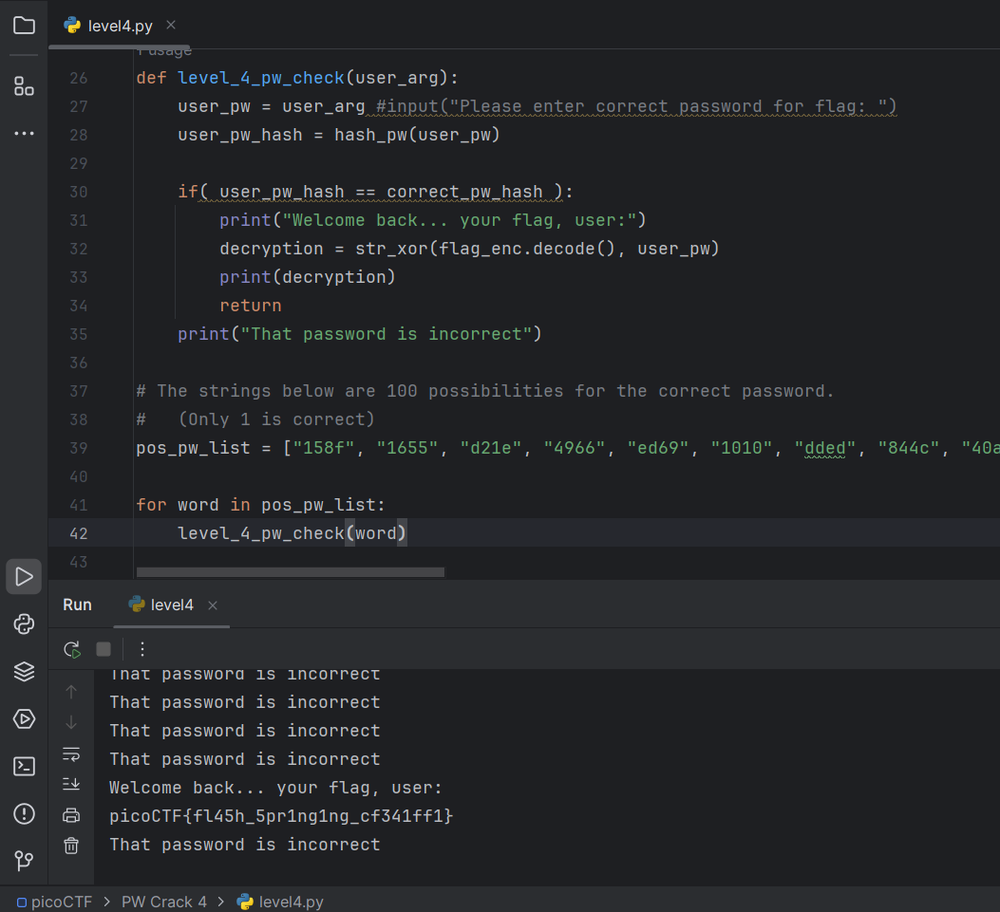
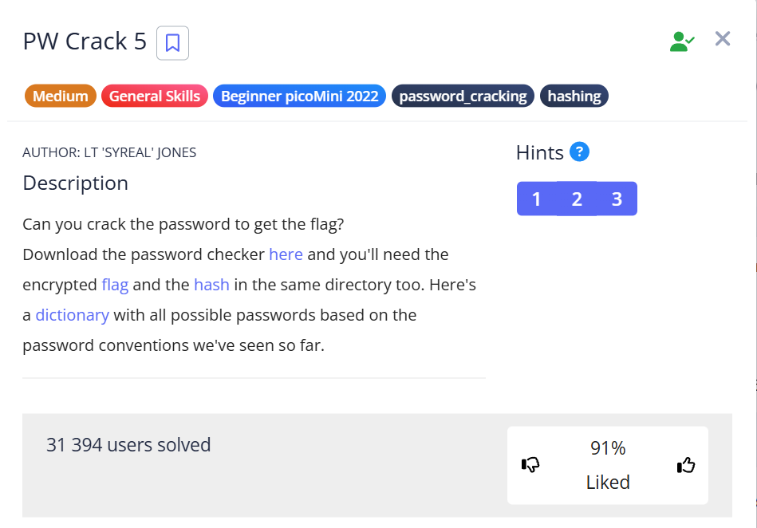
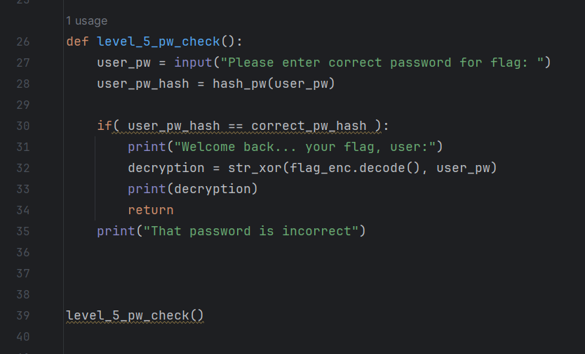
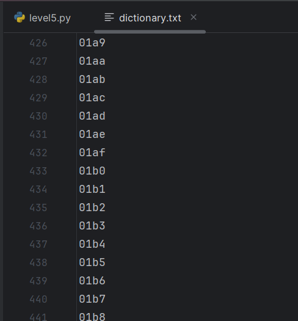
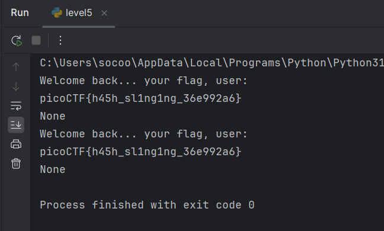

## PW Crack 3





`picoCTF{m45h_fl1ng1ng_6f98a49f}`

<br/>

## PW Crack 4


Slightly modify the program. At first, it looks like this:


`level4.py`:





After changes:

`level4_modified.py`:





`picoCTF{fl45h_5pr1ng1ng_cf341ff1}`

<br/>

## PW Crack 5




Now we need to substitute values from the dictionary:


`level5.py`:








This task can be solved in 2 ways:  

```python
# method 1
with open('dictionary.txt', 'r') as f:
    lines = f.readlines() 
    lines_amount = len(lines) 
    i = 0
    for i in range(lines_amount):
        var = lines[i].strip()
        flag = level_5_pw_check(var)
    print(flag)
```
```python
# method 2
with open('dictionary.txt', 'r') as f: 
    for line in f:
        var = line.strip()
        flag = level_5_pw_check(var)
    print(flag)
```


The main difference between these two options is that in 1:


* `f.readlines()` usually called in the block  `with open` only once, the file pointer (cursor) moves to the end of the file, and when this method is called again, the pointer, which is already at the end, simply returns an empty list
* However, to reuse it, you need to use the `f.seek()` method to move the cursor back.

**First call `f.readlines()`:** Reads all lines, cursor at the end.

**Second call `f.readlines()` (and next calls):** The cursor is already at the end, so there are no "remaining lines" from the current position. Method simply returns an **empty list (`[]`)**.


The second method is more Pythonic, because the object `as f:` is itself an iterator over strings.





`picoCTF{h45h_sl1ng1ng_36e992a6}`
