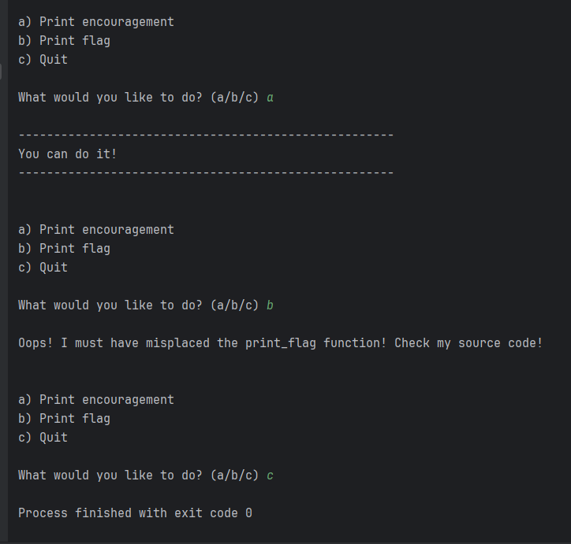
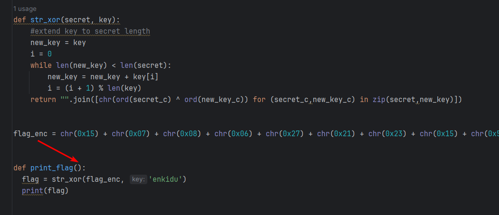
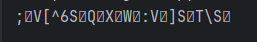
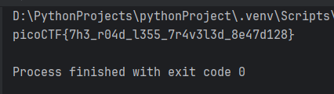

In this task, we have the code for the program `serpentine.py`, which needs some work. Let's take a closer look at it:  




When we launch the program, we see that when we select functions, the program displays text but does not perform any specific actions:




The logic of the program is as follows:


* Converting the 16 values into characters produces the following string: 
  

* Next, this string should be passed to the `print_flag()` function (which is missing the passed parameter).
* And passes the function `str_xor(secret, key)` with the word `"enkidu"`


Let's write a separate program that implements this logic in the correct sequence:


```python
def str_xor(secret, key):
    #extend key to secret length
    new_key = key
    i = 0
    while len(new_key) < len(secret):
        new_key = new_key + key[i]
        i = (i + 1) % len(key)
    return "".join([chr(ord(secret_c) ^ ord(new_key_c)) for (secret_c,new_key_c) in zip(secret,new_key)])

flag_enc = chr(0x15) + chr(0x07) + chr(0x08) + chr(0x06) + chr(0x27) + chr(0x21) + chr(0x23) + chr(0x15) + chr(0x5c) + chr(0x01) + chr(0x57) + chr(0x2a) + chr(0x17) + chr(0x5e) + chr(0x5f) + chr(0x0d) + chr(0x3b) + chr(0x19) + chr(0x56) + chr(0x5b) + chr(0x5e) + chr(0x36) + chr(0x53) + chr(0x07) + chr(0x51) + chr(0x18) + chr(0x58) + chr(0x05) + chr(0x57) + chr(0x11) + chr(0x3a) + chr(0x56) + chr(0x0e) + chr(0x5d) + chr(0x53) + chr(0x11) + chr(0x54) + chr(0x5c) + chr(0x53) + chr(0x14)
flag = str_xor(flag_enc, 'enkidu')
print(flag)
```





`picoCTF{7h3_r04d_l355_7r4v3l3d_8e47d128}`
