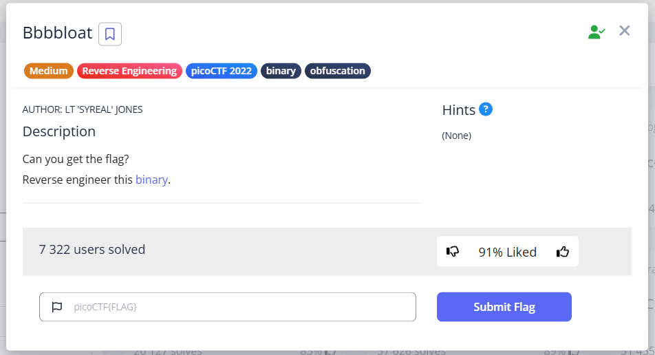
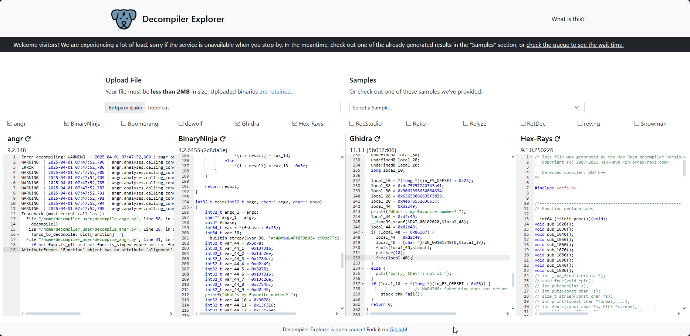
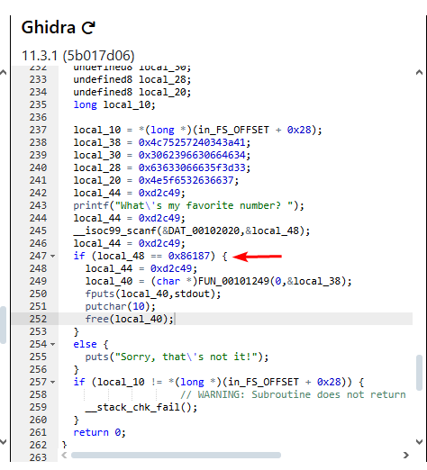
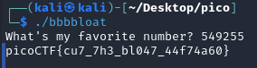

This task contains an ELF file that needs to be decompiled. The program itself asks "What's my favorite number?" and expects some number, after which a flag will be displayed. Otherwise, it outputs “`Sorry, that's not it!`”. 
To do this, we will use an online tool [Decompiler Explorer](https://dogbolt.org/)




Here, attention is drawn to the [Ghidra](https://github.com/NationalSecurityAgency/ghidra/releases) window, where there is an obfuscated function and an `if` check: 
```c 
if (local_48 == 0x86187)
```    



`0x86187` in decimal gives `549255`. So, let's try `549255`:



`picoCTF{cu7_7h3_bl047_44f74a60}`
