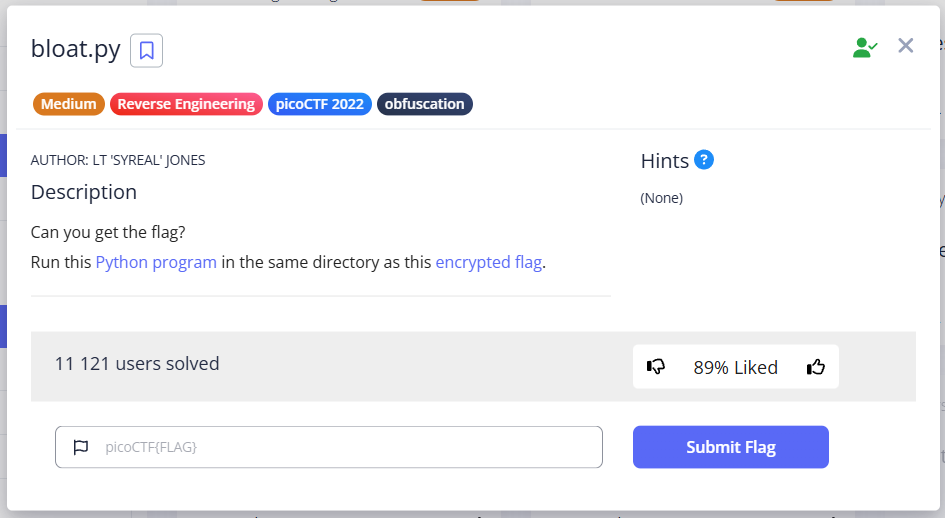
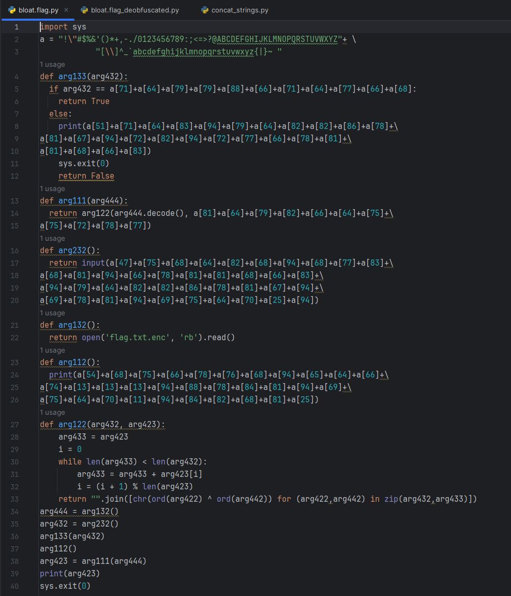
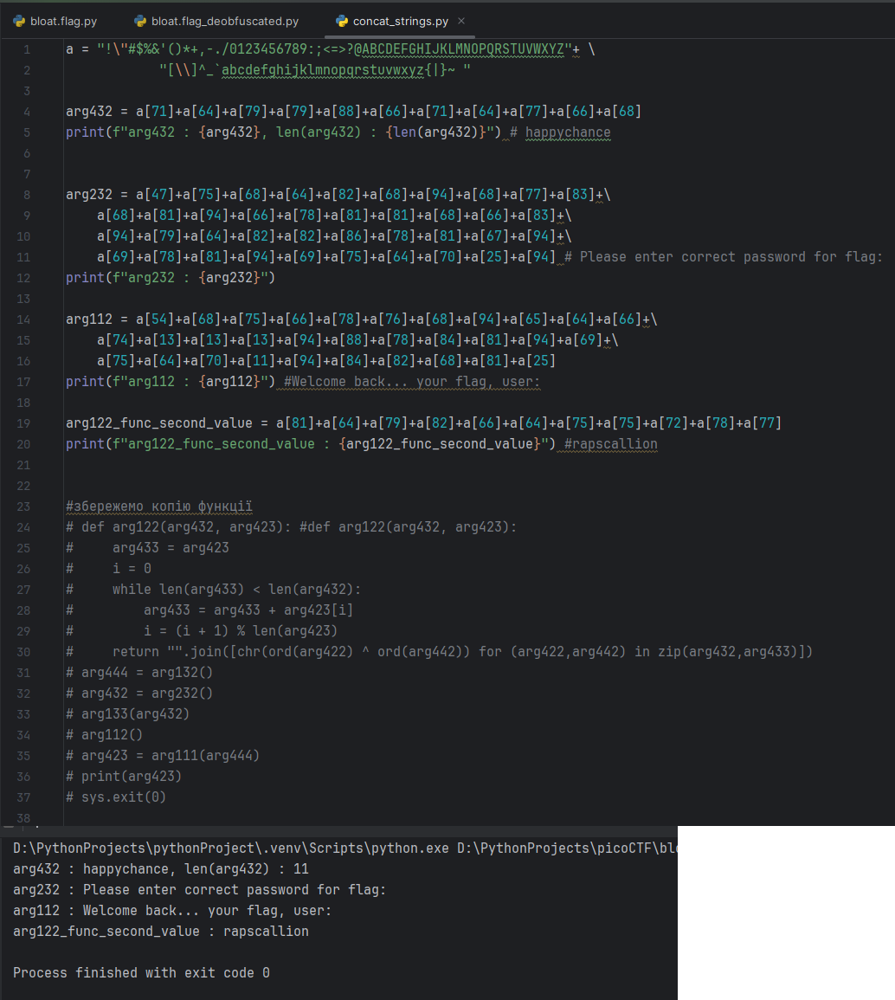
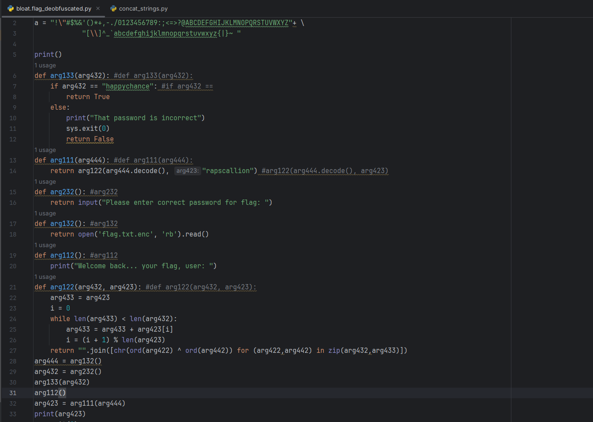
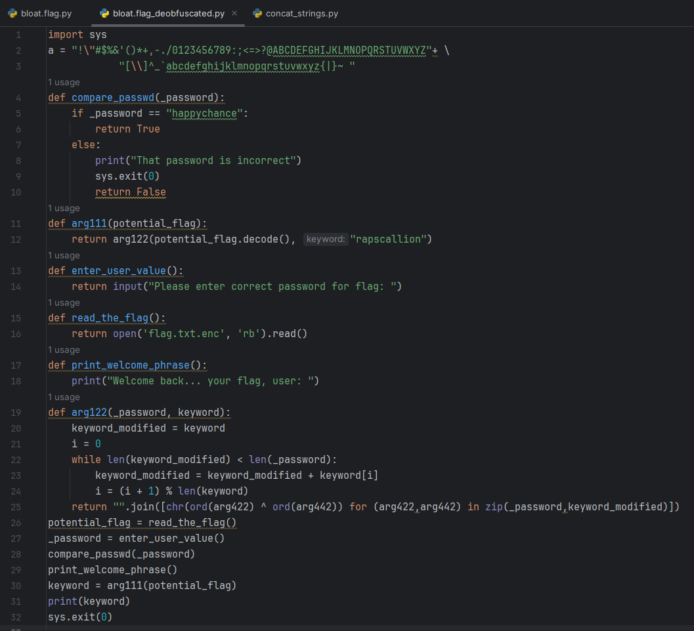
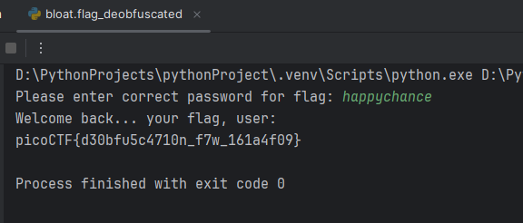

In this task, we have obfuscated code that decrypts the flag and a file with the encrypted flag itself. We need to understand its logic and make the code more understandable.

> [!TIP]
> All resources for this task I left here: [*click*](../scripts/reverse%20engineering/bloat.py)

---

We have a file called `bloat.flag`, which has an array of characters from which readable strings are collected by index, and variable/function names in the style of `arg<num>` to hide the actual logic of their work.

First, I take all the character combinations by index, put them in a separate file, and see what strings are hidden there:

I also copy the main function, which probably decrypts the flag based on the password that the program asks us for when it starts.

Next, I replace these character combinations by index with the readable strings we learned, and make notes, how functions and variables were previously called.:   

Now I will try to "beautify" all the code (or almost all of it):

It becomes clear that the program is waiting for `_password "happychance"` to start performing operations with the flag and eventually output it using the `read_the_flag()` method. 

In fact, it would have been enough to find out the secret word "happychance" to complete this task, since the **obfuscated version** of the program **was working**, but this improved our understanding of the program's logic.

`picoCTF{d30bfu5c4710n_f7w_161a4f09}`

