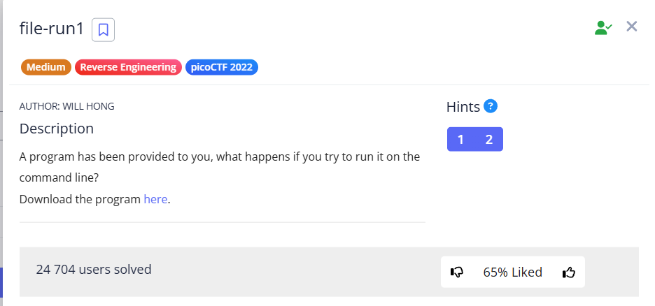
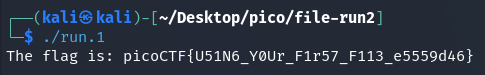
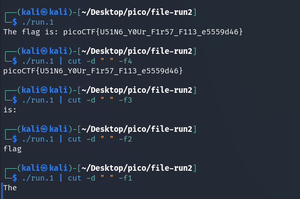

Downloading the file to examine:


```bash
wget https://artifacts.picoctf.net/c/219/run 
```


Giving it the access to execute: 


```bash
chmod +x run.1
```


and execute it:


```shell
./run.1
```





or you can cut off everything except the flag:


```shell
./run.1 | cut -d " " -f4
```

here:

* `cut`: **cutting out** certain sections (fields) from each line of the input text. `cut` reads from `stdin` or from files.
* `-d " "` means that a **space character** is used as a separator. `cut` will examine each line of the input text and split it into separate "fields" whenever it runs into a space.
* `-f4` – The option specifies which field to select for output. `4` means `cut` will select and extract the **4th field** from each line. Fields are counted starting from 1.

Example:





`picoCTF{U51N6_Y0Ur_F1r57_F113_e5559d46}`
